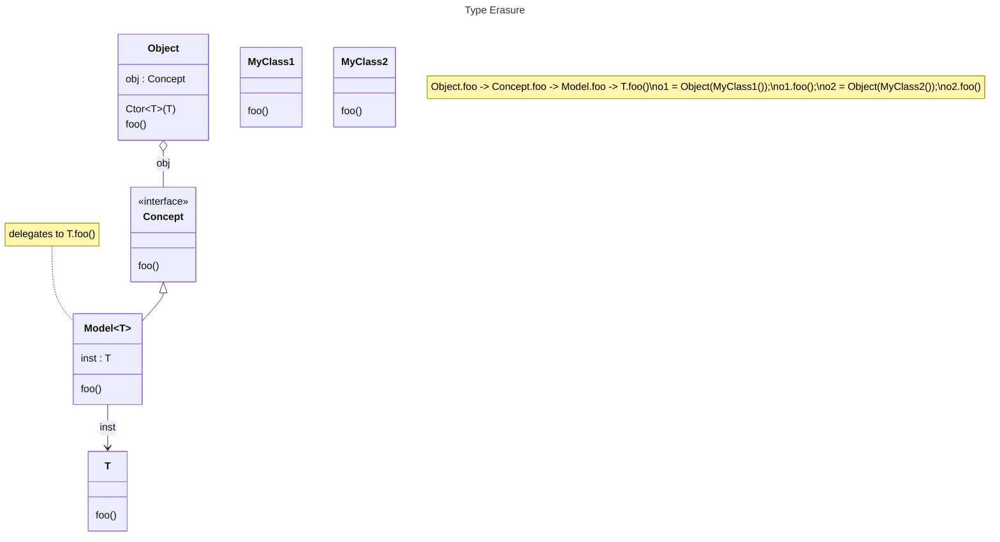
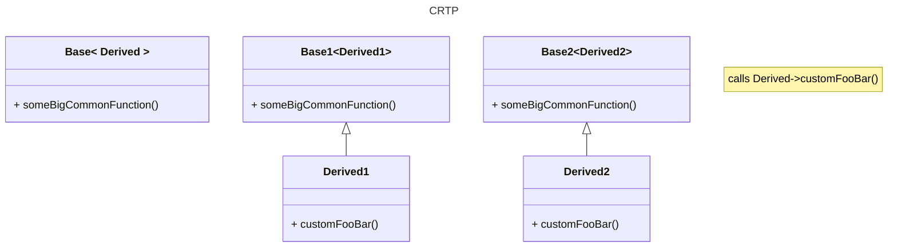
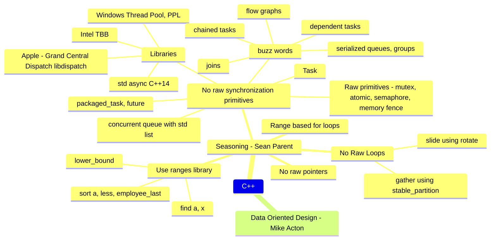

# Competitive programming

[what is new in C++20](https://en.cppreference.com/w/cpp/20) [working examples](https://github.com/makelinux/examples/blob/HEAD/cpp/20.cpp)

[github-repo](https://github.com/chicagoquant/chicagoquant.github.io/) [self](https://github.com/chicagoquant/chicagoquant.github.io/blob/main/cheat-cpp.md)

## Starting point
Lots of headers [Open this in Wandbox](https://wandbox.org/permlink/4uFFuefaNCJXEQX2)
```cpp
#include <iostream>
#include <variant>
#include <vector>
#include <map>
#include <string>
#include <type_traits>
#include <utility>
#include <algorithm>
#include <functional>
#include <memory>
#include <cstdint>
#include <cstdlib>
#include <numeric>
#include <mutex>
#include <thread>
#include <optional>
#include <sstream>
#include <string_view>
#include <iomanip>                  // for quoted(str)
#include <boost/core/demangle.hpp>

#include <ranges>

namespace rs = std::ranges;
namespace rv = std::ranges::views;   // same as std::views

using namespace std;
using namespace std::string_literals;   // for "..."s

#pragma GCC diagnostic ignored "-Wunused-parameter"
#pragma GCC diagnostic ignored "-Wunused-variable"

constexpr const char* multiline_string = R"""(hello
world
)""";
constexpr const char* multiline_also = R"(hello
world
)";

auto print_elem = [](auto const e) {std::cout << e << '\n'; };

int main([[maybe_unused]]int argc, [[maybe_unused]] const char* argv[])
{
    std::ios_base::sync_with_stdio(false);
    std::cin.tie(NULL);

    cout << boolalpha; // so that it prints boolean values as true/false
    auto s = "hello"s;
    cout << s << endl;
    cout << string(100, '-') << endl;
    return EXIT_SUCCESS;
}

// flag: -Wno-unused
```

## Small starting code

```cpp
#include <bits/stdc++.h>

#pragma GCC diagnostic ignored "-Wunused-parameter"
#pragma GCC diagnostic ignored "-Wunused-variable"

using namespace std;

/*
int main([[maybe_unused]]int argc, [[maybe_unused]] const char* argv[])
int main()
*/
int main(int argc, const char* argv[])
{
    std::ios_base::sync_with_stdio(false);
    std::cin.tie(NULL);

    return EXIT_SUCCESS;
}
```

[Open this in wandbox](https://wandbox.org/permlink/ql0bSNiqBOwZSJ4O)

## Header files for contests
```cpp
#include <bits/stdc++.h>

using namespace std;

namespace ME {
using VS = vector<string>;
using VVS = vector<vector<string>>;
using VI = vector<int>;
using VVI = vector<vector<int>>;
using PQI = priority_queue<int>;
using MAXPQI = PQI;
using MINPQI = priority_queue<int, VI, greater<int>>;
}

using ME::VI;

#define REP(i,a,b) for(int i = (a); i < (b); ++i)
#define RE(b) for(int lkzij = (b); lkzij > 0; --lkzij)
#define TRAV(a,x) for(auto& a : x)
#define ALL(x) begin(x), end(x)
#define SZ(x) (int)(x).size()

int main()
{
    VI v { 1, 2, 3, 4 };
    cout << v.size() << endl;
}
```

## Canonical Class

```cpp
#include <iostream>

using namespace std;

class A {
public:
    // default
    A() { cout << "A::default ctor(this=" << this << ")\n"; }
    ~A() { cout << "A::dtor(this=" << this << ")\n"; }
    // A(T x) : data_(move(x))
    // { cout << "A::conversion ctor(this=" << this << ", x=" << &x << ")\n"; }
    // operator T() const { return data_; }   // conversion-function, can specify explicit
    A(A const& rhs) { cout << "A::copy ctor(this=" << this << ", const A& rhs=" << &rhs << ")\n"; }
    A(A&& rhs) noexcept { cout << "A::move ctor(this=" << this << ", A&& rhs=" << &rhs << ")\n"; }

    // A& operator=(A const& rhs) { cout << "A::copy assignment(this=" << this << ") = " << &rhs << "\n"; return *this; }
    // A& operator=(A&& rhs) noexcept { cout << "A::move assignment(this=" << this << ") = " << &rhs << "\n"; rhs.swap(*this); return *this; }

    // replaces above 2 assignment operators
    A& operator=(A rhs) noexcept { cout << "A::copy_val assignment(this=" << this << ") = " << &rhs << "\n"; swap(*this, rhs); return *this; }

    // replaces both A::swap(b), std::swap(a, b)
    friend void swap(A& a, A& b) noexcept {
        cout << "friend swap(A& a=" << &a << ", A& b=" << &b << ")" << endl;
        //
        // // argument dependent lookup (ADL) rules will prefer a more specific swap,
        // // if nothing specific available, will fallback to std::swap
        // // member1.swap(b.member1);
        // // or swap(member1, b.member1)
        // // or std::swap(a.member1, b.member1);
        //
        // using std::swap;         // allow ADL
        // swap(pointerMember, b.pointerMember);
        // swap(basicTypeMember, b.basicTypeMember);
    }

    // void swap(A& b) noexcept {
    //   cout << "A::swap(this=" << this << ", A& b=" << &b << ")" << endl;
    //   // using std::swap;      // allow ADL
    //   // swap(pointerMember, b.pointerMember);
    //   // swap(basicTypeMember, b.basicTypeMember);
    // }
};

// namespace std {
//   // non-member swap, if we don't define, then default implementation will do tmp-move(a)-move(b)-move(tmp)
//   template<>                           // full-specialization required if defininig in std namespace
//   void swap(A& a, A& b) noexcept {
//     a.swap(b);
//   }
// }

class B : public A {
public:
    B() { cout << "B::default ctor(this=" << this << ")\n"; }
    ~B() { cout << "B::dtor(this=" << this << ")\n"; }

    void foo() { cout << "B::foo(this=" << this << ")\n"; }
};
```

Initializations: aggregate, constant, copy, default, direct, list, reference, value, zero

```cpp
T t = { 'a', "hello", 1, }; // aggregate
const int T::a = 5; // constant, static const member
T copy_t = t; // copy
T t; new T; // default
T t(some_param); // direct
T t { 'a', "hello", 1 }; // list
T& tr = t; // reference
T t = T(); T{};  // value (empty-initializer)
T t {};                       // zero initialization
static T t; T t(); T t = T(); // zero initialization

// struct field designator initialization { .field = val, .field = val }
struct {int sec,min,hour,day,mon,year;} z
   = {.day=31,12,2014,.sec=30,15,17}; // initializes z to {30,15,17,31,12,2014}
```
See also: https://en.cppreference.com/w/cpp/language/aggregate_initialization

### Overloads with ref-qualifier

Overloads of class function -- ref, const-ref, rvalue, const-rvalue
```cpp
template<typename T>
class X {
  constexpr T&        get_value() &       { return get_value_impl(*this); }
  constexpr const T&  get_value() const&  { return get_value_impl(*this); }
  constexpr T&&       get_value() &&      { return get_value_impl(move(*this)); }
  constexpr const T&& get_value() const&& { return get_value_impl(move(*this)); }

  template<typename Opt>
  static decltype(auto) get_value_impl(Opt&& opt) {
    return forward<Opt>(opt).val_;
  }
  T val_;
};

// better, with C++23
template<typename T>
class X {
  template<typename Self>
  constexpr auto&& get_value(this Self&& self) {  // not valid before C++23
    return forward<Self>(self).val_;
  }
  T val_;
};
```

### Copy-Move-Swap Idioms
```cpp
class A
{
  Big big;
  Pointer* ptr;
  int v;
public:
  A(const A& that) : big(that.big), ptr(nullptr), v(that.v) {
    ptr = new Pointer(*that.ptr);
  }

  A(A&& other) : big(std::move(other.big)), ptr(exchange(other.ptr, nullptr)), v(other.v) noexcept {
  }

  // replaces both copy and move assignment operators: operator=(const A&), operator=(A&&)
  A& operator=(A that) noexcept {      // create a copy
    that.swap(*this);         // swap the copy
    return *this;
  }

  ~A() {
    delete ptr;
  }

  // A& operator=(const A& other) {
  //   if (this != &other) {
  //     A tmp(other);
  //     tmp.swap(*this);
  //   }
  //   return *this;
  // }
  //
  // A& operator=(A&& other) noexcept {
  //   other.swap(*this);
  //   return *this;
  // }

  // if we don't define, then default implementation will do tmp-move(a)-move(b)-move(tmp)
  friend void swap(A& a, A& b) noexcept {  // note: not defining member swap, just using friend non-member swap
    using std::swap;
    swap(a.big, b.big);
    swap(a.ptr, b.ptr);
    swap(a.v, b.v);
  }
};
```

### Lazy Initialization

```cpp
// option 1: Using std optional -- object on stack
class Lazy
{
  optional<BigObject> big{};
public:
  void eval_lazy() {
    if (!big) {                             // no thread-safety
      big.emplace(...);                     // lazily construct big
    }
    big->some_method(...);
  }
};

// option 2: Using std smart pointer -- object created on heap
class Lazy
{
  unique_ptr<BigObject> big{};
public:
  void eval_lazy() {
    if (!big) {                             // no thread-safety
      big = make_unique<BigObject>(...);    // lazily construct big
    }
    big->some_method(...);
  }
};

// source: https://www.cppstories.com/2019/10/lazyinit/

// option 3: Using raw pointer -- forced to implement dtor, and rule-of-seven or rule-of-five
// class Lazy
// {
//   BigObject* big {nullptr};
// public:
//   ~Lazy() { delete big;  }
//   // have to implment all ctors
//   void eval_lazy() {
//     if (!big) {
//       big = new BigObject {...};           // lazily construct big
//     }
//     big->some_method(...);
//   }
// };

class ThreadSafeLazy : public Lazy
{
  mutable mutex mut;    // not copyable, not movable, need custom copy ctors, assignment etc
public:

  ThreadSafeLazy(const ThreadSafeLazy& other) noexcept { /* do not copy mut, copy the rest */ big = other.big; }
  ThreadSafeLazy& operator=(const ThreadSafeLazy& other) noexcept { /* do not copy mut, copy the rest */ big = other.big; return *this; }
  ThreadSafeLazy(ThreadSafeLazy&& other) noexcept { /* do not copy mut, copy the rest */ big = move(other.big); }
  ThreadSafeLazy& operator=(ThreadSafeLazy&& other) noexcept { /* do not copy mut, copy the rest */ big = move(other.big); return *this; }
  void some_method(...) const {
    MakeSureReady();
    big.something(...);
  }

private:
  // should keep big and mut mutable to modify from const fn
  void MakeSureReady() const {
    scoped_lock loc(mut);
    if (!big) {
      big.emplace(...);
    }
  }
};


class ThreadSafeLazyCallOnce : public Lazy
{
  mutable once_flag flag;// not copyable, not movable, need custom copy ctors, assignment etc
public:

  ThreadSafeLazy(const ThreadSafeLazy& other) noexcept { /* do not copy mut, copy the rest */ big = other.big; }
  ThreadSafeLazy& operator=(const ThreadSafeLazy& other) noexcept { /* do not copy mut, copy the rest */ big = other.big; return *this; }
  ThreadSafeLazy(ThreadSafeLazy&& other) noexcept { /* do not copy mut, copy the rest */ big = move(other.big); }
  ThreadSafeLazy& operator=(ThreadSafeLazy&& other) noexcept { /* do not copy mut, copy the rest */ big = move(other.big); return *this; }
  void some_method(...) const {
    MakeSureReady();
    big.something(...);
  }

private:
  // should keep big and flag to modify from const fn
  void MakeSureReady() const {
    if (!big) {
      call_once(flag, [&]() {
        if (!big) { big.emplace(...); }
      });
    }
  }
};
// source: https://www.cppstories.com/2019/11/lazyinit-multithreading/
```

How to deal with copy/move of mutex member of a class?
```cpp
class A
{
  #if CPP11
    using MutexType = std::mutex;
    using ReadLock =  std::unique_lock<MutexType>;
    using WriteLock = std::unique_lock<MutexType>;
  #endif
  #if CPP14
    using MutexType = std::shared_timed_mutex;          // or recursive_mutex for (this == &rhs)
    using ReadLock =  std::shared_lock<MutexType>;
    using WriteLock = std::unique_lock<MutexType>;
  #endif
  mutable MutexType mut_;

  std::string field1_;
  std::string field2_;

private:
  // helper constructor
  A(const A& a, ReadLock rhs_lk) // lock by value
    : field1_(a.field1_), field2_(a.field2_)
  {}

public:
  A(const A& a) : A(a, ReadLock(a.mut_))
  {}

  A(A&& a) {
    // do not need to lock this->mut_ in this ctor,
    // only 1 thread could construct this object
    WriteLock rhs_lk(a.mut_);
    field1_ = std::move(a.field1_);
    field2_ = std::move(a.field2_);
  }

  A& operator=(const A& a) {
    if (this != &a) {
      WriteLock lhs_lk(mut_, defer_lock);
      ReadLock rhs_lk(a.mut_, defer_lock);
      lock(lhs_lk, rhs_lk);
      field1_ = a.field1_;
      field2_ = a.field2_;
    }
  }

  A& operator=(A&& a) {
    if (this != &a) {
      WriteLock lhs_lk(mut_, defer_lock);
      WriteLock rhs_lk(a.mut_, defer_lock);
      lock(lhs_lk, rhs_lk);
      field1_ = move(a.field1_);
      field2_ = move(a.field2_);
    }
  }

  friend void swap(A& x, A& y) noexcept
  {
    if (&x != &y) {
      WriteLock lhs_lk(x.mut_, defer_lock);
      WriteLock rhs_lk(y.mut_, defer_lock);
      lock(lhs_lk, rhs_lk);
      using std::swap;
      swap(x.field1_, y.field1_);
      swap(x.field2_, y.field2_);
    }
  }
};

// source: https://stackoverflow.com/questions/29986208/how-should-i-deal-with-mutexes-in-movable-types-in-c/29988626#29988626
```

## Dump predefined macros
```text
echo | g++ -std=c++20 -dM -E -x c++ -
echo | clang -dM -E -x c++ -
```

## Watch memory allocation
```cpp
void* operator new(std::size_t count)
{
  void* ptr = ::malloc(count);
  cout << "  " << count << " bytes (" << ptr << ")" << endl;
  return ptr;
}

void operator delete(void* ptr) noexcept
{
  cout << "  delete(" << ptr << ")" << endl;
  std::free(ptr);
}

/*
void operator delete(void* ptr, std::size_t count) noexcept;   // preferred over delete(void*)

void* operator new[](std::size_t count);
void operator delete[](void* ptr) noexcept;
void operator delete[](void* ptr, std::size_t count) noexcept;   // preferred over delete[](void*)

struct X {
  static void* operator new(std::size_t count);
  static void operator delete(X* ptr) noexcept;
  static void operator delete(X* ptr, std::size_t count) noexcept;

  static void* operator new[](std::size_t count);
  static void operator delete[](X* ptr, std::size_t count) noexcept;
};
*/

vector v(100); // watch this allocate and free memory
```

## Rounding up to next integer value
```cpp
i = (val+k-1) / k;
```

## Uniform initialization
```cpp
struct Blah {
  vector<int> vi;
  Blah(std::initializer_list<int> l) : vi(l) {
    // ... l.size(), l.begin(), l.end()
  }
};

Blah b { 1, 2, 3 };

struct Foo {
  Foo(int a, int b) {}
};

Foo foo { 1, 2 };
```

## Copyable Moveable

```cpp
class Copyable                                              class NotCopyable
{                                                           {
public:                                                     protected:
  Copyable() = default;                                       NotCopyable() = default;
  ~Copyable() = default;                                      ~NotCopyable() = default;
                                                            private:
  Copyable(Copyable& rhs) = default;                          NotCopyable(const NotCopyable& rhs) = delete;
  Copyable& operator=(Copyable& rhs) = default;               NotCopyable& operator=(const NotCopyable& rhs) = delete;
};                                                          };

class Moveable                                              class NotMoveable
{                                                           {
public:                                                     public:
  Moveable() = default;                                       NotMoveable() = default;
  ~Moveable() = default;                                      ~NotMoveable() = default;
                                                            private:
  Moveable(Moveable&& rhs) = default;                         NotMoveable(NotMoveable&& rhs) = delete;
  Moveable(const Moveable&& rhs) = default;                   NotMoveable(const NotMoveable& rhs) = delete;
  Moveable& operator=(Moveable&& rhs) = default;              NotMoveable& operator=(NotMoveable&& rhs) = delete;
  Moveable& operator=(const Moveable& rhs) = default;         NotMoveable& operator=(const NotMoveable& rhs) = delete;
};                                                          };

class MoveNoCopy {                                          class NoMoveNoCopy {
protected:                                                  protected:
  MoveNoCopy() = default;                                     NoMoveNoCopy() = default;
  MoveNoCopy(MoveNoCopy&&) = default;                         NoMoveNoCopy(NoMoveNoCopy&&) = delete;
  MoveNoCopy(const MoveNoCopy&) = delete;                     NoMoveNoCopy(const NoMoveNoCopy&) = delete;
  MoveNoCopy& operator=(MoveNoCopy&&) = default;              NoMoveNoCopy& operator=(NoMoveNoCopy&&) = delete;
  MoveNoCopy& operator=(const MoveNoCopy&) = delete;          NoMoveNoCopy& operator=(const NoMoveNoCopy&) = delete;
};                                                          };
```

## Method chaining

```cpp
class A {
public:
  A& value1(int a) { value1_ = a; return *this; }
  A& name1(const char* s) { name1_ = s; return *this; }

private:
  int value1_ = 0;
  const char* name1_ = nullptr;
};

A a;
a.value1(10).name1("hello");
foo(a);

foo(A().value1(10).name1("hello"));
```

## Copy into a vector
```cpp
#include <algorithm>
#include <iterator>

vector<int> src;
vector<int> dst;

copy(src.begin(), src.end(), back_inserter(dst));
```

### transform vector
```cpp
vector<T1> v1;
vector<T2> v2;

T2 t1_to_t2(T1 p);

transform(v1.begin(), v1.end(), back_inserter(v2), [](const auto& p1) -> T2 { return t1_to_t2(p1); });
```

### Copying

```cpp
class C {
  vector<int> vi;
  C(vector<int> v) : vi(move(v)) { /* do not use v here, it is moved. use vi */ }
};

/* lvalue */                       | /* rvalue */                       | /* l/r-value */
C(const vector<int>& v) : vi(v) {} | C(vector<int>&& v) : vi(move(v)) {}| C(vector<int> v) : vi(move(v)) {}
```

## CPP Features

### CPP Data Types
```cpp
#include <cstdint>

bool;
char; byte; unsigned char; int8_t; uint8_t;
short; short int; unsigned short; unsigned short int; int16_t; uint16_t;
int; unsigned int; int32_t; uint32_t;
long; long int; unsigned long; unsigned long int;  // 32-bit on LLP64, 64-bit on LP64
long long; long long int; unsigned long long; unsigned long long int; int64_t; uint64_t;

float;        // 4 bytes
double;       // 8 bytes
long double;  // 16 bytes or 8 bytes

void;

enum;     // unscoped enum, can be converted to int implicitly
enum Color { red, green, blue }; Color r = red;
enum Color : byte { red, green, blue };

enum class; enum struct;      // scoped enum, need static_cast to convert to int
enum class Color { red, green, blue }; Color r = Color::red;
union;
class; struct;
```

POD - Plain Old Data

- equivalent to C type, same rules for initialization, copying, layout and addressing
- no constructors, no overloaded assignment operator
- no virtual functions, base classes
- no destructor
- public non-static data members, but not private or protected are allowed
- static data members allowed
- static member functions allowed
- non-static non-virtual member functions allowed
- no references, no pointers-to-members

### Conversion between number and string

`std::to_string()`, itoa, stringstream, boost lexical_cast, fmt library

```cpp
#include <string>

int n = 100;
string s = std::to_string(n);       // overloads for all numeric types, but uses C functions, not thread-safe
// s = "100"s
```

reverse conversion: `std::atoi("100")`, see also: `atol, atoll`

see also: `strtol(s, &endptr, base) -> long`

and for string: `string s = "100"; std::stoi(s)`, see also: `stol, stoul, stoll, stoull, stof, stod, stold`

```cpp
#include <string>
#include <cstdio>

int n = 100;
char s[100];
std::sprintf(s, "%d", n);
string s2 = s;
// s2 = "100"s

int sz = std::snprintf(nullptr, 0, "%d", n);    // calculate string size for number n
char* out = new char[sz+1];                     // use the right amount of space
std::snprintf(out, sz+1, "%d", n);
std::sprintf(out, "%d", n);
delete[] out;
```

reverse conversion: `sscanf(str, format-string, &n)` example: `sscanf(str, "%d", &n)`

```cpp
#include <charconv>
#include <array>
array<char, 10> out;
auto res = std::to_chars(out.data(), out.data()+out.size(), n);
const std::errc no_error{};
if (res.ec == no_error) {
  // res.ptr points past the end of the number in string
  cout << string_view(out.data(), res.ptr) << endl;
}

// string -> int, using from_chars defined in <charconv>
string s { "1999" };
int num {0};
std::from_chars(s.data(), s.data()+s.size(), num);

#include <format>
#include <string>
string s = std::format("{}", n);
```

```cpp
#include <sstream>
#include <string>

using namespace std;

string my_num_string(int n) {}
  ostringstream ss;
  ss << n;
  return ss.str();
}
```

```cpp
#include <boost/lexical_cast.hpp>

int n = 100;

string s = boost::lexical_cast<string>(n);
```

fmt library

```cpp
#include <string>
#include <fmt/core.h>

int n = 100;
string s = fmt::format("{}", n);

auto out = fmt::memory_buffer();
fmt::format_to(out, "{}", n);
cout << string_view(out.data(), out.data()+out.size()) << endl;
```


### CPP Number limits

```cpp
#include <limits>         | #include <limits.h>

int a = INT_MIN, b = INT_MAX;                 // c/c++ limits

int a = std::numeric_limits<int>::min(),      // c++ limits
    b = std::numeric_limits<int>::max();

```

### Function pointers
```cpp
R (*fp)(Arg1, Arg2);
fp = &sum;
v = fp(a, b);

R (A::*memfp)(Arg1, Arg2);
memfp = &A::foo;
A a;
v = (a.*memfp)(x, y);

```

### CPP File IO

#### CPP CSV Files
```cpp
#include <sstream>
#include <iomanip>
#include <ranges>
#include <string>

namespace rv = std::ranges::views;   // same as std::views

// multiline string
const char* csv_data = R"(field1,field2,field3
10,40,"hello world"
20,80,"abcd efg"
)";

istringstream ss(csv_data);
string line;
while (getline(ss, line)) {
    for (auto v : rv::split(line, ',')){
        // cout << boost::core::demangle(typeid(v).name()) << endl;
        cout << quoted(string_view(v)) << endl;
    }
    cout << endl;
}

// alternatively
#include <cstdio>  // for constant EOF
#include <fstream>
#include <string>

istringstream ss(csv_data);
string record, line;
while (getline(ss, line)) {
    istringstream line_ss(line);
    while (getline(line_ss, record, ',')) {
        cout << record << endl;
    }
}

// alternatively
#include <cstdio>  // for constant EOF
#include <fstream>
#include <string>

istringstream ss(csv_data);
string record;
while (ss.peek() != EOF) {        // std::char_traits<char>::eof()
  getline(ss, record, ',');
  cout << record << endl;
}
```

#### fstream

```cpp
#include <fstream>
#include <string>

ifstream ifs;
ifs.open(filepath);
if (ifs.fail()) {
  // error
}
string line;
while (ifs.peek() != EOF) {
  getline(ifs, line);
}
```

#### Standard I/O
```cpp
int i;
while (cin >> i) {
  cout << i << endl;
}

constexpr auto maxval = std::numeric_limits<std::streamsize>::max();
while (!cin >> i) {
  cout << "invalid integer entered, try again" << endl;
  cin.clear();
  cin.ignore(maxval, '\n');
}
cout << i << endl;
```

#### cin states
```cpp
if (cin >> n)     // operator bool(), equiv to !fail()
cin.eof() ||      // eof
  cin.bad()       // non recoverable, internal failure
cin.fail()        // any error, bad, eof, recoverable error, bad format data, eg not integer
  -> cin.clear(), cin.ignore(maxval, delim='\n')
```

### Structured binding

```cpp
auto [x, y] = get_point(n);

tuple<int, int> t(100, 200);
const auto& [x, y] = t;

int a[] = { 1, 3 };
auto& [x, y] = a;

struct S { int a; int b };
S s { 1, 10 };
auto [ x, y ] = s;    // accessible data members, in order declared in struct/class

int a = 1, b = 10;
const auto& [x, y] = tie(a, b);  // tie creates a tuple of lvalue references

int p, q;
tie(p, q) = tuple<int, int>(100, 200);

map<int, int> m { {1, 100}, {2, 200}, };
for (auto [x, y] : m)           | for (auto v : m)
{                               | {
  ...                           |   v.first; v.second;
}                               | }
```

Compatible type T, if the following metafunctions are available:
- `std::tuple_size<T>::value` number of T's elements
- `std::tuple_element<I>::type` type of I-th element
- `return_type std::get<I>(T)` retrieves I-th element

Already defined for `std::tuple, pair, array`

For a custom class, example:

```cpp
#include <utility>
#include <type_traits>
class A {
  ...
  // option 1 for get(), as a member
  template<size_t I> tuple_element_t<I, A>& get() &
  {
    if constexpr (I == 0) return int_val;
    if constexpr (I == 1) return char_val;
    ...
  }
  ... also need const, rvalue ref ...
  template<size_t I> tuple_element_t<I, A> const& get() const { ... }
  template<size_t I> tuple_element_t<I, A>& get() && { ... return std::move(int_val); ... }
  template<size_t I> tuple_element_t<I, A> const& get() const&& { ... return std::move(int_val); ... }
  // option 2 for get(), use helper
  template<size_t I, typename T> auto&& get_helper(T&& t)
  {
    static_assert(I < 5, "Index out of bounds for A");
    if constexpr (I == 0) return std::forward<T>(t).int_val;
    if constexpr (I == 1) return std::forward<T>(t).char_val;
    if constexpr (I == 2) return std::forward<T>(t).float_val;
    ...
  }
  template<size_t I> auto&& get() & { return get_helper<I>(*this); }
  template<size_t I> auto&& get() && { return get_helper<I>(*this); }
  template<size_t I> auto&& get() const& { return get_helper<I>(*this); }
  template<size_t I> auto&& get() const&& { return get_helper<I>(*this); }
  // see alternative get() below, as non-member
};

namespace std {
  template<> struct tuple_size<A> { static constexpr size_t value = 5; };
    // alternative
  template<> struct tuple_size<A> : integral_constant<size_t, 5> {};

  template<> struct tuple_element<0, A> { using type = int; };
  template<> struct tuple_element<1, A> { using type = char; };
  template<> struct tuple_element<2, A> { using type = float; };
  template<> struct tuple_element<3, A> { using type = string; };
  template<> struct tuple_element<4, A> { using type = int; };
    // alternative
  template<size_t I> struct tuple_element<I, A>
    : conditional<I == 0, int,
        conditonal<I == 1, char,
          conditional<I == 2, float,
            conditional<I == 3, string, int>
          >
        >
      >
  {
    static_assert(I < 5, "Index out of bounds for A">);
  };
    // alternative
  template<size_t I> struct tuple_element<I, A>
    : tuple_element<I, tuple<int, char, float, string, int>>
  {};

  // alternative get, possible to do this way for an existing class that can't modify
  template<size_t I> tuple_element_t<I, A>& get(A& a)
  {
    if constexpr (I == 0) return a.int_val;
    if constexpr (I == 1) return a.char_val;
    ...
  }

  // alternative get, using helper
  template<size_t I, typename T> auto&& A_get_helper(T&& t)
  {
    static_assert(I < 5, "Index out of bounds for A");
    if constexpr (I == 0) return std::forward<T>(t).int_val;
    if constexpr (I == 1) return std::forward<T>(t).char_val;
    if constexpr (I == 2) return std::forward<T>(t).float_val;
  }
  template<size_t I> auto&& get(A& t) { return A_get_helper<I>(t); }
  template<size_t I> auto&& get(const A& t) { return A_get_helper<I>(t); }
  template<size_t I> auto&& get(A&& t) { return A_get_helper<I>(move(t)); }
  template<size_t I> auto&& get(A const&& t) { return A_get_helper<I>(move(t)); }
}
```

See: [C++ on Sea 2020 - S/B uncovered](https://youtu.be/uZCvz-E1heA?t=1592)

### tuple

- fixed size collection, different types possible

```cpp
tuple tp { 10, 20l, 3.14, 42, "hello" }; // deduced type tuple<int, long, double, int, const char*>
get<0>(tp)        // 0th item is 10
get<double>(tp)   // ok, only 1 double
get<int>(tp)      // error, ambiguous

apply(callable, tp);    // callable(get<0>(tp), get<1>(tp), ...)
apply(callable, array); // can apply on anything tuple-like, that supports get<I>(), tuple_size(), eg: array, pair

struct Foo {
  Foo(int a, float b, int c) { ... }
};
auto tp1 = make_tuple(42, 3.14f, 1);
auto foo = make_from_tuple<Foo>(move(tp1));
```

printing all the fields of tuple

```cpp
template<typename... Ts>
ostream& operator<<(ostream& os, tuple<Ts...> const& tp) {
  auto lambda = [&os](Ts const&... tp) {
    os << '[';
    size_t n {0};
    (
      (os << tp << (++n != sizeof...(Ts) ? ", " : ""))
      , ...
    );
    os << ']';
  };
  apply(lambda, tp);
  return os;
}
```


### Swap

3 ways to define swap:

```cpp
// method 1: member swap, std::swap specialization
namespace X {
  class A {
    void swap(A& b) noexcept;               // member swap
  };
}
namespace std {
  template<>                              // full specialization
  void swap(A& a, A& b) noexcept { a.swap(b); }    // calls member swap
}

// method 2: overload std::swap, defined in same scope as class A
namespace X {
  class A {
    void swap(A& b) noexcept;             // member swap
  };

  // same scope as the class
  void swap(A& a, A& b) noexcept { a.swap(b); }    // calls member swap
}

// method 3: define swap() as a friend function
namespace X {
  class A {
    friend void swap(A& a, A& b) noexcept {
      ...
    }
  };
}

// usage:
template<typename T>
void some_func(T& obj)
{
  T tmp;
  using std::swap;
  swap(tmp, obj);   // would try X::swap() before std::swap()
}
```

### Allocators

- Doug Lea malloc (dlmalloc)
- pthread malloc (ptmalloc), derived from dlmalloc
- glibc malloc (derived from ptmalloc)
- tcalloc - google's malloc, fast, multi-threaded. used in chrome, safari
  - thread local ThreadCache for each thread
  - Small object (upto 32KB) allocation
  - CentralCache for large objects, 4k page aligned
- jemalloc - emphasizes fragmentation avoidance and scalable concurrency support, used in Firefox

```cpp
template<typename T>
struct Mallocator
{
  using value_type = T;

  Mallocator() noexcept = default;

  template<typename U> Mallocator(const Mallocator<U>&) noexcept = default;
  template<typename U> bool operator==(const Mallocator<U>&) const noexcept { return true; }
  template<typename U> bool operator!=(const Mallocator<U>&) const noexcept { return false; }

  T* allocate(const size_t n) const {
    if (n == 0) { return nullptr; }
    if (n > static_cast<size_t>(-1)/sizeof(T)) { throw std::bad_array_new_length(); }
    void* const pv = malloc(n* sizeof(T));
    if (!pv) { throw std::bad_alloc(); }
    return static_cast<T*>(pv);
  }

  void deallocate(T* const p, size_t) const noexcept { free(p); }

  Mallocator(void* begin, void* end);
  void release();

  // not copyable
  Mallocator(const Mallocator&) = delete;
  Mallocator& operator=(const Mallocator&) = delete;
};

std::vector<int> v;
std::vector<int, Mallocator> v;

// polymorphic allocator
struct NewDeleteAllocator : public std::pmr::polymorphic_allocator< {
  // ...
};

NewDeleteAllocator alloc;
std::pmr::vector<int> v(&alloc); // not usual vector
```

## Crazy STL

### Smart Pointers

- `shared_ptr` is half thread-safe
  - reference counting increment/decrement is atomic
  - referenced object is deleted safely only on one thread
  - i.e. control block is protected for thread safety
  - referenced object is not protected, if you update the object from different threads, you are responsible for thread-safety
  - calling non-const methods on `shared_ptr` from different threads is not thread-safe
    - example:
      ```cpp
      shared_ptr<T> t1 = make_shared<T>(...);
      // thread 1                           | thread 2
      t1 = make_shared<T>(...)              | t1 = make_shared<T>(...)        // not safe
      ```
  - C++20: use `atomic<shared_ptr<T>>` for thread safe updateable shared ptr

```cpp
shared_ptr<A>       // reference counted raw pointer
weak_ptr<A>         // does not change reference count
unique_ptr<A>       // unique ownership, not copyable

auto uptr = make_unique<A>();
uptr->foo();

auto us = make_unique<A[]>(10);
us[2].foo();

auto sp = make_shared<A>();
shared_ptr<A> sp2 = sp; // ref_count++
assert(sp.use_count() == 2);    // use_count() gives ref_count
sp->foo();

auto wp = weak_ptr(sp);
shared_ptr<A> sp3 = wp.lock();  // convert weak into shared

wp.expired()         // underlying shared-ptr deleted?
wp.use_count()

atomic<shared_ptr<T>> sp;   // for using mutable methods of sp across threads
atomic<weak_ptr<T>> wp;
```

Example implementation

```cpp

template<typename T>
class SharedPtr
{
  T* ptr;
  uint32_t* ref_count;
public:
  SharedPtr() : ptr(nullptr), ref_count(nullptr) {}
  SharedPtr(T* ptr) : ptr(ptr), ref_count(new uint32_t{1}) {}
  ~SharedPtr() { cleanup(); }

  SharedPtr(const SharedPtr& o) : ptr(o.ptr), ref_count(o.ref_count) { if (ptr != nullptr) ++(*ref_count); }
  SharedPtr& operator=(const SharedPtr& o) {
    if (this != &o) {
      cleanup();
      ptr = o.ptr;
      ref_count = o.ref_count;
      if (ptr != nullptr) {
        ++(*ref_count);
      }
    }
  }

  // TODO: move construction, assignment operator

  ...

private:
  void cleanup() {
    if (*ref_count > 0) {
      --(*ref_count);
      if (*ref_count == 0)
      {
        delete ptr;
        delete ref_count;
      }
    }
  }
};
```


### enable if

`enable_if< Condition, SomeType >` -- if `Condition` is true, then `enable_if::type == SomeType`, otherwise it is not defined.

```cpp
template<typename Cond, typename Type>
struct enable_if {};                            // empty

template<typename Type>
struct enable_if<true, Type> {
  using type = Type;                            // defined when Cond = true
};
```

#### Usage - 4 ways
```cpp
// usage:
// #1 - use non-type parameter for template
template<
  typename T,
  enable_if<is_integral<T>::value, Blah>::type = SomeBlahValue    // Cond is true, then this matches
                                                                  // otherwise, that type is not defined
                                                                  // and this template definition does not match
                                                                  // Blah can be int, bool, or anything else, does not matter
>
void func() { .... }

// #2 - use return type of function
template<typename T>
typename enable_if<Cond>::type            // return type, void (default param)
foobar()                                  // i.e. function: void foobar(), only if Cond is true
{}

// #3 - enable via function parameter
template<typename T>
void foobar(
  T t,
  typename enable_if<Cond>::type* = nullptr   // void* = nullptr, if Cond is true, foobar is not defined if Cond is false
)
{}

// #4 - use type parameter for template
template<
  typename T,
  typename = enable_if<Cond>::type          // enabled if Cond is true
>
void foobar(T t)
{}
```


### any, variant, optional

#### Usage - any (type-safe void*)

- does memory allocation on heap, heap allocation may be avoided for small objects
- `make_any<T>(t)`, `any_cast<T>`, exception `bad_any_cast`
- `has_value()`, `type()`, `emplace()`, `reset()`

```cpp
#include <any>
any a = 1;
any b = "hello";
a = b;
a = "world";
any_cast<string>(a)
a.has_value()
a.reset()
a.emplace(ctor args)

vector<any> va = { 1, 20.0, "hello", A(), };
```

#### Implementation idea - any
```cpp
namespace AA {

struct bad_any_cast1 : std::exception {};

struct any
{
  void* data_;
  std::type_info const& (*getType_)();
  void* (*clone_)(void* otherData);
  void (*destroy_)(void* data);

  template<typename T>
  explicit any(T&& value)
    : data_{new T{std::forward<T>(value)}}
    , getType_{[]() -> std::type_info const&{ return typeid(T); }}
    , clone_([](void* otherData) -> void* { return new T(*static_cast<T*>(otherData)); })
    , destroy_([](void* data_) { delete static_cast<T*>(data_); })
  {
  }

  any(any const& other)
    : data_(other.clone_(other.data_))
    , getType_(other.getType_)
    , clone_(other.clone_)
    , destroy_(other.destroy_)
  {
  }

  any(any&& other)
    : data_(exchange(other.data_, nullptr))
    , getType_(other.getType_)
    , clone_(other.clone_)
    , destroy_(other.destroy_)
  {
    other.data_ = nullptr;
  }

  any& operator=(any other) noexcept {
      swap(*this, other);
      return *this;
  }

  template<typename T>
  any& operator=(T&& t) {
      operator=(any { std::forward<T>(t) });
      return *this;
  }

  void swap(any& a, any& b) noexcept {
      using std::swap;
      swap(a.data_, b.data_);
      swap(a.getType_, b.getType_);
      swap(a.clone_, b.clone_);
      swap(a.destroy_, b.destroy_);
  }

  ~any()
  {
    destroy_(data_);
  }

  template<typename T>
  T& inner()
  {
    if (typeid(T) == getType_()) { return *static_cast<T*>(data_); }
    throw bad_any_cast1 {};
  }

};

template<typename T>
T& any_cast1(any& a) { return a.inner<T>(); }

}

// https://www.fluentcpp.com/2021/02/05/how-stdany-works/
// https://github.com/gcc-mirror/gcc/blob/master/libstdc%2B%2B-v3/include/std/any
// https://github.com/llvm/llvm-project/blob/main/libcxx/include/any
```

#### Usage - variant (type-safe union)

- not allowed to allocate additional memory dynamically on heap
- can not take references, arrays or void
- all the types must be specified in template parameters
- use `std::monostate` as first argument if first argument is not default constructible type
- `index()`, `visit()`, `get<T>()`, `variant_size<V>::value == variant_size_v<V>`, `variant_alternative<V>::type == variant_alternative_t<V>`

```cpp
variant< int, float > v;
v = 41;
int i = get<int>(v);
int i = get<0>(v);
get<float>(v); // throws bad_variant_access, stored int above
v.index() == 1        // active type's index, 0-based

holds_alternative<int>(v) == true;

using var_t = variant<int, long, double, string>;
using varvec_t = vector<var_t>;
varvec_t vv;
// invoke a lambda on many variant values
std::visit( [](auto&& val) { cout << val; }, vv[0], vv[1], vv[2], vv[3] );
for (auto& v : vv) {
  // option 1
  auto invoke = [](auto&& arg) { cout << arg; };            // side-effect only
  // option 2
  auto invoke = [](auto&& arg) -> var_t { return arg+arg; };// returns another variant
  // option 3
  auto invoke = [](auto&& arg) {                            // each type different
    using T = decay_t<decltype(arg)>;
    if constexpr (is_same<T, int>) { cout << "int with val " << arg; }
    else if constexpr (is_same<T, long>) { cout << "long with val " << arg; }
    else if constexpr (is_same<T, double>) { cout << "double with val " << arg; }
    else if constexpr (is_same<T, string>) { cout << "string with val " << arg; }
    else { static_assert( always_false_v<T>, "invalid visitor" ); }
  };
  // option 4
  // see https://www.cppstories.com/2019/02/2lines3featuresoverload.html/
  template<class... Ts>
  struct overloaded : Ts... { using Ts::operator()...; };

  auto invoke = overloaded {                 // polymorphic lambda overload technique
    [](auto arg) { cout << "int/long " << arg; },
    [](double i) { cout << "double" << i; },
    [](string s) { cout << "string" << s; },
  };
  // means overloaded<lambda1, lambda2, lambda3> : lambda1, lambda2, lambda3 {
  //   using lambda1::operator();
  //   using lambda2::operator();
  //   using lambda3::operator();
  // }

  std::visit(invoke , v);
}
// https://github.com/mpark/variant
// https://github.com/groundswellaudio/swl-variant
```

#### Implementation idea - variant
```cpp
#include <cassert>

// ---------------------------------------------------------------------------
// to compute index of type T1 in Ts...
// used to initialize active_idx, data above in Variant::ctor
template<typename T1, typename ...Ts>
struct PackIndex;

template<typename T1, typename ...Ts>
struct PackIndex<T1, T1, Ts...>
  : integral_constant<size_t, 0>
{};

template<typename T1, typename U1, typename ...Ts>
struct PackIndex<T1, U1, Ts...>
  : integral_constant<size_t, 1 + PackIndex<T1, Ts...>::value>
{};

// ---------------------------------------------------------------------------
template<typename T1, typename ...Ts>
union VariadicUnion                // recursive definition of union
{
  T1 first;
  VariadicUnion<Ts...> rest;

  template<typename U>
  VariadicUnion( integral_constant<size_t, 0>, U&& u)
    : first( forward<U>(u) )
  {}

  template<size_t I, typename U>
  VariadicUnion( integral_constant<size_t, I>, U&& u)
    : rest( integral_constant<size_t, I-1>(), forward<U>(u) )
  {}

  template<std::size_t I>
  auto& get() {
    if constexpr (I == 0) {
      return first;
    }
    else {
      return rest.template get<I-1>();
    }
  }

  void destroy(std::size_t I)
  {
    if (I == 0) {
      first.~T1();
    }
    else {
      rest.destroy(I-1);
    }
  }
};

template<typename T1>
union VariadicUnion<T1>                       // base case
{
  T1 first;

  template<typename U>
  VariadicUnion( integral_constant<size_t, 0>, U&& u)
    : first( forward<U>(u) )
  {}

  template<std::size_t I>
  auto& get() { return first; }

  void destroy(std::size_t I)
  {
    assert(I == 0);
    first.~T1();
  }
};

template<typename ...Types>
class Variant
{
  size_t active_idx;
  VariadicUnion<Types...> data;
public:
  template<typename T>
    requires (same_as<T, Types> or ... )
  Variant(T&& v)
    : active_idx( PackIndex<T, Types...>::value )
    , data( integral_constant<size_t, PackIndex<T, Types...>::value>(), forward<T>(v) )
  {}

  // template<typename T> Variant& operator=(T&& v);

  ~Variant() {
    data.destroy(active_idx);
  }

  size_t index() const { return active_idx; }

  template<std::size_t I>
  auto& get()
  {
    assert( I == active_idx );
    return data.template get<I>();
  }
};

Variant<int, double, bool> v { false };
v.index() == 2;
v.get<2>();
// ---------------------------------------------------------------------------
```

#### Usage - optional

contains storage for the object and manages its lifetime

```cpp
#include <optional>

optional<int> o;
optional<int> o(100);
o.has_value() == bool(o)
o.emplace(100);
nullopt == optional<int>{}
int i = *o;
int i = o.value();
int i = o.value_or(10);
*o = 20;
o.reset();

optional<string> o;
o->size();
auto taken = *move(o);

/* has value */                             | /* no value */
optional<A> o;                              |
o = optional<A>{A{}}                        | o = optional<A>{}
o = A{}                                     | o = {}
o = make_optional<A>()                      | o = nullopt
o.emplace()                                 | o.reset()
```

#### Implementation idea - optional
```cpp
struct Optional<T>  // messsy version
{
  bool got_value;
  aligned_storage_t<sizeof(T), alignof(T)> buf;  // space for T contained_value
  Optional(const T& t) : got_value(true) { ::new ((void*)&buf) T(t); } // in-place new
  ~Optional() { if (got_value) { reinterpret_cast<T&>(buf).~T(); } }   // destructor
};

struct Optional<T>  // better, with anonymous union
{
  union {
    char dummy;
    T val;
  };
  bool engaged;
  Optional() : dummy(0), engaged(false) {}
  Optional(const T& t) : val(t), engaged(true) {}
  ~Optional() {
    if constexpr (!is_trivially_destructible<T>{}) {
      if (engaged) val.~T();
    }
  }
};

// see: https://www.club.cc.cmu.edu/~ajo/disseminate/2017-02-15-Optional-From-Scratch.pdf
// https://www.club.cc.cmu.edu/~ajo/
```

### Tag Dispatch

Use a type to overload an implementation

```cpp
struct RandomIteratorTag {};
struct ForwardIteratorTag {};

void advance_impl(Iter& iter, int skip, RandomIteratorTag)
{
  iter += skip;
}

void advance_impl(Iter& iter, int skip, ForwardIteratorTag)
{
  while (skip > 0) {
    iter++;
    --skip;
  }
  return iter;
}

void advance(Iter& iter, int dist)
{
  advance_impl(iter, dist, Iter::category)
}
```

### Type Erasure



Example:
```cpp
class Wrapper {
  Concept* concept;

  class Concept {
  public:
    virtual void foobar() = 0;
  };

  template<typename T>
  class Model : public Concept {
    T instance;
  public:
    Model(T& o) : instance(o) {}

    void foobar() override final {
      instance.foobar();
    }
  };

public:
  template<typename T>
  Wrapper(T&& o) : concept(new Model<T>(o)) {}
  ~Wrapper() { delete concept; }

  void foobar() {
    concept->foobar();
  }
};

class MyImpl1 {
public:
  void foobar() {
    cout << "Impl 1" << endl;
  }
};

class MyImpl2 {
public:
  void foobar() {
    cout << "Impl 1" << endl;
  }
};

vector<Wrapper> v;
v.push_back(MyImpl1());
v.push_back(MyImpl2());

for (auto& x : v) {
  x.foobar();         // will call MyImpl1/MyImpl2 foobar()
}
```

### CRTP



```cpp
template<typename Derived>
class Base
{
  // calls foobar() which is customized in derived classes
  void someBigCommonFunctionWith1Difference()
  {
    ...
    static_cast<Derived*>(this)->foobar();
    ...
  }
};

class Derived1 : public Base<Derived1>
{
public:
  void foobar()
  {
    cout << "Custom definition of Derived1.foobar\n";
  }
};

class Derived2 : public Base<Derived2>
{
public:
  void foobar()
  {
    cout << "Custom definition of Derived2.foobar\n";
  }
};

Derived1 d1;
Derived2 d2;
d1.someBigCommonFunctionWith1Difference();
d2.someBigCommonFunctionWith1Difference();
```

### Return type resolver
```cpp
class MakeContainer
{
    int size;
  public:
    explicit MakeContainer(int size) : size(size) {}

    template<typename Container>
    operator Container()                  // conversion operator
    {
      Container c(size);

      return c;
    }
};

// deduce which conversion operator to call from type of variable used for return value
vector<int> vi = MakeContainer(9);    // will create vector of int
list<A> va = MakeContainer(2);        // will create list of A

// does not even have to use templates for conversion operator

class FromString
{
  const string& source;
public:
  explicit FromString(const string& src) : source(src) {}

  operator int() { return stoi(source); }
  operator double() { return stod(source); }
};

int ival = FromString("1122");          // implicit: FromString(...).operator int()
double dval = FromString("0.5");
```

### virtual constructor idiom

```cpp
struct IAnimal abstract
{
  virtual IAnimal* createNew() = 0;
  virtual IAnimal* copy() = 0;
};

template<typename Concrete>
struct AnimalBase : public IAnimal
{
  IAnimal* createNew() override final
  {
    return new Concreate();
  }

  IAnimal* copy() override final
  {
    return new Concrete(*static_cast<const Concrete*>(this));
  }
};

struct Dog : public AnimalBase<Dog> {};
struct Cat : public AnimalBase<Cat> {};

void foo()
{
  IAnimal* animal = new Dog();

  IAnimal* new_dog = animal->createNew();
  IAnimal* dog_copy = animal->copy();
}
```

### std string_view

should not outlive the pointed-to char array. this is a non-owning reference to a string.

```cpp
#include <string_view>

using namespace std::literals;

string_view s1 = "abcd"sv;        // literal string_view
string s2 = "abcd"s;              // literal string

string_view sv = str;
string_view sv(data, len);
string_view sv(c_str);
string_view sv2 = sv.substr(m, n);

sv.find_first_not_of(' ');

cout << sv << endl;

string_view sv(s.begin(), s.end()); // s is a std::string
```

### std string
```cpp
string s { "hello" };

size_t beg = 0;
size_t i = s.find('l', beg);
i != string::npos;
string s2 = s.substr(beg, i-beg);

auto it = find(s.begin(), s.end(), 'l');
it != s.end();
size_t count = it-s.begin();
size_t beg = 0;
string s2 = s.substr(beg, count);

string to_upper(string s)
{
  transform(s.cbegin(), s.cend(), s.begin(), toupper);
  return s;
}

string reverse_str(string s)
{
  std::reverse(s.begin(), s.end());
  return s;
}

string ltrim(string s) {
  s.erase(
    s.begin(),
    find_if(s.begin(), s.end(), not1(ptr_fun<int, int>(isspace)))
  );
  return s;
}

string rtrim(string s) {
  s.erase(
    find_if(s.rbegin(), s.rend(), not1(ptr_fun<int, int>(isspace))).base(),
    s.end()
  );
  return s;
}

string trim(string s) {
  s.erase(
    find_if(s.rbegin(), s.rend(), not1(ptr_fun<int, int>(isspace))).base(),
    s.end()
  );
  s.erase(
    s.begin(),
    find_if(s.begin(), s.end(), not1(ptr_fun<int, int>(isspace)))
  );
  return s;
}
```

### std span

span is a generalized string_view, can be used for other range types, not just strings. for view of a contiguous sequence of data.

```cpp
int arr[] = { 1, 2, 3, 4, 5, 6, 7, 8, 9, 10, };
vector<int> vec = { 1, 2, 3, 4, 5, 6, 7, 8, 9, 10, };
span<int, 10> arr_span { arr };     // static length
span<int>     dyn_arr_span { arr }; // dynamic length
span<int>     vec_span { vec };

span<int> sp = arr_span.subspan(3, 5);
arr_span.first(4);  // sub-span of first 4 items
arr_span.last(2);   // sub-span of last 2 items

span<char> sp { s };
span<char> sp { s, 5 };   // count=5

span<int> sp { begin(vec), end(vec) };
span<int> sp { begin(vec), 3 };   // count=3
```


### std function

- `std::function` is a polymorphic callable wrapper, is implemented using type-erasure idiom.
- note: it will make a virtual function call

```cpp
#include <iostream>
#include <functional>

using namespace std;
using namespace std::placeholders;

inline double add(double a, double b) { return a+b; }

struct Sub {
  double operator()(double a, double b) { return a-b; }
};

inline double multThree(double a, double b, double c) {
  return a*b*c;
}

Sub sub;

auto mult = std::bind(multThree, _1, _2, 1.0);

auto div = [](double a, double b) { return a/b; };

std::function<double(double,double)> arr[] = {
  add,        // function
  sub,        // function object
  mult,       // function object created by bind
  div,        // lambda expression
};

for (auto& f : arr) {
  cout << f(5.0, 2.5) << endl;
}
```

### lambda explained

lambda definition
```cpp
[capture](param_list) mutable exception_spec -> trailing_return_type { lambda_body }

[=]() mutable throw() -> int { ... return 100; }

[] - empty capture clause - accesses no variables in the enclosing scope
[&] -  all variables captured by reference
[=] - captured by value
[&a, b] - a by reference, b by value
[&, b] - all by reference, but b by value
[=, &a] - all by value, except a by reference
[newVar = captureVar] - introduce and initialize new variables (generalized captures)
[newVar = move(captureVar)] - can be an expression in capture
```

lambda expanded
```cpp
int x, y;
auto f = [&x, y](double a, double b) { return (a+b+x+y); };

// equivalent to:
class Lambda  // closure type
{
  // closure
  int &x;
  int y;
public:
  Lambda(int& x, int& y) : x(x), y(y) {}

  // callable, note this will become a template function lambda uses auto for params
  double operator()(double a, double b) const              // const callable, unless mutable lambda
  { return a+b+x+y; }

  // oh i get it now, this is so that it can be implicitly converted to std::function
  // not really necessary, this is getting generated when I assign lambda to a std::function
  using retType = double (*)(double, double);
  constexpr operator retType() const noexcept { return invoke; }
  static double invoke(double a, double b) {
    Lambda l{};
    return l.operator()(a, b);
  }
};

Lambda f{x, y}; // closure x, y

f.operator()(1.9, 2.3);    // callable
```

### Using lambdas
```cpp
auto sumInt = [](int a, int b) { return a+b; };             // ordinary

auto addAnything = [](auto a, auto b) { return a+b; };      // can pass any type data for a, b

auto sumDec = [](auto a, decltype(a) b) { return a+b; };    // not any b, convertible to type of 'a'

auto sumTmpl = []<typename T>(T a, T b) { return a+b; };    // templatized
```

More examples:
```cpp
[](const Person& a, const Person& b) { return a.name < b.name; }
    // immutable closure, it is a const function
    // return type - deduced - bool, can instead give trailing return type
    // not noexcept by default, if needed, can declare with noexcept

[](const Person& a, const Person& b) -> bool { return a.name < b.name; }
[](const Person& a, const Person& b) mutable { return a.name < b.name; }
[](const Person& a, const Person& b) noexcept { return a.name < b.name; }

[](int i) { return i*i; }
    // lambda expressions with empty closure can be used as function pointers
    // void foo(int (*)(int) f); foo([](int i) {return i*i; });
auto* fptr = +[](int i) { return i*i; };          // idiom: unary plus operator trick, to get a func ptr, not lambda object
{ int i, j = 0; auto f = [=] { return i==j; }}    // capture by value, =
    // only capture local variables, can not capture global/static variables
{ int i, j = 0; auto f = [&] { return i==j; }}    // capture by reference, &

struct X {
  int i_;
  void foo() {
    auto f = [this] {                             // capture this, to use members i_
      cout << i_;                                 // __this->i_
    };
    ...
  }
};

int foo() {
  static int k = 42;
  int m = 100;
  auto f = [=] { ++k; --m; };                     // not going to capture 'k' by value, 'm' is by val
  f();                                            // will modify that outer k, local m is not changed
  return k;                                       // will return 43
}

// idiom: immediately invoked function expression (IIFE)
[] {...} ();                                      // call it immediately, temporary lambda
const Foo foo = [] {
  if (hasDatabase) { return getFooFromDatabase(); }
  else { return getFooFromElsewhere(); }
} ();                                             // trick to conditional initialization

v.emplace_back([] {...}());                       // similar idea, passing return value of lambda
v.emplace_back(invoke([] { ...}));                // explicitly invoke the lambda, less confusing

// idiom: call-once lambda (daisy hollman, what you can learn from being too cute)
struct X {
  X() {
    static auto _ = [] { ... } ();                // we want it to be called only once
  }
};
X x1, x2, x3;                                     // called only once

// generic lambdas
[](auto i) { ... i ... };                         // template<T> call_operator(T i) const {...}

// perfect forwarding, auto ref ref
[&v](auto&& x) {                                  // template<T> call_oper(T&& x) const { __v.push_back(...); }
  v.push_back(forward<decltype(x)>(x));
};

// variadic templates
[](auto&&... args) {
  (cout << ... << args);                          // fold expression
} (123, "hello", 'a', 4.0);

// idiom: variable template lambda (bjorn fahller)
template<typename T>                              // not just the callable, the lambda closure type also is a template
constexpr auto x = [](auto y) {
  return (T)y;                                    // cast to type T
}

// example:
template<typename T> constexpr auto duration_cast = [](auto d) {
  return std::chrono::duration_cast<T>(d);
}
using ns = std::chrono::nanoseconds;
using ms = std::chrono::milliseconds;
using us = std::chrono::microseconds;
struct Time {
  variant<ms, ns> time;
  auto convert(const auto& converter) {
    return visit(converter, time);
  }
};
void foobar() {
  Time t(ns(3000));
  auto in_usecs = t.convert(duration_cast<us>).count();
}

// init capture
unique_ptr<A> ptr;
auto lambda_f_instance = [ptr = std::move(ptr)] { ... ptr.get() ... }
// equiv to
struct LambdaClosureType {
  LambdaClosureType(unique_ptr<A> p) : __ptr(move(p)) {}
  unique_ptr<A> __ptr;
  ... callable ...
} lambda_f_instance {move(ptr)};

// idiom: init capture initialization (bartlomiej filipek - C++ lambda story book)
const string prefix="foo"; // looking for "foobar" in a vector
auto iter = find_if(vs.begin(), vs.end(), [str=prefix+"bar"](const string& s) { return s == str}; );
// versus less efficient version, calculates prefix+"bar" for every item in vs
auto iter = find_if(vs.begin(), vs.end(), [&prefix](const string& s) { return s == prefix+"bar"}; );

// lambdas can be constexpr or consteval, that can execute at compile time
auto f = []() constexpr { return sizeof(void*); };    // compile time
array<int, f()> arr = {};
auto g = [](int i) consteval { return i*i; };         // compile time only
array<int, g(5)> arr = {};                            // ok
g(x); // error, not a constant

// idiom: lambda overload set (uses CTAD)
// idea -- lambda's are conceptually classes, and you should be able to inherit from them
template<typename... Ts>                      // variadic args will be lambdas
struct overload : Ts... {                     // we inherit from those lambdas
  using Ts::operator()...;                    // we pull in the callable operator from all of them
};

overload f = {                                // note: CTAD use, haven't given template arg types
  [](int i) { cout << "Wonderful, called with int"; },
  [](float f) { cout << "Call with float detected"; }
};
f(10);  // Wonderful, called with int
f(2.5); // Call with float detected
variant<int, float> v = 3.9;
visit(f, v);        // Call with float detected

// structured binding captured in lambdas
auto [x, y] = Point();
auto f = [=] {
  cout << x << ", " << y << endl;
};
// variadic args captured in lambdas
auto foo(auto... args) { cout << sizeof...(args) << endl; }
template<typename... Args>
auto delay_invoke_foo(Args... args) {
  return [args...]() -> decltype(auto) {
    return foo(args...);
  }
}

erase_if(v.begin(), v.end(), [](auto i) { ... i ... });           // callable is a template, but no name for the type
erase_if(v.begin(). v.end(), []<typename T>(T i) { ... i ...});   // can give the template type a name, can specify constraints etc. (C++20)

// lambda as a data member of a class
class W {
  auto mem_f_ = []{};    // error: data member with auto not allowed
  decltype([]{}) mem_f_; // ok in C++20
};
// benefit: now can define template parameters that are lambdas
// note: earlier we could not do this in template definition at compile time,
// had to pass it as constructor param, which is for later (run time)
typename<typename T>
using UniquePtrTypeWithMyOwnDeleter = unique_ptr<T, decltype<[](T* t) { myDeleter(t); }>>;
UniquePtrTypeWithMyOwnDeleter<A> ptr;
// comparison function is a lambda given in template definition at compile time
using WidgetSet = std::set< Widget, decltype([](Widget& a, Widget& b) { return a.x < b.x; })>;
WidgetSet ws;

// compiler generates a different type for every lambda it sees
auto f1 = []{};
auto f2 = []{};     // f1 and f2 have different types, even though lambdas look identical
auto f3 = f1;       // f1, f3 have same type
decltype(f1) f4;    // f1 and f4 have same type
using t = decltype([]{});
t f5, f6;           // f5 and f6 have same type
template<auto = []{}> struct X{};
X x1, x2;           // x1 and x2 have different type, each instantiation is different type
static_assert(typeid(decltype(x1)) == typeid(decltype(x2)), "types are different");
// idiom: unique type generator (kris jusiak)

// idiom (C++23): recursive lambdas
// factorial using lambdas,
// idea 1:
// auto fact = [](int i) { if (i==0); return 1; return i*fact(i-1); };
// cannot refer to fact in its own initializer

// idea 2: use capture by reference, after making lambda a std::function
// ok, but there is an overhead here, function uses type erasure etc.
function<int(int)> fact = [&](int i) { if (i==0) return 1; return i*fact(i-1); };

// idea 3: c++23, "deduce this"
auto fact = [](this aut&& self, int i) { if (i==0); return 1; return i*self(i-1); };

// idiom (C++23): recursive lambda overload set -- ben deane -- deducing this patterns
// binary tree implemented as a variant, use overload defined above
struct Leaf {};
struct Node;
using Tree = std::variant<Leaf, Node*>;
struct Node { Tree left, right; }

int countLeaves(const Tree& tree) {
  return visit(
    overload {
      [] (const Leaf&) { return 1; },
      [] (this const auto& self, const Node* node) -> int {
        // self is the compiler generated type for "overload" template instantiated
        return visit(self, node->left) + visit(self, node->right);
      }
    },
    tree
  );
}
```

### Class Template Argument Deduction (CTAD)
```cpp
vector vi = { 1, 2, 3, 4}; // vector<int> deduced from the initializer list with integers
```

### std bind
```cpp
#include <functional>

using namespace std::placeholders;

double divide(double a, double b) { return a/b; }

auto calcOneByTwo = bind(divide, 1.0, 2.0);       // we get a callable object
double half = calcOneByTwo();                     // call that callable

auto inverse = bind(divide, 1.0, _1);             // 1st param is bound, 2nd is free, placeholder
double half = inverse(2.0);

auto twice = bind(divide, _1, 0.5);              // 2nd arg is bound
double ten = twice(5.0);

```

### sort

- default sorts in increasing order (or non-decreasing order), `A[j] <= A[j+1]`
- default comparator is less, `<`
- after sort `comparator(A[j+1], A[j]) == false`, equivalent to `not(A[j+1] < A[j]) --> A[j] <= A[j+1]`

```cpp
sort(v.begin(), v.end(), [](const A& a, const A& b) { return a.m1 < b.m1; }); // lambda expr
//  lambda => "closure type" with public inline call operator

sort(v.rbegin(), v.rend()); // reverse order sort
sort(v.begin(), v.end(), greater<int>()); // in decreasing order
```

#### insert in sorted vector

`it = upper_bound(b, e, v[, pred=less])` - returns first element in the range that is greater than "v" (`pred(v, *it) = true`).
`[b, it)` is ordered after "v", ie, `pred(v, *it)`


`it = lower_bound(b, e, v[, pred=less])` - returns first element in the range that is not less than "v" (`pred(*it, v) = false`).
`[b, it)` is not ordered before "v", ie, `not pred(*it, v)`


```text
        [ 1, 2, 3, 3, 3, 4, 5 ]
                ^        ^
          0  1  2  3  4  5  6  7

lower_bound(b, e, 3) == 2
upper_bound(b, e, 3) == 5
```

```cpp
template< typename T, typename Pred >
typename std::vector<T>::iterator
insert_sorted( std::vector<T> & vec, T const& item, Pred pred )
{
    return vec.insert
        (
           std::upper_bound( vec.begin(), vec.end(), item, pred ),
           item
        );
}

template< typename T >
typename std::vector<T>::iterator
insert_sorted( std::vector<T> & vec, T const& item )
{
    return vec.insert
        (
            std::upper_bound( vec.begin(), vec.end(), item ),
            item
        );
}
```

### sum of vector

```cpp
#include <numeric>
int sum = accumulate(v.begin(), v.end(), 0); // older api

#include <numeric>
int sum = reduce(v.begin(), v.end(), 0); // introduces parallal execution
```

transform

```cpp
std::string s("hello");
std::transform(s.cbegin(), s.cend(), s.begin(), [](char c) { return std::toupper(c); });
std::transform(s.cbegin(), s.cend(), s.begin(), std::toupper);

vector<int> ordinals;
ordinals.reserve(s.size());
std::transform(s.cbegin(), s.cend(), back_inserter(ordinals), [](char c) -> int { return static_cast<int>(c); });

// inner product
vector<int> v1 { 1, 2, 3, 4 };
vector<int> v2 { 10, 9, 8, 7 };
vector<int> out(v1.size(), 0);
transform(v1.cbegin(), v1.cend(), v2.cbegin(), out.begin(), [](int a, int b) { return a*b; });
int dot = reduce(out.cbegin(), out.cend());

// 1-step without temp copying
int dot = transform_reduce(
  v1.cbegin(), v1.cend(),
  v2.cbegin(),
  0,                        // init
  plus<int>(),              // reduce
  multiplies<int>()         // transform
  );
dot = transform_reduce(v1.cbegin(), v1.cend(), v2.cbegin(), 0); // same, defaults are plus, multiply
```

prefix sum / partial sum

```cpp
vector<int> v {1, 2, 3, 4, 5, 6, 7, 8, 9, 10 };
vector<int> out;

partial_sum(v.cbegin(), v.cend(), back_inserter(out));    // older api

inclusive_scan(                                           // new, parallelizable
  v.cbegin(),
  v.cend(),
  back_inserter(out)
  // default: binary_op = plus<int>()
  // default: init = 0
  );

/*
     v0
     v0+v1
     ...
     v0+v1+...+vi
     ...
*/
```

see also: `exclusive_scan`, which exclude ith item from the prefix sum.

see also: `transform_inclusive_scan`, `transform_exclusive_scan`, apply a transformation before doing the prefix sum.

### std ranges
```cpp
#include <ranges>
#include <algorithm>

namespace rs = std::ranges;
namespace rv = std::ranges::views;   // same as std::views

using namespace std;

auto print_elem = [](auto const e) {std::cout << e << '\n'; };
auto even = [](auto const i) { return i%2 == 0; };
auto  odd = [](auto const i) { return i%2 != 0; };
auto square = [](auto const i) { return i*i; };

std::string to_roman(int value)
{
   std::vector<std::pair<int, char const*>> roman
   {
      { 1000, "M" },{ 900, "CM" },
      { 500, "D" },{ 400, "CD" },
      { 100, "C" },{ 90, "XC" },
      { 50, "L" },{ 40, "XL" },
      { 10, "X" },{ 9, "IX" },
      { 5, "V" },{ 4, "IV" },
      { 1, "I" }
   };
   std::string result;
   for (auto const & [d, r]: roman)
   {
      while (value >= d)
      {
         result += r;
         value -= d;
      }
   }
   return result;
}

// print vector elements
rs::for_each(crbegin(vi), crend(vi), print_elem);                   | for_each(cbegin(vi), cend(vi), print_elem);
rs::for_each(as_const(vi), print_elem);                             | for (const auto i : vi) { print_elem(i); }

// print vector elements in reverse
rs::for_each(rv::reverse(vi), print_elem);                          | for_each(crbegin(vi), crend(vi), print_elem);
rs::for_each(vi|rv::reverse, print_elem);                           |

// print only even items
rs::for_each(vi|rv::filter(even), print_elem);                      | for_each(cbegin(vi), cend(vi), [](auto i) { if (even(i)) print_elem(i); });


// skip 2 items, print only even from next 5 items
rs::for_each(vi|rv::drop(2)|rv::take(5)|rv::filter(even), print_elem);

// print all from 101 to 200
rs::foreach(rs::iota_view(101, 201), print_elem)                    | for (int n = 101; n < 201; ++n) { print_elem(n); }

// print all roman numerals from 101 - 200
rs::for_each(rv::iota(101, 201), print_elem, /* proj= */ to_roman); | for (int i = 101; i < 201; ++i) { print_elem(to_roman(i)); }

// print roman numerals of last 3 numbers divisible by 7 in the range 101-200
rs::for_each(                                                       | for (int i = 200, count = 0; i > 100 && count < 3; --i) {
    rv::iota(101, 201) |                                            |   if (i % 7 == 0) {
    rv::reverse |                                                   |     print_elem(to_roman(i)); ++count;
    rv::filter([](auto i) { return i%7==0; }) |                     |   }
    rv::take(3) |                                                   | }
    rv::transform(to_roman)                                         |
  ,                                                                 |
  print_elem                                                        |
);                                                                  |

// get a vector of above roman numerals
template <std::ranges::range R>                                     |
auto to_vector(R&& r) {                                             |
    auto r_common = r | std::views::common;                         |
    return std::vector(r_common.begin(), r_common.end());           |
}                                                                   |
                                                                    |
auto vr =                                                           | vector<string> vs;
    rv::iota(101, 201) |                                            | for (int i = 200, count = 0; i > 100 && count < 3; --i) {
    rv::reverse |                                                   |   if (i % 7 == 0) {
    rv::filter([](auto i) { return i%7==0; }) |                     |     vs.push_back(to_roman(i));
    rv::take(3) |                                                   |     ++count;
    rv::transform(to_roman);                                        |   }
vector<string> vs = to_vector(vr);                                  | }
// in C++23, we can use | rs::to<vector<string>>()

// get unique items in reverse sorted order
vector<int> vi;                                                     | sort(vi.begin(), vi.end());
vi = move(vi) | rs::sort | rs::unique | rs::reverse;                | vi.erase(unique(vi.begin(), vi.end()), vi.end());
                                                                    | reverse(vi.begin(), vi.end());

// remove smallest 2 and largest 2 items, the rest in sorted order
vector<int> vi;                                                     | vector<int> vi, vi2; vi2 = vi; sort(v2.begin(), v2.end());
auto vi2 = vi | rs::copy | rs::sort | rs::slice(2, rs::end-2);      | auto first = vi2.begin() + 2, last = vi2.end()-2;
                                                                    | vi2.erase(last, vi2.end());  // not using std::erase()+std::remove(), i.e. erase-remove idiom
                                                                    | vi2.erase(vi2.begin(), first);

// join strings
vector<string> vs { .... };                                         | string joined;
string joined = vs | rs::move | rs::join;                           | for (const auto& w : vs)
string joined = vs | rs::move | rs::join_with(' ');                 | { joined += w; }

// count words separated by space
auto count = rs::distance( rv::c_str(str) | rv::split(' ') );       | istringstream iss(str);
                                                                    | vector<string> words (istream_iterator<string>(iss), istream_iterator<string>());
                                                                    | string token;
                                                                    | int count = 0;
                                                                    | istringstream iss(str);
                                                                    | while (getline(iss, token, ' ') { ++count; }

// sort vector
rs::sort(vi);       // default: rs::less(), increasing order
rs::sort(vi, rs::greater());
rs::sort(rv::reverse(vi));

// composition
auto const vi = rs::iota_view { 1,  21 };   // view factory
for (int i : vi | rv::filter(even) | rv::transform(square)) {...}

// pipe ==> composing views
vi | rv::filter(even) | rv::transform(square);
// same as
rv::transform(
  rv::filter(
    vi
  )
);
```

### search a string in a large text

use boyer moore searcher

```cpp
const string haystack = "Lorem ipsum dolor sit amet, consectetur adipiscing elit, sed do eiusmod tempor incididunt ut labore et dolore magna aliqua.";
const string needle = "consectetur";

auto boyer_moore_searcher searcher(cbegin(needle), cend(needle));         // can reuse for multiple searches
const auto result = search(cbegin(haystack), cend(haystack), searcher);

if (result != cend(haystack))
    cout << "Found it.\n";
else
    cout << "Not found.\n";


// default search
auto result = search(cbegin(haystack), cend(haystack), cbegin(needle), cend(needle));
if (result != cend(haystack))
{
  // found it
}

```

### Utilities - move forward
```cpp
std::move(v) = static_cast<remove_reference<T>::type&&>(v)
T v;
std::move(v) = static_cast<T&&>(v)

std::forward<T>(arg) = static_cast<T&&>(arg)

remove_reference<T>::type = T
remove_reference<T&>::type = T
remove_reference<T&&>::type = T
```

### Utilities - clamp

```cpp
const int low = -32'768;
const int high = 32'767;
cout << clamp(12'000, low, high) << '\n';   // 12,000
cout << clamp(-36'000, low, high) << '\n';  // -32,768
cout << clamp(40'000, low, high) << '\n';   // 32,767
```
### Generator Iterator protocol

```cpp
template<typename T>
class Generator
{
  T curr;

public:
  using iterator_category = input_iterator_tag;
  using value_type = T;
  using difference_type = long;
  using pointer = T*;
  using reference = T&;

  using const_pointer = const T*;
  using const_reference = const T&;

  explicit Generator(T t) : curr(t) {}
  Generator& operator++() { ++curr; return *this; }
  Generator operator++(int) { auto ret {*this}; this->operator++(); return ret; }
  bool operator==(Generator other) const { return curr == other.curr; }
  bool operator!=(Generator other) const { return !(*this == other); }
  const_reference operator*() const { return curr; }
  reference operator*() { return curr; }
  const_pointer operator->() const { return &curr; }
  pointer operator->() { return &curr; }
};

class MyRange
{
  int from, to;
public:
  MyRange(int from, int to) : from(from), to(to)
  {
  }

  Generator<int> begin() { return Generator {from}; }
  Generator<int> end() { return Generator {to}; }
};

```

### Transform Iterator

```cpp
template<typename It, typename Func>
class transform_iterator
{
    Func m_inner;
    It m_it;

public:
    transform_iterator(It&& it, Func&& f) : m_inner(std::forward<Func>(f)), m_it(std::forward<It>(it))
    {
    }

    using iterator_category = typename It::iterator_category;
    using value_type = typename std::invoke_result<Func, typename It::value_type>::type;
    using difference_type = typename std::iterator_traits<It>::difference_type;
    using pointer = value_type*;
    using reference = value_type&;

    bool operator==(transform_iterator const& other) { return m_it == other.m_it; }
    bool operator!=(transform_iterator const& other) { return m_it != other.m_it; }

    const auto operator*() const { return m_inner(*m_it); }
    auto operator*() { return m_inner(*m_it); }

    auto operator++()       { ++m_it; return *this; }
    auto operator++(int)    { auto prev = *this; ++m_it; return prev; }

    auto operator--()       { --m_it; return *this; }
    auto operator--(int)    { auto prev = *this; --m_it; return prev; }

    auto operator+=(std::iter_difference_t<It> n)   { m_it.operator+=(n); return *this; }

    difference_type operator-(const transform_iterator& it) { return m_it-it.m_it; }
};

// For C++14 (no CTAD)
template<typename It, typename Func>
auto make_transform_iterator(It&& it, Func&& f)
{
    return transform_iterator<It, Func>(std::forward<It>(it), std::forward<Func>(f));
}

template<typename It, typename Func>
auto make_transform_iterator_pair(It&& it1, It&& it2, Func&& f)
{
    return tuple {
        transform_iterator<It, Func>(std::forward<It>(it1), std::forward<Func>(f)),
        transform_iterator<It, Func>(std::forward<It>(it2), std::forward<Func>(f))
    };
}

struct A {
    int a, b, c, d;
};

int g(A a) { return a.d; }
auto f = [](const A& a) { return a.d; };

vector<A> aa {
    { 1, 4, 2, 3, },
    { 2, 3, 4, 1, },
    { 5, 5, 5, 5, },
    { 3, 9, 8, 2, },
};

auto it = make_transform_iterator(aa.begin(), g);
cout << *it << endl;

auto [b, e] = make_transform_iterator_pair(aa.begin(), aa.end(), f);
vector<int> bb(b, e);
copy(bb.begin(), bb.end(), ostream_iterator<int>(cout, "\n"));

Source: https://devblogs.microsoft.com/oldnewthing/20230523-00/?p=108233
```

## Templates

- ellipsis opertor
  - `... T` -- a **parameter pack** of 0+ arguments, example: `template<typename ...T>`, `func( ...v)` is a parameter pack
  - `pattern_with_v ...` -- an **expansion** of parameter pack into separate arguments, whole expression to the left of ellipsis is repeated for all the unpacked arguments, separated with a comma or a space
  - `p1 BINARY_OP ... BINARY_OP p2` -- a **fold** expression of parameter pack. example: `u + ... + v`, or `v + ...`, or `... + v`
- `sizeof...(T)` -- number of arguments in the pack

See also: cpp insights

### Variadic Template Function

```cpp
template<typename ...T> auto sum(const T& ... x) { // zero or more arguments
  return (x + ...);   // fold expression
}
// alternative, recursion
template<typename T1> auto sum(const T1& x1) { return x1; }                     // overload 1
template<typename T1, typename ...T> auto sum(const T1& x1, const T& ... x) {   // overload 2
  return x1 + sum(x ...);
}
```

### Variadic Template Class

```cpp
template<typename ...T> class Tuple
```

### Abbreviated function template, placeholder types
```cpp
void f1(auto v);                          |  template<typename T> void f1(T v);

template<typename T, typename U>          |  template<typename T, typename U, typename W>
void g(T x, U y, auto w);                 |  void g(T x, U y, W w);
```

### template auto
```cpp
template<auto val>                        |  template<typename T, T val>
constexpr auto constant = val;            |  constexpr T constant = val;

// example:
int age = constant<50>;                   |  int age = constant<int, 50>;
```

## Variadic arguments

```cpp
#include <cstdarg>

void foo(int count, ...)
{
  int result = 0;
  std::va_list args;
  va_start(args, count);     // enable access to the variable arguments
  for (int i = 0; i < count; ++i) {
    result += va_arg(args, int);    // get next variable arg, of type T=int
  }
  va_end(args);
  return result;
}

auto n = foo(3, 5, 10, 11);
// n == 26 = 5+10+11

// macro with variadic arguments
#define FOO(count, ...) foo(count, __VA_ARGS__)
#define CHECK1(x, count, ...) if ((x)) { foo(count, __VA_ARGS__); }
```

## Concepts

A _named set of requirements_ is `Concept`

### Very simple example
```cpp
template<typename T>
concept ConceptName = requires(T a)
{
  // satisfied by any type 'T' such that for values 'a' of type 'T', the expression in {...} compiles
  // and its result satisfies constraint_on_result
  { ... } -> constraint_on_result
}

// how to use the concept defined above
template<ConceptName T>
void f(T x) { ... }

SomeTypeThatSatisfiesConceptName y;
f(y);
```

### How to define a concept?
```cpp
template<typename T>
concept arithmetic = std::is_arithmetic_v<T>;

// equivalent to

template<typename T>
concept arithmetic = requires {
  std::is_arithmetic_v<T>;
};

template<arithmetic T>           <<-- notice arithmetic concept
T add(T const a, T const b) { return a+b; }
```

Is type a container?
```cpp
template<typename T>
concept container = requires(T t) {
  typename T::value_type;
  typename T::size_type;
  typename T::allocator_type;
  typename T::iterator;
  typename T::const_iterator;
  t.size();
  t.begin();
  t.end();
  t.cbegin();
  t.cend();
};

struct foo {};
static_assert(container<std::vector<foo>>);
static_assert(!container<foo>);

template<container C>
void process(C&& c) {}
```

## Print type name
```cpp
// best option
#include <boost/type_index.hpp>
boost::typeindex::type_id_with_cvr<decltype(x)>().pretty_name()

// other options
#include <typeinfo>
typeid(expr).name() // | c++filt -t

#include <boost/core/demangle.hpp>
boost::core::demangle( typeid(expr).name() )

__FUNCSIG__ // MSVC
__PRETTY_FUNCTION__

type_name<T>()

// typeid(expr) -> type_info
#include <cxxabi.h>
int status;
char* name = typeid(expr).name();
char* realname = abi::__cxa_demangle(name, nullptr, nullptr, &status);
free(realname);

// boost type_name
#include <boost/compute/type_traits/type_name.hpp>

boost::compute::type_traits::type_name(expr);
```

### have compiler spit out the type name
```cpp
template<typename T> class TypeDisplayer; // no definition, just declaration

SomeComplexType expr;                       // example: const int v = 10; auto expr = &v;

TypeDisplayer<decltype(expr)> xType;        // compiler will spit an error
// error: ... TypeDisplayer<SomeComplexType> xType has incomplete type ...
```

### utility function for printing type name
```cpp
// usage: cout << type_name<T>() << endl;
template<T>
string type_name()
{
  using TR = std::remove_reference<T>::type;
  string name = boost::core::demangle( typeid(TR).name() );

  if (std::is_const<TR>::value)             name += " const";
  if (std::is_volatile<TR>::value)          name += " volatile";
  if (std::is_lvalue_reference<T>::value)   name += " &";
  if (std::is_rvalue_reference<T>::value)   name += " &&";

  return name;
}

example: type_name<int>()
// see: https://github.com/willwray/type_name
```

## CPP Stack trace
```cpp
// C++ stacktrace backtrace GCC
#include <unistd.h>
#include <execinfo.h>
void print_stacktrace()
{
    void* array[50];
    auto size = backtrace(array, 50);

    backtrace_symbols_fd(array, size, STDOUT_FILENO);
}
```

Print source location
```cpp
#include <iostream>
#include <source_location>

using std::source_location;

void print(const source_location& location = source_location::current()) noexcept
{
    std::cout << location.file_name() << '('  << location.line() << ':' << location.column() << ") ";
    std::cout << location.function_name();
}

void foo()
{
    print();  // line 20
}
// prints: main.cpp(20:4) void foo()
```

## RAII for malloc/free
```cpp
unique_ptr<T, void(*)(void*)> raii_ptr( static_cast<T*>(::malloc(size)), ::free );
```

## Print a vector
```cpp
#include <algorithm>
#include <iterator>

const char* separator;
vector<int> src;
copy(src.begin(), src.end(), ostream_iterator<int>(cout, separator));

auto print_elem = [](const auto& i) { cout << i << ", "; };
for_each(cbegin(src), cend(src), print_elem);
```

## alignment and packing

```cpp
struct alignas(8) X {   // struct is aligned to 8-byte address boundary
  int a;
  int b;
};

alignas(long long) int data;

using cacheline_t = alignas(64) array<char, 64>;
using cacheline_t = alignas(64) char[64];

// get alignment of a type
alignof(X) == 8

struct Y {
  char a;
  int x[2] __attribute__((packed));
};

// or
#pragma pack(1)

// or
struct Z {
  ...
} __attribute__((packed));
```

## Thread
```cpp
#include <thread>

std::jthread t1(func, std::ref(obj1), val1);
t1.join();
```

## Async thread
```cpp
#include <future>
auto fut = async(std::launch::async, func, args, ...);
// func(args,...) will execute on a thread/thread-pool
fut.wait();
```

## Synchronization

- Mutex: `mutex`
- Lock Guard: `lock_guard<mutex>`, `unique_lock<mutex>`
- Condition Variable
- Semaphore
- Synchronized Queue
  ```cpp
  deque<packaged_task<int()>> Q;
  mutex q_mut;
  condition_variable q_condvar;

  thread_do_work()
  {
    packaged_task<int()> t;
    {
      unique_lock<mutex> q_lock(q_mut);
      q_condvar.wait(q_lock, [] { return !Q.empty(); });
      t = move(Q.front());
      Q.pop_front();
    }
    t(); // call the received callable
  }

  int long_job();

  int main()
  {
    thread t1(thread_do_work);
    packaged_task<int()> t (long_job);
    future<int> f = t.get_future();
    {
      unique_lock<mutex> q_lock(q_mut);
      Q.push_back(move(t));
    }
    q_condvar.notify_one(); // only 1 thread is waiting, so notify_one
    auto result = f.get();
    t1.join();

    return EXIT_SUCCESS;
  }
  ```

- Synchronized Queue
  ```cpp
  template<typename T, typename Container = deque<T>>
  class SynchQueue : Container
  {
    mutex mtx;
    bool stopped = false;
  public:
    condition_variable cv;

    void push(T&& v) {
      lock_guard<mutex> { mtx }, Container::push(v);
      cv.notify_one();
    }

    T& pull() {
      unique_lock<mutex> lk(mtx);
      cv.wait(lk, [&] { return !this->empty() || stopped; });
      if (stopped) { throw "stopped"; }
      T& ret = Container::front();
      this->pop();
      return ret;
    }

    void stop() {
      stopped = true;
      cv.notify_all();
    }
  };

  struct Interface
  {
    virtual void method() = 0;
    virtual ~Interface() noexcept = default;
  };

  struct ActiveObject : Interface
  {
    using Command = function<void()>;
    Interface& subject;
    SynchronizedQueue<Command> cmd_q;
    thread th;

    ActiveObject(Interface& s) : subject(s) {
      th = thread([this] {
        try {
          while (true)
            cmd_q.pull()();
        }
        catch(...) {
        }
      });
    }

    ~ActiveObject() noexcept {
      cmd_q.stop();
      th.join();
    }

    int method() override {
      promise<int> p;
      future f = p.get_future();
      cmd_q.push([&p, this] { p.set_value(subject.method()); });
      auto status = f.wait_for(1s);
      if (status != future_status::ready) { throw status; }
      return f.get();
    }
  };

  struct SampleProduct : Interface {
    int data;
    int method() override { return data; }
    SampleProduct(int d = 0) : data(d) {}
  };

  SampleProduct sp(3);
  ActiveObject ao(sp);
  auto result = ao.method();
  ```

### Mutex lock
```cpp
#include <mutex>
using namespace std;
mutex mut;
{                                   |  ~ +23 nsec
  lock_guard guard(mut);            |  call pthread_mutex_lock(mut) # automatic memory barriers
                                    |    if failed call __throw_system_error(...)
  ... critical section ...          |  ...
                                    |  call pthread_mutex_unlock(mut)
}
```

*Guarded* access to *shared* data is slow ... *unguarded* access to *non-shared* data is fast

See also: `std::lock`, takes care of not getting into a deadlock when locking multiple mutexes.

#### Read-Write lock

```cpp
#include <shared_mutex>
shared_mutex mut;  // provides lock/unlock(), lock_shared/unlock_shared()
{
  unique_lock g(mut);   // writer lock
  ... critical ...
}
{
  shared_lock g(mut);   // reader lock
  ... critical ...
}
```

### Atomic

```cpp
#include <atomic>
std::atomic<unsigned long> x(0);
unsigned long y(100);

{                                   |  ~ +7 nsec
  ++x; /* safe   */                 |  lock add DWORD PTR x[rip], 1  ; locks cache line
  ++y; /* unsafe */                 |  add DWORD PTR y[rip], 1
}
```

#### Atomic for 2 numbers, pack them in 64-bit atomic word

```cpp
struct Pair {
  int32_t a;
  int32_t b;

  // return true if equal, otherwise store update stored values from atomic n
  bool equal(atomic<Pair>& n) {
    if (a == b) return true;
    *this = n.load(memory_order_relaxed);
    return false;
  }
};

atomic<Pair> nums;
```

### Spinlock (not optimized, not good performance)
```cpp
class Spinlock {
public:
  // default constructible
  // noncopyable
  void lock() {
    // not CAS, always exchange, exit loop when 0 -> 1
    while (flag_.exchange(1, memory_order_acquire)) {}
  }
  void unlock() {
    flag_.store(0, memory_order_release);
  }
private:
  atomic<unsigned int> flag_; // 0: unlocked, 1: locked
};
```

#### A bit better, but still not great
```cpp
  void lock() {
      // do not keep updating when it is already 1, avoid locking cache line
    while (
      flag_.load(memory_order_relaxed) ||      // somebody else can slip in before us, its ok
      flag_.exchange(1, memory_order_acquire)
    )
    {}
  }
```

Problem: This is checking very aggressively for the lock. The thread holding the lock doesn't get scheduled to unlock. Solution: yield after trying to lock a few times

#### Optimized spin-lock

```cpp
struct SpinLock {
  SpinLock() = default; // copy constructible
  SpinLock(const SpinLock&) = delete;
  SpinLock& operator=(const SpinLock&) = delete;
  void lock() {
      // yield the cpu every now and then, by sleeping
    for (int i = 0;
      flag_.load(memory_order_relaxed) ||      // somebody else can slip in before us, its ok
        flag_.exchange(1, memory_order_acquire);
      ++i
      ) {
        if (i == 8) {       // 8 or 16 works best
          lock_sleep();
          i = 0;
        }
    }
  }

  void unlock() {
    flag_.store(0, memory_order_release);
  }

private:
  void lock_sleep() {
    static const timespec one_ns = {0, 1};
    nanosleep(one_ns, nullptr);
  }
  atomic<uint> flag_ { 0 };
};
```

#### Read Write Spinlock

```cpp
static constexpr timespec ns = { 0, 1 };
inline void nanosleep(int& i) {
  if (++i == 8) {
    i = 0;
    nanosleep(&ns, NULL);
  }
}

struct RWSpinLock {
  RWSpinLock() = default; // copy constructible
  RWSpinLock(const RWSpinLock&) = delete;
  RWSpinLock& operator=(const RWSpinLock&) = delete;

  void lock() {
    while (true) {
      if (flag_.fetch_sub(unlocked, std::memory_order_acquire) == unlocked) return;
      flag_.fetch_add(unlocked, std::memory_order_relaxed);    // Undo the lock
      for (int i = 0; flag_.load(std::memory_order_relaxed) != idle; ) {
        nanosleep(i);
      }
    }
  }

  void unlock() {
    flag_.store(unlocked, memory_order_release);
  }

  void lock_shared() {
    while (true) {
      if (flag_.fetch_sub(1, memory_order_acquire) > 0) return;
      flag_.fetch_add(1, memory_order_relaxed); // undo subtract
      for (int i = 0; flag_.load(memory_order_relaxed) <= 0; ) {
        nanosleep(i);
      }
    }
  }

  void unlock_shared() {
    flag_.fetch_add(1, memory_order_release);
  }

  bool is_unlocked() const { return flag.load(memory_order_acquire) == unlocked; }
  bool is_locked() const { return flag.load(memory_order_acquire) != unlocked; }
  bool is_rdlocked() const { return (flag.load(memory_order_acquire) & (unlocked-1)) != 0; }
  bool is_wrlocked() const { return (flag.load(memory_order_acquire) == 0; }

private:
  static constexpr long unlocked = 0x1L<<60;            // 0x 1000 0000 0000 0000
  static constexpr long write_lock = 0;                 // 0x 0000 0000 0000 0000
  static constexpr long read_lock_mask = (unlocked-1);  // 0x 7fff ffff ffff ffff ... 1

  atomic<long> flag_ { unlocked };
};
```

### Spinlock to control access to an object

```cpp
template<typename T>
class PtrSpinlock {
public:
  explicit PtrSpinlock(T* p) : p_(p) {}
  T* lock() {
    static const timespec one_ns { 0, 1 };
    T* tmp = nullptr;
    for (
      int i = 0;
      !p_.load(memory_order_relaxed) ||   // cheaper, if p_ != nullptr then try exchange
        !(tmp = p_.exchange(nullptr, memory_order_acquire);
      ++i
    ) {
      if (i == 8) {
        nanosleep(&ns, nullptr);
        i = 0;
      }
    }
    p_save_ = tmp;
    return tmp;
  }

  void unlock() { p_.store(saved_p_, memory_order_release); }
private:
  atomic<T*> p_;
  T* saved_p_ = nullptr;
};

PtrSpinlock<unsigned long> obj { new unsigned long(5) };

void t1() {
  unsigned long* p = obj.lock();
  // have exclusive access to the object
  (*p) = (*p) * 10;
  obj.unlock();
}
```

### Atomic counter, array next empty slot index

Array next empty slot index has a data dependency, we want to ensure that the producer has filled the empty slot, and only then the index is incremented. That is guaranteed with atomic index.

Counter on the other hand is not protecting any other data, so its atomic can be made memory order relaxed. Relaxed are faster on ARM CPUs, but no benefit for x86 CPUs, we any way get the stricter behavior there.

```cpp
class AtomicIndex {                                     |   class AtomicCount {
public:                                                 |   public:
  atomic<uint> N;                                       |     atomic<uint> N;
  uint incr() noexcept                                  |     uint incr() noexcept
    { return 1+N.fetch_add(1, memory_order_release); }  |       { return 1+N.fetch_add(1, memory_order_relaxed); }
  uint get() const noexcept                             |     uint get() const noexcept
    { return N.load(1, memory_order_acquire); }         |       { return N.load(1, memory_order_relaxed); }
};                                                      |   };
                                                        |
AtomicIndex idx;                                        |   AtomicCount count;
idx.incr();                                             |   count.incr();
```

### Thread Safe Unique Pointer

Efficient, but useful only when single producer. No checks at cleanup, cleanup should be handled in some other way.
Can use thread safe shared-ptr if cleanup is that big a deal.

```cpp
template<typename T>
class ThrSafeUniquePtr {
public:
  ThrSafeUniquePtr() = default;
  explicit ThrSafeUniquePtr(T* p) : p_ { p } {}
  ~ThrSafeUniquePtr() {
    del p_.load(memory_order_relaxed);
  }
  // not copyable
  ThrSafeUniquePtr(const ThrSafeUniquePtr& rhs) = delete;
  ThrSafeUniquePtr& operator=(const ThrSafeUniquePtr& rhs) = delete;

  void publish(T* p) noexcept {
    p_.store(p, memory_order_release);
  }
  T* get() const noexcept {
    return p_.load(memory_order_acquire);
  }
private:
  atomic<T*> p_;
};

ThrSafeUniquePtr<MyObj> safe_ptr;

void t1()                                   |   void t2()
{                                           |   {
  safe_ptr.publish(new MyObj());            |     MyObj* p = safe_ptr.get(); if (p != nullptr) { ... }
}                                           |   }
```

Consumer would call `get()`, good to use if returns non-null value. Otherwise publisher not ready with data yet. Should wait for `publish()`.

### Thread Safe Shared Pointer

```cpp
atomic<shared_ptr<T>>
```

### Producer-Consumer

#### SPSC queue using atomic size (lock-free, wait-free)
```cpp
array<Item, SIZE> Q;                |  // Q[0, N) is filled
atomic<size_t> N;                      // count of items
/* Producer */                      |  /* Consumer */
  produce(Q[N]);                       /* write after end of queue */
{                                   |  {
  ++N; /* advance end ptr */        |    while (N <= i) {}; /* wait for data */
}                                   |  }
                                    |  consume(Q[i]) // ok to use [0, N)
```

#### SPSC queue using locks
```cpp
array<Item, SIZE> Q;                |  // Q[0, N) is filled
size_t N;                              // count of items
mutex m;
/* Producer */                      |  /* Consumer */
  produce(Q[N]);                       /* write after end of queue */
{                                   |  {
  lock_guard l(m);                  |    size_t copy_of_N;
  ++N;                              |    do {
                                    |      lock_guard l(m);
                                    |      copy_of_N = N;
                                    |    } while (copy_of_N <= i);
}                                   |  }
                                    |  consume(Q[i]) // ok to use Q[0, N)
```

### Memory order

| Memory Order | Description |
|---|---|
| Relaxed `relaxed` | least restricted, only atomic operation guarantee, nothing about visibility of other r/w |
| Acquire-Release `acq_rel` | atomic operation become visible in correct order in all threads |
| Acquire `acquire` | all operations done after the atomic operation should become visible after that operation, should not jump before the atomic operation in any thread |
| Release `release` | all operations done before the atomic operation should become visible before that operation becomes visible to other threads. no guarantee about operations after that atomic operation |

- Note: On X86 processors, all stores are accompanied by a release barrier. So relaxed is not any cheaper on X86.
- Note: Compilers don't optimize by reordering instructions around atomic
- Note: Still may specify memory order explicitly for documenting intent, or for portability to ARM

#### SPSC queue using atomic size (lock-free, wait-free, with appropriate memory order)

```cpp
array<Item, SIZE> Q;                    |  // Q[0, N) is filled
atomic<size_t> N;                          // count of items
/* Producer */                          |  /* Consumer */
  produce(Q[N]);                           /* write after end of queue */
{                                       |  {
  N.fetch_add(1, memory_order_release); |    while (N.load(memory_order_acquire) <= i);
}                                       |  }
                                        |  consume(Q[i]) // ok to use [0, N)
```

#### Release order
```cpp
thread_A()      |   thread_B()
{               |   {
a += 1;         |   a += 1;   // can not go after release barrier
b += 1;         |   b += 1;   // can not go after barrier
... release barrier ...
c += 1;         |   c += 1;   // it is possible for this line to show up before release barrier
}               |   }
```

#### Acquire order
```cpp
thread_A()      |   thread_B()
{               |   {
a = x;          |   a = x;   // it is possible for this line to show up after acquire barrier
... acquire barrier ...
b = y;          |   b = y;   // can not go before acquire barrier
c = z;          |   c = z;   // can not go before barrier
}               |   }
```

### Compare and swap CAS (lock-free, but not wait-free)

#### Multiply operation in assembly is not atomic

```cpp
std::atomic<size_t> count;

size_t count_copy = count.load(memory_order_relaxed);  // there is no data dependency so can be relaxed
while (!count.compare_and_swap_strong(count_copy, count_copy*10, memory_order_relaxed, memory_order_relaxed))
{}
```

## Raw synchronization primitives

### Condition variables

```cpp
#include <condition_variable>
#include <mutex>
#include <thread>

std::condition_variable cond_var;
std::mutex mut;                       // mutex for cond_var
bool data_ready { false };            // flag used by cond_var

void waitForWork() {
  auto condition_to_check = []() { return data_ready; }
  unique_lock<mutex> lk(mut);
  cond_var.wait(lk, condition_to_check);
  // blocked until data_ready is true
  ... do the work ...
  // mutex is locked at this point
  data_ready = false;
}

void setDataReady() {
  {
    lock_guard<mutex> lk(mut);  // to protect the flag
    data_ready = true;          // set the flag
  }
  cond_var.notify_one();        // tell threads waiting on the condition that flag was updated
}
```

### Semaphore

- thread blocks if semaphore is 0

```cpp
#include <semaphore>
#include <thread>

std::counting_semaphore<1> sem(0);   // semaphore max count = 1, current value = 0

void dataIsReady() {
  ... prepare data ...
  sem.release();                    // increment the semaphore
}

void doWork() {
  ... wait for work to be ready ...
  sem.acquire();                    // decrement the semaphore, blocked if sem = 0
  // unblocked, and semaphore goes down to 0
  ... do the work ...
}
```

### concurrent queue using std list

Source: Sean Parent - No Raw Synchronization Primitives

```cpp
template<typename T>
class concurrent_queue
{
  mutex mutex_;
  list<T> q_;
public:
  void enqueue(T x) {
    list<T> tmp;
    tmp.push_back(move(x));
    {
      lock_guard<mutex> lock(mutex):
      q_.splice(end(q_), tmp);
    }
  }
};
```

### Promise Future
```cpp
#include <future>

promise<int> p;
future<int> fut = p.get_future();

p.set_value(99);
p.set_value_at_thread_exit(99);
fut.wait();
int result = fut.get(); // 99


try {
  ... some exception is throw ...
}
catch (...) {
  p.set_exception(current_exception());
  // well p.set_exception can itself throw too,
  // so ideally wrap the above line inside a try-catch
}


try {
  fut.get(); // in case an exception was forwarded by promise, then this will throw the exception. so catch it
}
catch (const exception& e) {
  ...
}

```

### Packaged Tasks

```cpp
packaged_task<R(T1,T2)> task(fn);

#include <thread>
#include <future>
#include <cmath>

int fn(int x, int y) { std::pow(x, y); }

packaged_task<int(int,int)> task(fn);

packaged_task<int(int,int)> task([](int a, int b) {return std::pow(a,b); });

future<int> result = task.get_future();

thread thr(move(task), 2, 10);      // will call task(2, 10)

// or alternatively, can call this without thread
// task(2, 10);

int power = result.get();           // will block();
cout << "2^10 = " << power << endl;

thr.join();
```


## Thread-safe Singleton, Double checked locking

Scott Meyers singleton, guaranteed thread safe by compiler. Fastest, easiest, best option

https://laristra.github.io/flecsi/src/developer-guide/patterns/meyers_singleton.html

```cpp
class Singleton       // Scott Meyer's singleton
{
  Singleton() = default;
  // delete copy, move ctor, dtor, assignment operators
public:
  static Singleton& GetInstance() {
    static Singleton instance;
    return instance;
  }
};
```

Singleton using optional, call_once / once_flag

```cpp
#include <mutex>
#include <optional>
class Singleton
{
public:
  static Singleton* GetInstance();

private:
  Singleton() = default;
  static optional<Singleton> instance;
  static once_flag flag;
};

optional<Singleton> Singleton::instance;
once_flag Singleton::flag {};

Singleton* Singleton::GetInstance()
{
  call_once(flag, []() { instance.emplace(Singleton {}); });
  return &(*instance);
}
```

Singleton with double checked locking
```cpp
#include <atomic>
#include <mutex>
class Singleton
{
public:
  static Singleton* GetInstance();

private:
  Singleton() = default;
  static atomic<Singleton*> instance;
  static mutex mut;
};

atomic<Singleton*> Singleton::instance;
mutex Singleton::mut;

Singleton* Singleton::GetInstance()
{
  Singleton* p = instance.load(memory_order_acquire);
  if (p == nullptr) {
    lock_guard g(mut);
    p = instance.load(memory_order_relaxed);
    if (p == nullptr) {
      p = new Singleton();
      instance.store(p, memory_order_release);
    }
  }
  return p;
}
```

## Data Strucutures
### Thread safe stack

#### Problematic interface

Each member function is thread safe, but together they can't ensure correctness.

```cpp
struct NaiveMTStack {       |  NaiveMTStack s;
  void push(T v);           |  ...
  void pop();               |  if (!s.empty()) {
  T top() const;            |    x = s.top(); // undefined behavior if empty
  bool empty() const;       |    s.pop();
};                          |  }
```

#### Better interface

```cpp
struct MTStack {            |  MTStack s;
  void push(T v);           |  ...
  optional<T> pop();        |  if (!s.empty()) {
  optional<T> top() const;  |    x = s.pop();  // not undefined even if empty
  bool empty() const;       |  }
};                          |
```

#### Locked stack

```cpp
#include <stack>
template<typename T, typename MutexType=mutex>      |  template<typename T>
struct LockedMTStack {                              |  struct UnsafeStack {
  void push(const T& v) {                           |    void push(const T& v) {
    lock_guard g(mut);                              |      s.push(v);
    s.push(v);                                      |    }
  }                                                 |
  optional<T> pop() {                               |    optional<T> pop() {
    lock_guard g(mut); /* writer lock */            |      if (s.empty()) { return optional<T>(nullopt); }
    if (s.empty()) { return optional<T>(nullopt); } |      else {
    else {                                          |        optional<T> v(move(s.top()));
      optional<T> v(move(s.top()));                 |        s.pop();
      s.pop();                                      |        return v;
      return v;                                     |      }
    }                                               |    }
  }                                                 |
  optional<T> top() const {                         |    optional<T> top() const {
    lock_guard g(mut); /* reader lock */            |      if (s.empty()) { return optional<T>(nullopt); }
    if (s.empty()) { return optional<T>(nullopt); } |      else {
    else {                                          |        optional<T> v(s.top());
      optional<T> v(s.top());                       |        return v;
      return v;                                     |      }
    }                                               |    }
  }                                                 |
private:                                            |  private:
  stack<T> s;                                       |    stack<T> s;
  mutable MutexType mut;                            |
};                                                  |  };
```

Performance of `LockedMTStack` vs `UnsafeStack` with 1 thread is 33ns vs 2ns.

A few ideas for performance:
- Provide interface to add / remove batches of items. That will amortize locking cost over N items
- Use RW Lock, `top()` would use R, but `pop()` and `push()` would be W lock. Not much gain in performance in benchmarks

### Thread Safe Queue

#### Option 1 -- spinlock
```cpp
template<typename T>
struct MTQueue {
  void push(const T& v) {
    lock_guard g(l);                // faster than mutex
    q.push(v);
  }

  optional<T> pop() {
    lock_guard g(l);
    if (q.empty()) {
      return optional<T>(nullopt);
    }
    else {
      optional<T> res(move(q.front()));
      q.pop();
      return res;
    }
  }
private:
  queue<T> q;
  mutable spinlock l;
};
```

#### Option 2 -- lock-free, wait-free queue SPSC (1 producer, 1 consumer)

- Producer, Consumer for a queue don't interact unless when the queue is empty. Don't need synchronization, except for `size`, which we can make atomic
- Even alternating `push()`, `pop()` will run out of a linear array when we reach the end. Solution: circular buffer
- Upper bound on the size of the queue
- 1 P, 1 C -- for  transfer data, with very low, predictable latency

```cpp
template<typename T>
struct SPSCLockFreeWaitFreeQueue {
  explicit SPSCLockFreeWaitFreeQueue(size_t cap) : capacity(cap), buffer(new T[cap]) {}
  ~SPSCLockFreeWaitFreeQueue() { delete[] buffer; }

  bool push(const T& v);
  optional<T> pop();
private:
  const size_t capacity;
  T* const buffer;
  size_t front = 0;
  size_t back = 0;
  atomic<size_t> size;
};

bool push(const T& v) {
  if (size.load(memory_order_relaxed) >= capacity) {
    return false;
  }
  new (&(buffer[back % capacity])) T(v);  // placement new
  ++back;
  size.fetch_add(1, memory_order_release);
  return true;
}

optional<T> pop() {
  if (size.load(memory_order_acquire) == 0) {
    return optional<T>(nullopt);
  }
  else {
    optional<T> res( move(buffer[front%capacity]) );
    buffer[front%capacity].~T();
    ++front;
    size.fetch_sub(1, memory_order_relaxed);
    return res;
  }
}
```

## Coroutines in C++20

### Bare c++
```cpp
// g++ -std=c++20 -fcoroutines
#include <coroutine>

// can call the return type anything else, instead of generator<T>
generator<int> a_coroutine_func()
{
  ...
  for (int i = 0; i < 100; ++i)
  {
  co_yield i;
  }
  // or
  // co_await;
  ...
  co_return;
}

int main()
{
   auto handle = a_coroutine_func().h_;     // creates activation frame
   auto& promise = handle.promise();        // not std::promise, a different type, generator::promise_type
   ...
   promise.value_;          // use what yield returned
   handle();                // resume the coroutine, like next() in python
   ...
   handle.destroy();
}

```

## Hijack clock

```shell
LD_PRELOAD=libmy_library.so ./program_using_clock

cat CMakeLists.txt
add_library(my_library SHARED my_clock_hijacker.cpp)
target_link_libraries(my_library rt dl)
# g++ -Wall -fPIC -shared -o libmy_library.so my_clock_hijacker.cpp
```

```cpp
#include <time.h>
#include <sys/time.h>
#include <dlfcn.h>

static int (*saved_gettimeofday)(struct timeval* tv, struct timezone* tz);
static int (*saved_clock_gettime)(clockid_t clk_id, struct timespec *tp);

extern "C" int gettimeofday(struct timeval* tv, struct timezone* tz) noexcept
{
  // TODO: ... generate your own time, fill tv, tz ...
  return 0;
}

extern "C" int clock_gettime(clockid_t clk_id, struct timespec* tp)
{
  if (clk_id == CLOCK_REALTIME) {
    // TODO: ... fill tp ...
    return 0;
  }
  return saved_clock_gettime(clk_id, tp);
}

// library constructor function, will be called before dlopen() returns
__attribute__((constructor))
static void library_init(void)
{
  // see man dlsym -- Find the next occurrence of the desired symbol in the search order after the current object.
  saved_gettimeofday = (decltype(saved_gettimeofday))dlsym(RTLD_NEXT, "gettimeofday");
  saved_clock_gettime = (decltype(saved_clock_gettime))dlsym(RTLD_NEXT, "clock_gettime");
}
```

## Timeit

Even though these time functions ultimately end up making a system call, these syscalls are not typically expensive. These are VDSO calls in Linux, implemented in user-space, very very fast.

```cpp
#include <chrono>

auto tick = std::chrono::high_resolution_clock::now();
do_work();
auto tock = std::chrono::high_resolution_clock::now();
auto elapsed_secs = std::chrono::duration_cast<std::chrono::duration<double>>(tock - tick).count();

// other clocks -- high_resolution_clock, system_clock
// system_clock -> measures realtime == wallclock time
// steady_clock -> monotonic clock
// high_resolution_clock -> system_clock (alias for smallest tick clock)
using std::chrono::{duration_cast, milliseconds, system_clock};
auto t0 = system_clock::now(); // system_clock::time_point
auto ms = duration_cast<milliseconds>(t1-t0).count();
```

## Old school time (nanosec granularity, high resolution)
```cpp
#include <time.h>
timespec real_ts0, proc_cpu_ts0, thread_cpu_ts0, monotonic_ts0;
clock_gettime(CLOCK_REALTIME, &real_ts0);
clock_gettime(CLOCK_PROCESS_CPUTIME_ID, &proc_cpu_ts0);
clock_gettime(CLOCK_THREAD_CPUTIME_ID, &thread_cpu_ts0);
clock_gettime(CLOCK_MONOTONIC_RAW, &monotonic_ts0);

secs(t) = t
nsecs(t) = t / 10**9
double duration(timespec a, timespec b) {
  return secs(a.tv_sec-b.tv_sec) + nsecs(a.tv_nsec-b.tv_nsec);
}
```

### ReaD Time Stamp Counter RDTSC

RDTSC - how many CPU clock cycles have passed? a relative time, also may be reordered by the CPU (see: How to Benchmark Code Execution Times on Intel IA-32 and IA-64 Instruction Set Architectures Sep 2010 pdf Gabriele Paolini, https://stackoverflow.com/questions/13772567/how-to-get-the-cpu-cycle-count-in-x86-64-from-c/51907627#51907627)

```cpp
// warning: do not use this, CPU may reorder it relative to other instructions
// will add noise to measurements
static __inline__ int64_t rdtsc(void)
{
  unsigned a, d;
  asm volatile("rdtsc" : "=a" (a), "=d" (d));               // may be reordered by cpu
  return ((unsigned long)a) | (((unsigned long)d) << 32);
}

int64_t t0, t1, delta;

t0 = rdtsc ();               // may be reordered by cpu
/* code to be benchmarked */
...
t1 = rdtsc ();               // may be reordered by cpu
delta = t1-t0;
```

Note: could use `t0 = __rdtsc()` or `t1 = __rdtscp()` with `_mm_lfence()`

RDTSCP - Read timestamp counter and Processor ID, pair it with CPUID instruction which acts as a memory barrier.

first cpuid + rdtsc ensures instructions before this do not cross the barrier down.

rdtscp itself ensures anything before that does not get reordered later, but later stuff can move up, to prevent that we have rdtscp+cpuid

Note: may use load-fence `lfence` instead of `cpuid` for barrier

```cpp
static __inline__ int64_t rdtsc_start(void)
{
  unsigned a, d;
  asm volatile("cpuid" ::: "%rax", "%rbx", "%rcx", "%rdx"); // memory barrier/fence, expensive
  asm volatile("rdtsc" : "=a" (a), "=d" (d));
  return ((unsigned long)a) | (((unsigned long)d) << 32);
}

static __inline__ int64_t rdtsc_end(void)
{
  unsigned a, d;
  asm volatile("rdtscp" : "=a" (a), "=d" (d));
  asm volatile("cpuid" ::: "%rax", "%rbx", "%rcx", "%rdx"); // memory barrier/fence, expensive
  return ((unsigned long)a) | (((unsigned long)d) << 32);
}

int64_t t0, t1, delta;

t0 = rdtsc_start ();
/* code to be benchmarked */
...
t1 = rdtsc_end ();
delta = t1-t0;
```

## Set CPU affinity
```cpp
cpu_set_t my_cpu;
/* Skip CPU0 - let the OS run on that one */
int my_cpu_num = (tid % (num_cpus-1))+1;

CPU_ZERO (&my_cpu);
CPU_SET (my_cpu_num, &my_cpu);        // use any CPU other than CPU0
if (sched_setaffinity (0, sizeof(my_cpu), &my_cpu) == -1) {
  perror ("setaffinity failed");
}
```

```text
# in boot-loader kernel command line, to tell it to not use CPUs 1-7
linux ... isolcpus=1,2,3,4,5,6,7

taskset -p $$            # to check cpu used by your shell

# set interrupts to go to CPU0 only
for f in /proc/irq/*/smp_affinity
do
  echo 1 > $f
done
```

## Sleep in your code
```cpp
#include <unistd.h>
sleep(secs);
usleep(microsecs);

// --
#include <chrono>
#include <thread>

this_thread::sleep_for(chrono::milliseconds(msec));

using namespace std::chrono_literals; // y, d, h, min, s, ms, us, ns
this_thread::sleep_for(400ms);

this_thread::sleep_until(steady_clock::now() + 500ms);
```

## Generate sequence of numbers

```cpp
#include <numeric>
#include <vector>
size_t n = 10, start = 1;
std::vector<long> v(n);
iota(v.begin(), v.end(), start);

#include <random>
shuffle(v.begin(), v.end(), std::mt19937 {std::random_device{}()});

// use generate_n
size_t n = 10, start = 1;
std::vector<long> v;
v.reserve(n);
std::generate_n(
  std::back_inserter(v),
  n,
  [i = start]() mutable { return i++; }
);
// v = { 1, 2, 3, ..., n }

// use generate
size_t n = 10, start = 1;
std::vector<long> v(n);
std::generate(
  v.begin(),
  v.end(),
  [i = start]() mutable { return i++; }
);
```

## Random data
```cpp
#include <random>

std::default_random_engine gen; // msvc: mt19937
std::uniform_int_distribution<int> U(1, 1000);
auto x_i = U(gen);

std::minstd_rand rgen; // minstd_rand0 minstd_rand mt19937 mt19937_64
const auto x_i = rgen();

std::random_device rd; // kernel random device
std::uniform_int_distribution<int> U(1, 1000);
auto x_i = U(rd);

std::random_device rd; // kernel random device
std::default_random_engine gen(rd()); // msvc: mt19937
std::uniform_int_distribution<int> U(1, 1000);
auto x_i = U(gen);

// seeded with time
std::default_random_engine gen(time(0));
auto X = gen();

// old school
#include <cstdlib>
#include <ctime>

srand(time(0)); // seed with time
srand(0); // seed with a deterministic value
int X = rand();
```

## Sample items from an array
```cpp
// initialize random generator
random_device seeder;
const auto seed = seeder.entropy() ? seeder() : time(nullptr);
default_random_engine generator(
       static_cast<default_random_engine::result_type>(seed));

// input data
vector<int> data(20);
iota(begin(data), end(data), 1);

// sample
const size_t numberOfSamples = 5;
vector<int> sampledData(numberOfSamples);
sample(cbegin(data), cend(data), begin(sampledData), numberOfSamples, generator);

// sampleData[] has 5 items picked from data[]
```

## Generate N random strings of lengths upto L
```cpp
constexpr uint L = 2**22, N = 2**18;
constexpr ntimes = 2**10;

// generate 1 random string of length
unique_ptr<char[]> s = new char[L];
memset(s.get(), 'a', L*sizeof(char));
for (uint i = 0; i < ntimes; ++i)
{
  s[rgen() % (L-1)] = 'a' + (rgen() % 26);
}
s[L-1] = 0;

// fill a vector of pointers starting at random index in s
vector<const char*> vs(N);
for (uint i = 0; i < N; ++i)
{
  vs[i] = &s[rgen() % (L-1)];
}
```

## Generate N random ints
```cpp
#include <algorithm>
for (size_t i = 0; i < N; ++i) { v[i] = i;}
std::random_shuffle(v.begin(), v.end());        // removed in C++17, use shuffle instead

random_device rd;
mt19937 gen(rd());
shuffle(v.begin(), v.end(), gen);
```

## Use array of function pointers to avoid branch
```cpp
ulong f1(ulong x, ulong y);
ulong f2(ulong x, ulong y);

decltype(f)* fp[] = { f1, f2 };
bool* flag = new bool[...];
for (int i = 0; i < N; ++i) {
  a += f[flag[i]](p1[i], p2[i]);
}

--- equivalent ---
  a += f[flag[i]](p1[i], p2[i]);           // cons: no inlining possible

  if (flag[i]) { a += f1(p1[i], p2[i]); }
  else         { a += f2(p1[i], p2[i]); }
```

## Use lookup table
```cpp
#define times(i,N) for (int i = 0; i < N; ++i)

unsigned char* c = ...;  // random values in [0, 255]
unsigned char LUT[256] = { 0, 1, ..., 127, 128, 128, ..., 128 };
times(i,N) {
  c[i] = LUT[c[i]];
}

--- equivalent ---
  c[i] = LUT[c[i]];

  c[i] = (c[i] < 128) ? c[i] : 128;
```

## Avoid branches
```cpp
ulong a1 = 0, a2 = 0;
ulong* a[2] = { &a2, &a1 };
times(i,N) {
  ulong s[2] = { p1[i]*p2[i], p1[i]-p2[i] };
  a[b1[i]] += s[b1[i]];
}

--- or ---

ulong a1 = 0, a2 = 0;
times(i,N) {
  ulong s1[2] = { 0, p1[i]-p2[i] };
  ulong s2[2] = { p1[i]*p2[i], 0 };
  a1 += s1[b1[i]];
  a2 += s2[b1[i]];
}

--- equivalent to ---
times(i,N) {
  if (b1[i]) {
    a1 = p1[i]-p2[i];
  }
  else {
    a2 = p1[i]*p2[i];
  }
}
```

## Build Benchmark, GTest
```shell
# build google benchmark
cmake google-benchmark -B build-release \
    -DCMAKE_BUILD_TYPE=Release \
    -DBENCHMARK_DOWNLOAD_DEPENDENCIES=on  \
    -DCMAKE_BUILD_TYPE=Release  \
    -DCMAKE_INSTALL_PREFIX=d:/devtools/benchmark  \

cmake --build build-release --config Release
ctest --build-config Release
cmake --build . --config Release --target install

# build google test
cmake google-benchmark\googletest -B googletest-release \
    -DCMAKE_INSTALL_PREFIX=d:/devtools/google-test \
    -DBUILD_GMOCK=OFF \
    -Dgtest_force_shared_crt=on \

cmake --build googletest-release --config Release
cmake --build googletest-release --config Release --target install

# build project using these
cmake . -B build-msvc \
    -GNinja \
    -DCMAKE_BUILD_TYPE=Release \
    -Dbenchmark_ROOT=d:/devtools/benchmark \
    -DGTest_ROOT=d:/devtools/google-test \

cmake --build build-msvc
```

### Use google benchmark
```cpp
#include <benchmark/benchmark.h>

void BM_some_name(benchmark::State& state) {
  // args passed to BM are in state.range(i)
  // state.range(0) == 100
  ... init ..
  for (auto _ : state) {
    ... code to measure ...
    benchmark::DoNotOptimize(someFuncToMeasure(...));
  }
}
BENCHMARK(BM_some_name)->Arg(100); // Arg -> state.range(i)

...

BENCHMARK_MAIN();

// c++ -g  ... -lbenchmark -pthread
// cmake target_link_libraries(... benchmark::benchmark)

// cl.exe /nologo /TP \
//     -DBENCHMARK_STATIC_DEFINE \
//     -external:I${benchmark_ROOT}/include \
//     -external:W0 \
//     /DWIN32 \
//     /D_WINDOWS \
//     /EHsc \
//     /O2 \
//     /Ob2 \
//     /DNDEBUG \
//     -std:c++20 \
//     -MD \
//     /showIncludes \
//     /Foobjdir/blah.obj \
//     /Fdobjdir/ \
//     /FS \
//     -c \
//     blah.cpp

// vs_link_exe --rc="...\rc.exe" \
//     --mt="...\mt.exe" \
//     --manifests \
//     -- \
//     ...\link.exe \
//     /nologo \
//     objdir/blah.obj \
//     /out:blah.exe \
//     /implib:blah.lib \
//     /pdb:blah.pdb \
//     /version:0.0 \
//     /machine:x64 \
//     /INCREMENTAL:NO \
//     /subsystem:console \
//     ${benchmark_ROOT}\lib\benchmark.lib \
//     shlwapi.lib \
//     kernel32.lib \
//     user32.lib \
//     gdi32.lib \
//     winspool.lib \
//     shell32.lib \
//     ole32.lib \
//     oleaut32.lib \
//     uuid.lib \
//     comdlg32.lib \
//     advapi32.lib

```

## Build Catch2 unittests

### Catch2 - Build local copies from GIT repo
```text
git clone https://github.com/catchorg/Catch2.git
cd Catch2

cmake . -B build-debug -DCMAKE_BUILD_TYPE=Debug -G Ninja -DBUILD_TESTING=off -DCMAKE_INSTALL_PREFIX=d:/devtools/catch2
cmake --build build-debug --target install

cmake . -B build-release -DCMAKE_BUILD_TYPE=Release -G Ninja -DBUILD_TESTING=off -DCMAKE_INSTALL_PREFIX=d:/devtools/catch2
cmake --build build-release --target install
```

### Catch2 - Example CMakeLists.txt file

Top level
```text
cmake_minimum_required(VERSION 3.22)
project(TBD_Project_Name VERSION 0.1.0 LANGUAGES C CXX)

set(CMAKE_CXX_STANDARD 20)

include_directories(${PROJECT_SOURCE_DIR}/include)

add_subdirectory(src)
add_subdirectory(example)

if (NOT DISABLE_CATCH2)
    if (Catch2_ROOT)
        find_package(Catch2 REQUIRED) # define Catch2_ROOT=d:/devtools/catch2
    else()
        include(FetchContent)
        FetchContent_Declare(Catch2 GIT_REPOSITORY https://github.com/catchorg/Catch2.git GIT_TAG v3.5.0)
        FetchContent_MakeAvailable(Catch2)
        list(APPEND CMAKE_MODULE_PATH ${catch2_SOURCE_DIR}/extras)
    endif()

    add_subdirectory(tests)

    include(CTest)
    enable_testing()
endif()

set(CPACK_PROJECT_NAME ${PROJECT_NAME})
set(CPACK_PROJECT_VERSION ${PROJECT_VERSION})
include(CPack)
```

Test directory

```text
include(CTest)
include(Catch)

set (AllTheTests mytest1)

add_executable(mytest1 mytest1.cpp)

foreach (test ${AllTheTests})
    target_link_libraries(${test} PRIVATE disruptor Catch2::Catch2WithMain)
    catch_discover_tests(${test}) # will take care of -- add_test(NAME ${test} COMMAND ${test})
endforeach()
```


### Catch2 - Build your code
```bash
cmake . -B build-debug -D CMAKE_BUILD_TYPE=Debug -D Catch2_ROOT=d:/devtools/catch2 -G Ninja
cmake --build build-debug --target all
ctest --test-dir build-debug
```

### Catch2 - Example test code

```cpp
#include <catch2/catch_test_macros.cpp>

TEST_CASE( test_name, "[tagname]" ) {
  // setup, will execute once for each SECTION() below
  ... some setup code ...

  ... some checks to verify setup ...
  REQUIRE(condition1);
  CHECK(condition2);
  REQUIRE_FALSE(condition3);
  CHECK_FALSE(condition3);
  REQUIRE_NOTHROW(expression);
  REQUIRE_THROWS(expression);
  REQUIRE_THROWS_AS(expression, exception_type);
  REQUIRE_THROWS_WITH(expression, string_or_matcher);
  REQUIRE_THAT(expression, Matcher);

  SECTION( section1_name ) {
    ...
    REQUIRE(condition1_1);
    ...
    SECTION( nested_section1_1_name ) {
      ...
      REQUIRE(condition1_1_1);
      ...
    }
  }
}

// benchmarking
#include <catch2/benchmark/catch_benchmark.hpp>

TEST_CASE( test_name, ... ) {
  BENCHMARK( "benchmark 1" ) {
    ... some_time_consuming_code ...
    return some_value;
  };
}
```

## Boost Property Tree

```cpp
#include <boost/property_tree/ptree_fwd.hpp>
#include <boost/property_tree/json_parser.hpp>

using namespace boost::property_tree;

ptree // like a container of pair<string, ptree>
ptree n;
json_parser::read_json(file, n);

string root_node_name = "Root";

n.get_child(node_name)
n.empty()
n.count(node_name)
n.erase(node_name)
obj = n.get_value<T>()
obj = n.get<T>(node_path)
obj = n.get<T>(node_path, default_value)
obj = n.get_optional<T>(node_path)

for (const auto& child : n.get_child(node_path))
{
  ... child.second.data() ...
}

json_parser::write_json(file, n);
n.put_value(value);
n.put(node_path, value); // overwrites value, if there is already one
for (...)
{
  n.add(node_path, value); // adds value to the list
}

add_child(node_path, subtree)
put_child(node_path, subtree)

// n. get, get_optional, get_value, get_child(), get_child_optional()
// n. put, put_value, put_child()
// n. data()
// n. add, add_child

// n. insert, push_back()
// n. find(name)
// n. erase()

it = node.find(name)
x = boost::lexical_cast<T>(it->second.data())
// or
n.get<T>(name)

n.push_back(ptree::value_type(name, ptree(value))
// or
n.put(name, value)

// get, put can work with node_path
```

## Boost Intrusive

### doubly linked list
```cpp
#include <boost/intrusive/list.hpp>

namespace BI = boost::intrusive;

// using base class
class X : public BI::list_base_hook<BI::link_mode<BI::normal_link>>
{};

using XList = BI::list<X, BI::constant_time_size<true>>;

X x1, x2, x3;
XList l;

l.push_back(x1);
l.push_back(x2);
l.push_back(x3);

// using hook as a class member
class Y
{
public:
  BI::list_member_hook<> member_hook_;
};

using YList = BI::list<Y, BI::member_hook<Y, BI::list_member_hook<>, &Y::member_hook_>>;

Y y1, y2;
YList l2;
l2.push_back(y1);
l2.push_back(y2);

l2.clear();
```

### Intrusive Pointer

- benefits:
  - because refcount is saved in the object, can create many intrusive_ptr to the same object. can't do with shared_ptr
  - can give better performance than shared_ptr.
    - but note that make_shared() will create both the object and refcount allocated next to each other, giving better performance
- disadvantages:
  - have to add a refcount field in every class
  - have to declare functions to manage the refcount
  - intrusive_ptr does not have weak_ptr

```cpp
#include <boost/intrusive_ptr.hpp>

class X {
  std::string name;
  int age;

  long references;
  X() : references(0) {}
};

template<typename T>
inline void intrusive_ptr_add_ref(T* expr){
    ++expr->references;
}

template<typename T>
inline void intrusive_ptr_release(T* expr){
    if(--expr->references == 0)
        delete expr;
}

{
  boost::intrusive_ptr<X> x(new X);
  foo(x->name);
}
```

## std chrono, cctz time library

```cpp
const char* str_timezone = "Asia/Tokyo";
cctz::time_zone tz;
cctz::load_time_zone(str_timezone, &tz);
auto tz_local = cctz::local_time_zone();
auto tz_utc = cctz::utc_time_zone();

cctz::civil_second dt{Y, m, d, H, M, S};
auto time_pt = cctz::convert(dt, tz);
auto time_str = cctz::format("%Y%m%d", time_pt, tz);
cctz::parse("%Y-%m-%d", "2024-09-18", tz, &time_pt);
cctz::parse("%Y-%m-%d %H:%M:%S.%E*f %z", "2024-09-18 10:30:00.000001 -05:00", tz, &time_pt);

std::chrono::system_clock::duration nanosec_duration;
T = std::chrono::hours;
auto hours_duration = std::chrono::duration_cast<T>(nanosec_duration);
auto hours = hours_duration.count();
nanosec_duration -= hours_duration;

auto seconds_granularity_tp = std::chrono::time_point_cast<SecondsGranularityDurationT>(nanosec_granularity_tp);
seconds_granularity_tp.time_since_epoch().count();

make_local_time = [](Y,m,d,H,M,S) {
  auto tz = cctz::local_time_zone();
  auto tm = cctz::civil_second(Y,m,d,H,M,S);
  return cctz::convert(tm, tz);
};

// current time
using namespace std::chrono;
high_resolution_clock::time_point now = high_resolution_clock::now();
high_resolution_clock::duration d = now.time_since_epoch(); // duration
high_resolution_clock::rep ts = d.count();  // nanosecond ts, int64_t
cout << ts << endl;
```

## Talks summary

### Sean Parent Undo Idiom
- Runtime-Concept Idiom
- Concept based Polymorphism
- Concept-Model Idiom
- Inheritance is the base class of evil
- Type Erasure?

```cpp
// default implementation
template <typename T>
void draw(const T& x, ostream& out, size_t position)
{ out << string(position, ' ') << x << endl; }

class object_t {
public:
  template<typename T>
  object_t(T x) : self_(make_shared<model<T>>(move(x)) {}

  friend void draw(object_t& x, ostream out, size_t pos) { x.self_->draw_(out, pos); }

  private:
  struct concept_t {
    virtual ~concept_t() = default;
    virtual void draw_(ostream& os, size_t pos) const = 0;
  };
  template<typename T>
  struct model final : concept_t {
    model(T x) : data_(move(x)) {}
    void draw_(ostream& out, size_t pos) const override { draw(data_, out, pos); }

    T data_;
  };
  shared_ptr<const concept_t> self_;
};

using document_t = vector<object_t>;
using history_t = vector<document_t>;

constexpr int indent = 2;
void draw(const document_t&, ostream& out, size_t pos) {
  out << string(pos, ' ') << "<document>" << endl;
  for (const auto& e : x) draw(e, out, pos+indent);
  out << string(pos, ' ') << "</document>" << endl;
}

// assert(h.size()) in all 3
void commit(history_t& h)         { h.push_back(h.back()); }
void undo(history_t& h)           { h.pop_back(); }
document_t& current(history_t& h) { return h.back(); }

class my_class_t { /* ... */ };
void draw(const my_class_t&, ostream& out, size_t pos) {
  out << string(pos, ' ') << "my_class_t" << endl;
}

history_t h(1);
current(h).emplace_back(0);
current(h).emplace_back(string("hello!"));
draw(current(h), cout, 0);
cout << string(100, '-') << endl;
commit(h);
current(h)[0] = 42.5;
auto saving = async([document=current(h)])() {
  this_thread::sleep_for(chrono::seconds(3));
  cout << "-- 'save' --" << endl;
  draw(document, cout, 0);
});
current(h)[1] = string("world");
current(h).emplace_back(current(h));
current(h).emplace_back(my_class_t());

draw(current(h), cout, 0);
cout << string(100, '-') << endl;

undo(h);
draw(current(h), cout, 0);

// see: https://sean-parent.stlab.cc/presentations/2017-01-18-runtime-polymorphism/2017-01-18-runtime-polymorphism.pdf
```

Alernative
```cpp
using document_t = vector<function<void(ostream&,size_t)>>;

document_t d;
int n = 0;
d.emplace_back([n](ostream& os, size_t pos) { draw(n, os, pos); })

void draw(document_t& d, ostream& out, size_t pos)
{
  for (auto f : d)
  {
    f(out, pos);
  }
}

```

### Sean Parent Seasoning

Slide using rotate
```cpp
pair<I, I> slide(I f, I l, I p)
{
    if (p < f) return { p, rotate(p, f, l) };
    if (l < p) return { rotate(f, l, p), p };
    return { f, l };
}
```

Gather using stable partition
```cpp
pair<I, I> gather(I f, I l, I p, S s)
{
    return { stable_partition(f, p, not1(s)),
                stable_partition(p, l, s) };
}
```

### Mindmap



## Tools of trade
- Google benchmark, catch2, nanobenchmark
- Google test, doctest
- Google profiler
- LLVM Machine Code Analyzer (LLVM MCA), look at timeline for assembly code execution
- renatoGarcia/icecream-cpp
- TCMalloc thread caching malloc

## Buzz words
- New SSE 4.2 Instructions
- Improved Lock Support
- Additional Caching Hierarchy
- Deeper Buffers
- Simultaneous Multi-threading
- Faster Virtualization
- Better Branch Prediction
- Improved Loop Streaming
- Execution Unit
- L1 Data Cache
- Memory Order & Execution
- L2 Cache & Interrupt Servicing
- Paging
- Branch Prediction
- Out-of-order Scheduling & Retirement
- Instruction Decode & Microcode
- Instruction Fetch & L1 Cache
- Thread Sanitizer in GCC, Clang - detects data races etc
- NUMA - Non Uniform Memory Architecture - a memory bank is closer to one CPU, memory is not symmetric
- SIMD instructions -- SSE, AVX
- RCU Read-Copy-Update synchronization mechanism
- TLB Translation lookaside buffer - recent translations of virtual memory to physical memory, a miss needs a page table lookup (called page walk). Memory address translation cache
- Page table - mapping of virtual to physical memory

## Glossary
- CPU
  - Instruction Level Parallelism (ILP) - if operands are already in registers, CPU can execute several operations at once (77)
  - Pipelining - a complex exporession is broken into stages and executed in a pipeline. Stage 2 of previous expression runs at the same time as stage 1 of next one (83)
  - Register renaming (85)
  - Loop unrolling
  - Conditional Move/Add instructions to avoid conditional jump screwing up pipeline (88)
  - Branch prediction - CPU analyzes history of every branch in the code and assumes behavior will not change (92)
  - Speculative execution - execute code before we know for sure whether that branch will be taken or not (92)
  - Pipeline flush - expensive, prediction was wrong, discard the result of every instruction that should not have been evaluated (92)
  - Branch misprediction - profile with gperf
  - Branchless computing (103)
  - Loop Unrolling
  - Branchless selection

- Memory
  - Column Access Strobe Latency / CAS Latency / CL - num of cycles for RAM to recv + process + return value for a data request (116)
  - cache hierarchy (CPU - L1 - L2 - L3 - RAM)
  - SRAM (cache, faster, more electricity) vs DRAM (RAM, slower, less power consumed)
  - L1 48KB (per-core), L2 512KB (per-core), L3 16MB (per-cpu)
  - Cache Hit (good), Cache Miss (slow)
  - Latency - delay between time of request for data issued and time data is retrieved
  - Bandwidth - amount of data memory bus can transmit a given time
  - Prefetch - forward/backward access orders detected, fetch with stride (skip k items) detected

- Compiler Optimizations
  - RVO return value optimization, NRVO named-RVO
  - Copy elision, Move elision
  - Loop unrolling
  - Strength reduction - taking expensive operations and transforming them to less expensive
  - Inlining
  - Constant folding - replace expressions that can be calculated at compile time with constant
  - Constant propagation - value is constant for all possible executions
  - Dead code removal
  - Instruction selection - set of choices of assembly instructions to choose
    - `countSetBits(n)` -> `POPCNT`
    - https://uops.info/table.html
  - Loop invariant code movement
  - Peephole optimization - look for local optimizations between short sequences of instructions
  - Tail call removal - replace recursive function calls with a loop
  - LTO link time optimization, LTCG link time code generation, `g++ -flto a.cpp b.cpp -o main`
  - Devirtualization, at LTO time, speculative devirtualization

- C++ Idioms
  - Empty base class optimization
  - CRTP
  - RAII
  - Tag dispatching
  - Type erasure

## Latency numbers

| Operation | Time | Size | | Cycle |
|---|---|---|---|---|
| CPU instruction cycle | 0.4 ns || 2.5 GHz | 1 cycle |
| CPU registers | ||||
| L1 cache | 0.5-1 ns | 48KB | SRAM | 4-5 cycles |
| Branch misprediction| 3-5 ns ||||
| L2 cache | 4-7 ns | 512KB | SRAM| 13 cycles |
| Mutex lock/unlock | 17-25 ns ||||
| L3 Cache || 16MB || 42 cycles |
| RAM | 100 ns| 32GB | DRAM| 42 cycles + 70 nsec |
| PCIe card to RAM (DMA) |||| ? |
| Compress 1KB w/Zippy | 3us ||||
| Send 2KB over 1Gbps nw| 20us ||||
| SSD random read | 150us ||||
| Read 1MB seq from RAM | 250us ||||
| Roundtrip within same datacenter| 0.5ms ||||
| Read 1MB seq from SSD | 1ms ||||
| Disk seek | 10ms ||||
| Read 1MB seq from disk | 20ms ||||

Source: [Latency Numbers Everyone Should Know](https://static.googleusercontent.com/media/sre.google/en//static/pdf/rule-of-thumb-latency-numbers-letter.pdf)
Ice Lake: [CPU Benchmark](https://www.7-cpu.com/cpu/Ice_Lake.html)

- Ref: Rocket Lake, 11th Gen Intel Core i7 11700 @ 2.5GHz, Cores 8, Threads 16, 32 GB, L1 32KB, L2 2MB, L3 6MB, PCIe 4
- Ref: Alder Lake, Intel Core i3-N305 @ 1.8 GHz, Core 8, Threads 8, 8 GB, L1 48KB, L2 512KB, L3 16MB, PCIe 3,


- Launder
