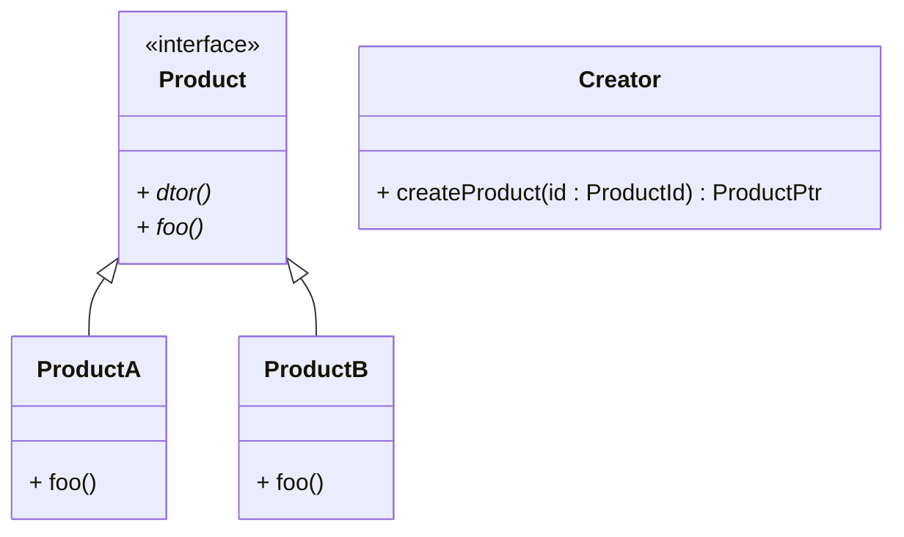
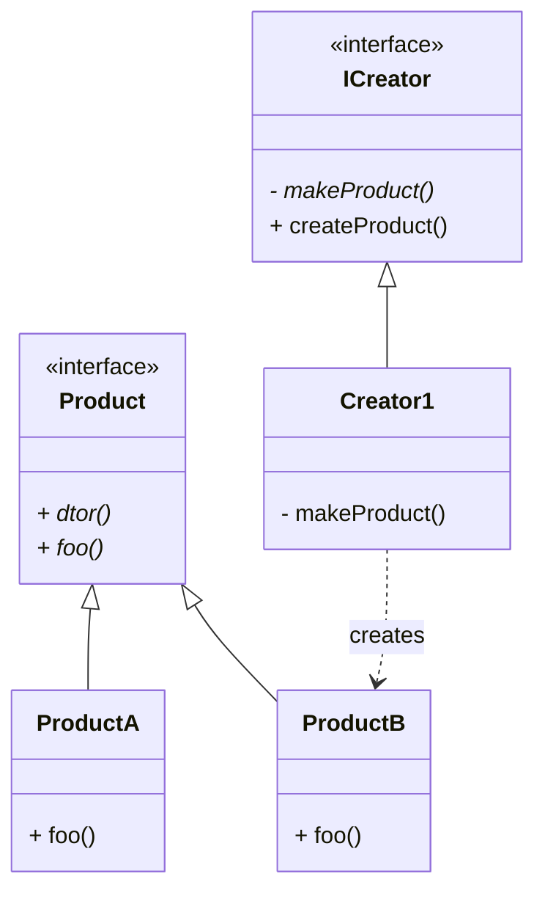
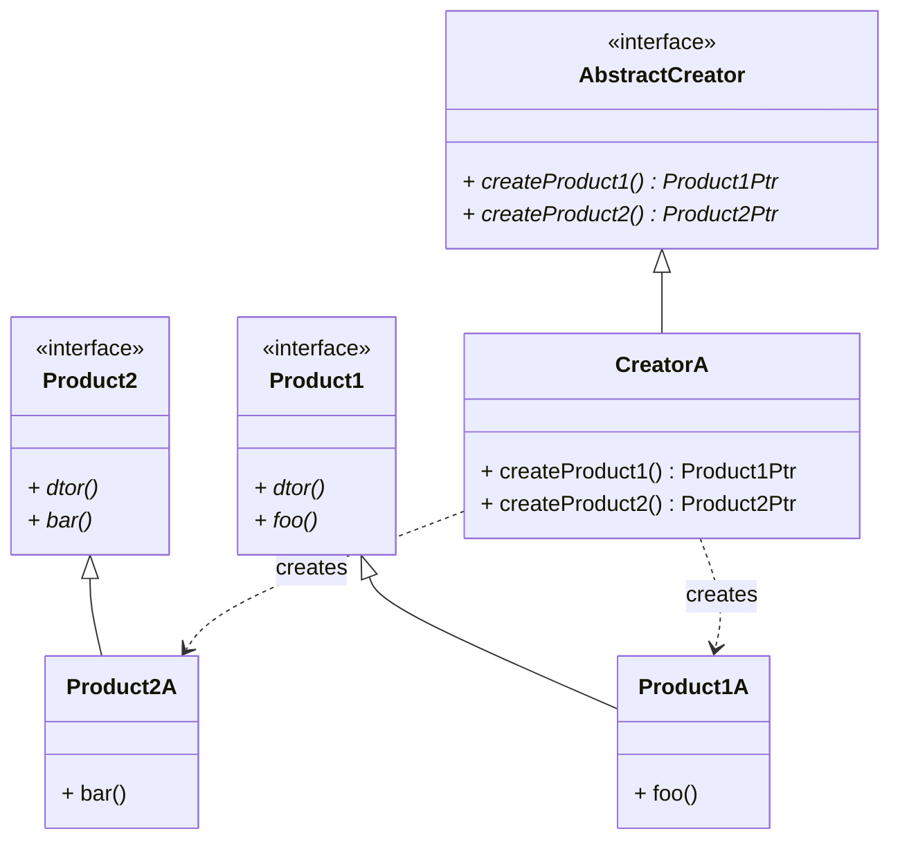
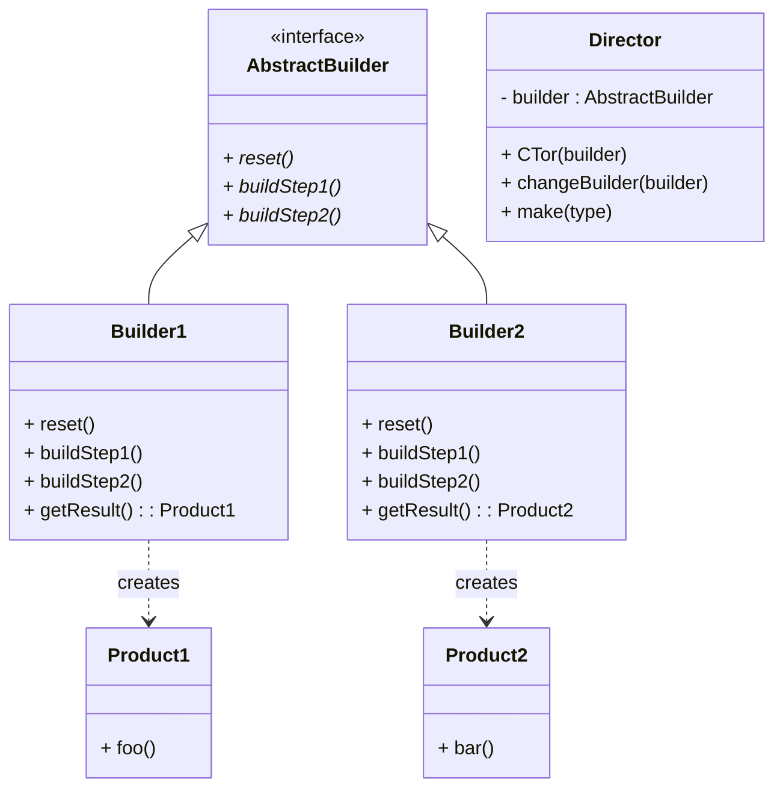
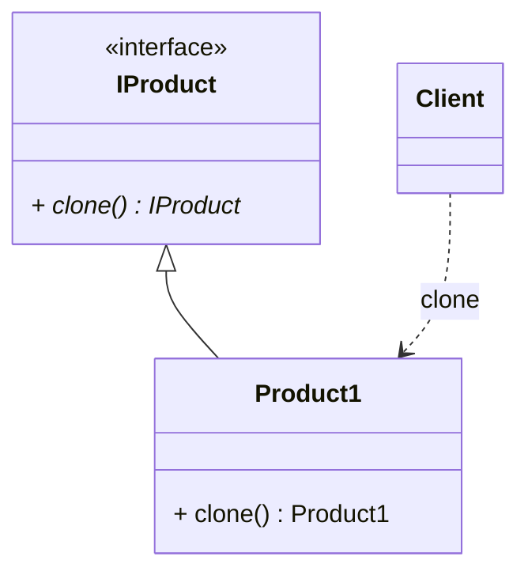
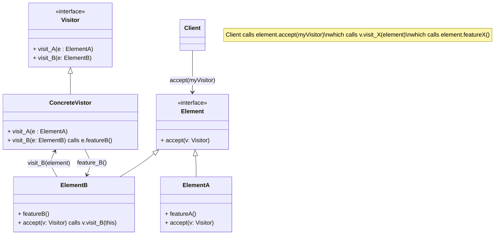

# Design Patterns

## DP - Creational - Factory Method - Identifier

```cpp
enum class ProductId { A, B, C, D, };

// interface for the object to be created
class Product {
public:
  virtual ~Product() = default;
  virtual void foo() = 0;
};

// concrete classes, whose objects will get created by the factory
class ProductA : public Product {
public:
  void foo() override { ... }
};
class ProductB : public Product {
public:
  void foo() override { ... }
};
...

// class with the factory method
class Creator {
public:
  unique_ptr<Product> createProduct(ProductId id) {
    switch (id) {
    case ProductId::A:
      return make_unique<ProductA>();
    case ProductId::B:
      return make_unique<ProductB>();
    ...
    }
    return nullptr;
  }
};
// alternatively, could have a base Creator interface class and a concrete derived Creator with a factory method

// using factory method pattern
unique_ptr<Creator> creator = make_unique<Creator>();
auto product = creator->createProduct(ProductId::D);
product->foo();
```

class diagram



## DP - Creational - Factory Method - Inheritance

Create objects without having to specify the exact class of the object that will be created. Define a separate operation `factoryMethod` for creating an object. Defer instantiation to subclasses.



```cpp
// interface for the object to be created
class Product {
public:
  virtual ~Product() = default;
  virtual void foo() = 0;
};

// concrete classes, whose objects will get created by the factory
class ProductA : public Product {
public:
  void foo() override { ... }
};
class ProductB : public Product {
public:
  void foo() override { ... }
};
...

// Base Class
class ICreator {
protected:
  virtual unique_ptr<Product> makeProduct() = 0;

public:
  unique_ptr<Product> createProduct() { // factory method
    return makeProduct();     // defined in a derived class
  }

  unique_ptr<ComplexProduct> createComplex() { // factory method
    auto a = makeProduct();    // complex product consists of 2 products
    auto b = makeProduct();
    return make_unique<ComplexProduct>(a, b);
  }
};

class CreatorA : public ICreator {
protected:
  unique_ptr<Product> makeProduct() override {
    return make_unique<ProductA>();
  }
};

class CreatorB : public ICreator {
protected:
  unique_ptr<Product> makeProduct() override {
    return make_unique<ProductB>();
  }
};

// using factory method pattern
unique_ptr<ICreator> creator = make_unique<CreatorA>();
auto product = creator->createProduct();
product->foo();

auto complex = creator->createComplex();
complex->blah();
```

## DP - Creational - Abstract Factory

create families of related objects without specifying their concrete classes. encapsulating a group of individual factories

```cpp
// abstract base
class MapSite {
public:
  virtual void enter() = 0;
  virtual ~MapSite() = default;
};

// concrete objects to be created
class Room : public MapSite {
  int roomNumber;
public:
  Room(int n) : roomNumber(n) {}
  void setSide(Direction d, MapSite* site) { ... }
  void enter() override {}

  Room(const Room&) = delete;
  Room& operator=(const Room&) = delete;
};

class Wall : public MapSite {
public:
  void enter() override {}
};

class Door : MapSite {
  Room* room1;
  Room* room2;
public:
  Door(Room* a, Room* b) : room1(a), room2(b) {}
  void enter() override {}
};

class Maze : public MapSite {
public:
  void addRoom(Room* r);
  Room* getRoom(int idx) const;
  void enter() override {}
};

// abstract factory base
class IMazeFactory {
public:
  virtual Room* createRoom(int id)            = 0;
  virtual Wall* createWall()                  = 0;
  virtual Door* createDoor(Room* a, Room* b)  = 0;
  virtual Maze* createMaze()                  = 0;
  virtual ~IMazeFactory()             = default;
};

// concrete factory class
class MazeFactory : public IMazeFactory {
public:
  Room* createRoom(int id)            override { return new Room(id); }
  Wall* createWall()                  override { return new Wall(); }
  Door* createDoor(Room* a, Room* b)  override { return new Door(a, b); }
  Maze* createMaze()                  override { return new Maze(); }
};

// client using abstract factory
class MazeGame {
public:
  Maze* createGame(IMazeFactory& factory) {
    // create some rooms, walls, doors, add them a maze
    Maze* maze = factory.createMaze();
    Room* r1 = factory.createRoom(1);
    Room* r2 = factory.createRoom(2);
    Door* aDoor = factory.createDoor(r1, r2);
    aMaze->addRoom(r1);
    aMaze->addRoom(r2);
    r1->setSide(North, factory.createWall());
    r1->setSide(East, aDoor);
    r1->setSide(South, factory.createWall());
    r1->setSide(West, factory.createWall());
    r2->setSide(North, factory.createWall());
    r2->setSide(East, factory.createWall());
    r2->setSide(South, factory.createWall());
    r2->setSide(West, aDoor);
    return maze;
  }
};

MazeGame game;
MazeFactory factory;
game.createGame(factory);
```

class diagram



## DP - Creational - Builder

assemble a complex object from its parts, encapsulates internal representation & construction steps of the complex object




```cpp
struct Car {
  GPS gps;
  TripComputer tripComputer;
  Engine engine;
  Seats seats;
};

struct UserManual {
  Pages pages;
};

struct IBuilder {
  virtual void reset() = 0;
  virtual void setSeats(...) = 0;
  virtual void setEngine(...) = 0;
  virtual void setTripComputer(...) = 0;
  virtual void setGPS(...) = 0;
};

class CarBuilder : public IBuilder {
  unique_ptr<Car> car;
public:
  CarBuilder() {
    reset();
  }
  void reset() override {
    car = make_unique<Car>();
  }
  void setSeats(...) override {
    car->seats.update(...);
  }
  void setEngine(...) override {
    car->engine.set(...);
  }
  void setTripComputer(...) override {
    car->tripComputer.set(...);
  }
  void setGPS(...) override {
    car->gps.set(...);
  }
  unique_ptr<Car> getResult() {
    unique_ptr<Car> result { move(car) };
    return result;
  }
};

class UserManualBuilder : public IBuilder {
  unique_ptr<UserManual> manual;
public:
  UserManualBuilder() {
    reset();
  }
  void reset() override {
    manual = make_unique<UserManualBuilder>();
  }
  void setSeats(...) override {
    manual->pages.describeSeats(...);
  }
  void setEngine(...) override {
    manual->pages.describeEnginet(...);
  }
  void setTripComputer(...) override {
    manual->pages.describeTripComputer(...);
  }
  void setGPS(...) override {
    manual->pages.describeGPS(...);
  }
  unique_ptr<UserManual> getResult() {
    unique_ptr<UserManual> result { move(manual) };
    return result;
  }
};

class Director {
public:
  void assembleSedan(IBuilder& builder) {
    builder.reset();
    builder.setSeats(5);
    builder.setEngine(new OrdinaryEngine);
    builder.setTripComputer(true);
    builder.setGPS(false);
  }
  void assembleSportsCar(IBuilder& builder) {
    builder.reset();
    builder.setSeats(2);
    builder.setEngine(new SportEngine);
    builder.setTripComputer(true);
    builder.setGPS(true);
  }
};

class Customer {
public:
  tuple<unique_ptr<Car>, unique_ptr<UserManaul>> makeCarWithUserManual() {
    Director director;

    CarBuilder car_builder;
    director.assembleSportsCar(car_builder);
    auto my_car = car_builder.getResult();

    UserManualBuilder manual_builder;
    director.assembleSportsCar(manual_builder);
    auto my_user_manual = manual_builder.getResult();
    return make_tuple(my_car, my_user_manual);
  }
};
```

## DP - Creational - Prototype

clone to produce new objects


```cpp
class MapSite {
public:
  virtual MapSite* clone() const = 0;
};

class Room : public MapSite {
public:
  Room* clone() const override {
    return new Room(*this);
  }
};

class IMazeFactory {
public:
  virtual Room* makeRoom(int n) const = 0;
};

class MazePrototypeFactory : public IMazeFactory {
  Room* modelRoom;
public:
  MazePrototypeFactory(Room *r) : modelRoom(r) {}

  Room* makeRoom(int) const override {
    return modelRoom->clone();
  }

  ...
};

MazeGame game;
MazePrototypeFactory factory(new Room(1));
game.createGame(factory);
```

## DP - Creational - Singleton

Check out Scott Meyers singleton implementation https://laristra.github.io/flecsi/src/developer-guide/patterns/meyers_singleton.html

```cpp
struct Singleton {
  static Singleton& instance() {
    static Singleton s;
    return s;
  }
  // do not allow creation
private:
  Singleton() {}
  ~Singleton() {}
  // not copyable
  Singleton(const Singleton&) = delete;
  Singleton& operator=(const Singleton&) = delete;
};
```


## DP - Creational - RAII
## DP - Creational - Object Pool
## DP - Creational - Multiton
## DP - Creational - Lazy Initialization
## DP - Creational - Dependency Injecton

- Service - contains some useful functionality
- Client - uses services
- Dependencies - services required by a client
- Interfaces - clients do not know how the services / dependencies are implemented. Only the API. Clients do not need to change when implementation of  services changes.
- Injector / Assembler / Container / Provider / Factory - introduces services to the client. Construct and connect clients and services, may be a complex object graph. No circular dependencies.

```cpp
class IService {
public:
};

class Client {
  IService* service;
public:
  Client(IService* svc) : service(svc) {}

  void setService(IService* svc) { service = svc; }

  void foo();
};

class ExampleService : public IService {
public:
};

IService* service = new ExampleService();
Client client = new Client(service);

client.foo();
```

- Separate the concerns of constructing objects and using them
- Loosely coupled programs
- Client does not construct the Services
- Dependency inversion principle
- Inversion of control - framework first constructs an object, then passes control flow to it

## DP - Structural - Adapter


## DP - Structural - Bridge
## DP - Structural - Composite
## DP - Structural - Decorator
## DP - Structural - Facade
## DP - Structural - Flyweight
## DP - Structural - Proxy

## DP - Behavioral - Chain of responsibility
## DP - Behavioral - Command

Turns a request into a stand-alone object that contains all information about the request. This transformation lets you pass requests as a method arguments, delay or queue a request's execution, and support undoable operations.

## DP - Behavioral - Interpreter
## DP - Behavioral - Iterator
## DP - Behavioral - Mediator
## DP - Behavioral - Memento
## DP - Behavioral - Observer
## DP - Behavioral - State
## DP - Behavioral - Strategy
## DP - Behavioral - Template method
## DP - Behavioral - Visitor

separate algorithms from the objects on which they operate.



```cpp
class Shape {
  virtual void move(int x, int y) = 0;
  virtual void draw() = 0;

  virtual void accept(Visitor& v) = 0;
};

class Dot : public Shape {
  // ...
  void accept(Visitor& v) override {
    v.visitDot(*this);
  }
};

class Circle : public Shape {
  // ...
  void accept(Visitor& v) override {
    v.visitCircle(*this);
  }
};

class Visitor {
  virtual void visitDot(Dot& d) = 0;
  virtual void visitCircle(Circle& c) = 0;
  // ...
};

class XMLExportVisitor {
  void visitDot(Dot& dot) override
  {
    // knows how to save dot to xml format
  }

  void visitCircle(Circle& circle) override
  {
    // knows how to save circle to xml format
  }
};

class App {
  vector<Shape*> all_shapes;

  void export_to_xml() {
    XMLExportVisitor exportVisitor;

    for (auto* shape : all_shapes) {
      shape->accept(exportVisitor);
    }
  }
}

```

## DP Summary

| Pattern | Description | |
|---|---|---|
|<td colspan=3>**Behavioral Patterns**</td>|
|Chain of Responsibility|Lets you pass requests along a chain of handlers. Upon receiving a request, each handler decides either to process the request or to pass it to the next handler in the chain|
|Command|Turns a request into a stand-alone object that contains all information about the request. This transformation lets you pass requests as a method arguments, delay or queue a request's execution, and support undoable operations|
|Iterator|Lets you traverse elements of a collection without exposing its underlying representation (list, stack, tree, etc.).|
|Mediator|Lets you reduce chaotic dependencies between objects. The pattern restricts direct communications between the objects and forces them to collaborate only via a mediator object|
|Memento|Lets you save and restore the previous state of an object without revealing the details of its implementation|
|Observer|Lets you define a subscription mechanism to notify multiple objects about any events that happen to the object they're observing|
|State|Lets an object alter its behavior when its internal state changes. It appears as if the object changed its class|
|Strategy|Lets you define a family of algorithms, put each of them into a separate class, and make their objects|
|Template Method|Defines the skeleton of an algorithm in the superclass but lets subclasses override specific steps of the algorithm without changing its structure|
|Visitor|Lets you separate algorithms from the objects on which they operate|Element.accept(v) Visitor.visit(e)|
|||
|<td colspan=3>**Structural Patterns**</td>|
|Adapter|Allows objects with incompatible interfaces to collaborate|
|Bridge|Lets you split a large class or a set of closely related classes into two separate hierarchies—abstraction and implementation—which can be developed independently of each other|
|Composite|Lets you compose objects into tree structures and then work with these structures as if they were individual objects|
|Decorator|Lets you attach new behaviors to objects by placing these objects inside special wrapper objects that contain the behaviors|
|Facade |Provides a simplified interface to a library, a framework, or any other complex set of classes|
|Flyweight |Lets you fit more objects into the available amount of RAM by sharing common parts of state between multiple objects instead of keeping all of the data in each object|
|Proxy |Lets you provide a substitute or placeholder for another object. A proxy controls access to the original object, allowing you to perform something either before or after the request gets through to the original object|
|||
|<td colspan=3>**Creational Patterns**</td>|
|Abstract Factory |Lets you produce families of related objects without specifying their concrete classes|MazeGame.createGame(factory) creates rooms, walls using factory.createBlah(). MazeFactory.createBlah() knows how to create Blah|
|Builder |Lets you construct complex objects step by step. The pattern allows you to produce different types and representations of an object using the same construction code|App has CarBuilder, UserManualBuilder, Director. App uses Director.assembleSportsCar(carBuilder), assembleSportsCar(manualBuilder) and then calls Director.getResult() to get car and user-manual|
|Factory Method (id)||Creator.createProduct(id) switch case on id to create|
|Factory Method (inheritance)|Provides an interface for creating objects in a superclass, but allows subclasses to alter the type of objects that will be created|ICreator.createProduct() calls makeProduct(), concrete Creator makeProduct() creates it|
|Prototype |Lets you copy existing objects without making your code dependent on their classes|You have a factory object and a game object. MazeGame.createGame(factory), factory uses clone() method on component objects to make a copy|
|Singleton |Lets you ensure that a class has only one instance, while providing a global access point to this instance|Single.getInstance() static method, see Scott Meyers' singleton|


## SOLID
- Single Responsibility - "Responsibility" means "Reason for change". A module should have only 1 responsibility, so that if it changes, it should change for 1 reason. If it has 2 responsibilities / roles, it may change if any of them changes.
- Open-Closed - interface should be open for extension, closed for modification. **Modifying an API may break existing code that uses the API. Extending the API does not break.**
- Liskov Substitution - if D derives from B, then wherever we can use B, we should be able to substitute with D. **Ok to substitute DERIVED in-place of BASE**
- Interface Segregation - split very large interfaces into smaller, more specific ones. So that a client object depends on a service object interface that has only the methods that the client uses. **SMALL RELEVANT INTERFACES**
- Dependency Inversion - high level abstractions (interfaces) **do not** depend on (concrete) low level details. Instead "details" / "concrete implementations" should depend on "abstractions" / "interfaces". **INTERFACES DO NOT DEPEND ON IMPLEMENTATION**


## Design goals
- Loose coupling
- Tight cohesion
- Separation of concerns
- Encapsulation
- Information hiding / Data hiding
- IoC Inversion of Control - Like a callback. Don't call us, we will call you / Hollywood principle. Unlike procedural programming, where user code calls library functions. In a callback mechanism, user code gets called to handle something. Inverted from procedural paradigm. Event loop, web server frameworks, dependency injection use IoC