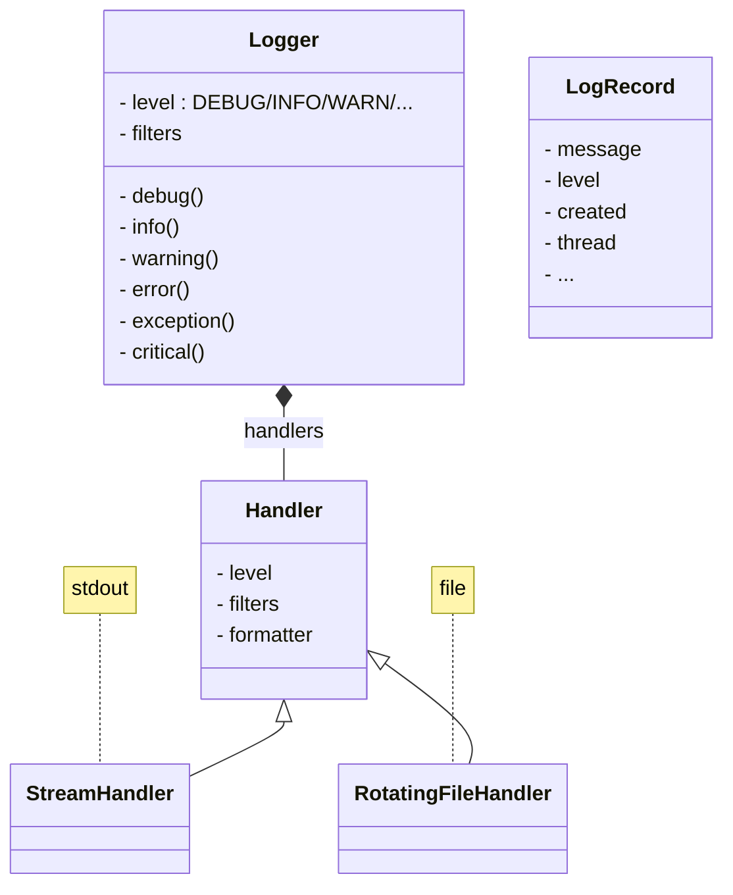
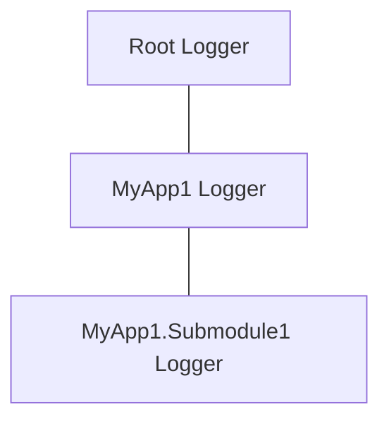

# Python

## Python arguments
```python
import argparse

def main(args):
  if args.enable:
    print("enabled")

if __name__ == '__main__':
  p = argparse.ArgumentParser()
  p.add_argument('--input-file', '-i', help='Input file name')
  p.add_argument('--output-file', '-o', help='Output file name')
  p.add_argument('args', nargs='?')
  p.add_argument("--enable", action="store_true")
  args = p.parse_args()

  try:
    main(args)
  except KeyboardInterrupt:
    # allow Ctrl+C to terminate gracefully
    pass
```

[Open this in wandbox](https://wandbox.org/permlink/sCg2uqmCur0DyguF)

## Class boilerplate

```python
from functools import total_ordering
@total_ordering
class Klass:
    def __init__(self, id: int, sval: str, ival: int):
        self._id: int = id
        self._sval: str = sval
        self._ival: int = ival

    def __eq__(self, other):
        if other.__class__ is not self.__class__:   # alternatively type(self)
            return NotImplemented
        return (other.id, other.sval, other.ival) == (self.id, self.sval, self.ival)

    def __repr__(self):
        return f"{self.__class__.__qualname__}(id={self.id!r}, sval={self.sval!r}, ival={self.ival!r})"

    def __hash__(self):     # by default classes are not hashable, define this to make it hashable
        return hash((self.id, self.sval, self.ival))

    @property
    def id(self):           # to make it immutable, so that Klass can be a key for a dict
        return self._id
    @property
    def sval(self):         # to make it immutable
        return self._sval
    @property
    def ival(self):         # to make it immutable
        return self._ival

    def __lt__(self, other):
        if other.__class__ is not self.__class__:
            return NotImplemented
        return (self.id, self.sval, self.ival) < (other.id, other.sval, other.ival)

    # total_ordering fills out the missing <=, > etc, as long as you have 2 like eq, lt

klass = Klass(id=1, sval="hello", ival=100)
```

### Using attrs and dataclass

Same class, but boilerplate methods are automatically generated

```python
from attrs import define, field                 | from dataclasses import dataclass, field
                                                |
@define(kw_only=True)                           | @dataclass(kw_only=True)
class User:                                     | class User:
    id: int = 0                                 |     id: int = 0
    sval: str = field(default="")               |     sval: str = field(default="")
    ival: int = field(repr=1)                   |     ival: int = field(repr=1)
                                                |
klass = Klass(id=1, sval="hello", ival=100)     | klass = Klass(id=1, sval="hello", ival=100)
```

- just calling `dataclasses.dataclass` on a class will modify the definition.
  ```python
  class X:
        ...

  Y = dataclasses.dataclass(X)
  assert(id(Y) == id(X))
  ```
  But dataclass will recreate a new class if you use slots, will not reuse the original class

- `dataclass(frozen=True, order=True)`, order makes it generate comparison functions, `__eq__, __lt__, ...`

- `for f in dataclasses.fields(o)` to iterate over all the fields
- `dataclasses.asdict(o), astuple(o)` work for dataclass objects
- can add property and other methods to dataclass definition

# Basics

## pathlib

```python
p = pathlib.Path(path_to_file)
p.name # basename
p.parent # dirname

if p.is_dir():
    dir_contents = list(p.iterdir())

all_json_files = list(p.glob('**/*.json')

new_path = p / 'blah' / 'haha.txt'

p.resolve() # realpath

p.exists()

with p.open() as ifp:
    process(ifp)
```

See: https://docs.python.org/3/library/pathlib.html

## Debugging
```python
print(globals())
print(locals())

import inspect
print(inspect.getsource(Klass.__init__))
```

## Compressed text to binary
```python
import bz2
import sys
import binascii

inp = bz2.BZ2File(sys.argv[1], 'r')

out = open(sys.argv[2], 'w')

for line in inp:
    date_str, ipaddr, data = line[:-1].split()
    payload = binascii.unhexlify(data)
    out.write(payload)

out.close()
inp.close()
```

## unzip gunzip the data
```python
import zlib
# this magic number can be inferred from the structure of a gzip file
d = zlib.decompressobj(16+zlib.MAX_WBITS)
indata = d.decompress(indata)
```

## Write to gzip file
```python
import gzip
outf = gzip.GzipFile(filename, 'wb')            | with gzip.open(filename, 'wb') as outf:
outf.write('bla bla')                           |   outf.write('bla bla')
```

## python msgpack unpack
```python
import msgpack
# Unpack the msgpack data
unpacker = msgpack.Unpacker()
unpacker.feed(indata)
header_data = unpacker.next()
payload_data = unpacker.next()
more_data = unpacker.next()

# alternatively
import msgpack
msg = msgpack.unpackb(data)
```

## time and date
```python

import datetime, time, pytz

## unix epoch time, seconds.microsecs since UTC epoch
print(time.time())
> 17226666259.561194
print(time.ctime())
> Wed Jul 24 10:30:00 2024
print(time.strftime('%Y%m%d'))
> 20240724
print(time.localtime())
> time.struct_time(...)

## utc time
print(datetime.datetime.utcnow())
> 2024-07-24 10:30:00.000000
print(datetime.datetime.now(datetime.timezone.utc))
> 2024-07-24 10:30:00.000000
print(datetime.datetime.now(pytz.utc))
> 2024-07-24 10:30:00.000000

## local time
print(datetime.datetime.now())
> 2024-07-24 10:30:00.000000
print(datetime.datetime.now().astimezone(pytz.timezone('America/Chicago'))
> 2024-07-24 10:30:00.000000-05:00
print(datetime.datetime.now().astimezone(pytz.timezone('America/New_York'))
> 2024-07-24 10:30:00.000000-04:00

## timestamp to datetime object
ns = 1e9
t_ns = 1413763200024882865 # nsec
dt = datetime.datetime.fromtimestamp(t_ns/ns)
print(dt)

## current local time string, now
time.asctime(time.localtime(time.time()))

now = datetime.datetime.now()
d = datetime.date.today()

## ISO 8601 format
'''
2024-09-18
2024-09-18 19:30:00
2024-09-18 19:30:00.000005
2024-09-18 19:30:00-05:00
2024-09-18T19:30:00-05:00
2024-09-18 19:30:00Z        i.e. UTC time, offset 0:00
2024-09-18 193000
20240918 193000
20240918T193000
20240918T193000123456       i.e. 2024-09-18 19:30:00.123456
'''

dt_str = '2024-09-18 13:30:59.012345'     # local_time
dt = datetime.datetime.fromisoformat(dt_str)

dt.timestamp()
> 1726666259.012345                       # utc epoch time

dt.isoformat() 
> 2024-09-18 13:30:59.012345

import numpy as np, pandas as pd
pd.to_datetime('today')
> Timestamp('2024-09-19 08:53:05.326202')
np.datetime64('today')
> numpy.datetime64('2024-09-19')
np.datetime64('now')
> numpy.datetime64('2024-09-19T13:53:40')
```

### performance - measuring time

```python
import time

start = time.perf_counter()         # seconds, with highest clock precision
...
end = time.perf_counter()
elapsed_secs = end-start


start = time.perf_counter_ns()      # better, int, no precision lost due to float conversion
...
end = time.perf_counter_ns()
elapsed_nanosecs = end-start

```

## python unittests
```python
import unittest
class MyTestCase(unittest.TestCase):
    def setUp(self):
        pass
    def tearDown(self):
        pass
    def test_bla_bla(self):
        self.assertIn(needle, data)
        self.assertEqual()
        self.assertTrue()
        self.assertFalse()
        self.fail('Always fails')

if __name__ == '__main__':
    unittest.main(warnings='ignore')
```

## python properties

```python
class World:
    def __init__(self, msg):
        self._msg = msg

    @property
    def msg(self):
        return self._msg

    @msg.setter
    def msg(self, value):
        self._msg = value


w = World("hello")
print(w.msg)    # getter
w.msg = "hi"    # setter
```

### using property class

```python
class World(object):
    def __init__(self, msg):
        self.__msg = msg
    def greet(self):
        return self.__msg
    def set(self, msg):
        self.__msg = msg
    msg = property(greet, set)

w = World("hello")
print(w.msg)    # getter
w.msg = "hi"    # setter
```

## python logging

### simple logging
```python
import logging
# level = { NOTSET, DEBUG, INFO, WARN, ERROR, CRITICAL }
logging.basicConfig(filename=LOG_FILENAME,
                    level=logging.DEBUG,
                    format='[%(levelname)s] %(asctime)s - %(message)s'
                    )
logging.debug('This message should go to the log file')
logging.info(...)
logging.error(...)
```

### logging diagram



loggers: `root`, `MyApp1`, `MyApp1.SubModule1`



### logging config file

```python

import logging
import logging.config
import logging.handlers

logger = logging.getLogger("myapp")

def main():
    # setup logging
    config_file = "conf/logging-stderr.json"
    with open(config_file) as inp:
        import json
        config = json.load(inp)
        # or
        #pip install pyyaml
        #import yaml
        #config = yaml.safe_load(inp)
    logging.config.dictConfig(config)

    logging.basicConfig(level="INFO") # root logger level

    logger.debug("debug message")
    logger.info("info message")
    logger.warning("warning message")
    logger.error("error message")
    logger.critical("critical message")
    try:
        some_exception_throwing_code()
    except:
        logger.exception("exception message")

if __name__ == "__main__":
    main()
```

conf/logging-stderr.json

```json
{
    "version": 1,
    "disable_existing_loggers": false,
    "loggers": { "root": { "level": "DEBUG", "handlers": ["stderr", "file"] } },
    "handlers": {
        "stderr": { "class": "logging.StreamHandler", "level": "WARNING", "formatter": "simple", "stream": "ext://sys.stderr" },
        "file": { "class": "logging.handlers.RotatingFileHandler", "level": "DEBUG", "formatter": "detailed", "filename": "logs/myapp.log", "maxBytes": 100000, "backupCount": 3 },
        "queue_handler": { "class": "logging.handlers.QueueHandler", "handlers": [ "stderr", "file_json" ], "respect_handler_level": true }
    },
    "formatters": {
        "simple": { "format": "%(levelname)s: %(message)s", "datefmt": "%Y-%m-%dT%H:%M:%S%z" },
        "detailed": { "format": "[%(levelname)s|%(module)s|L%(lineno)d] %(asctime)s: %(message)s", "datefmt": "%Y-%m-%dT%H:%M:%S%z" }
    }
}
```

conf/logging-stderr.yaml
```yaml
version: 1
disable_existing_loggers: false
loggers:
  root:
    level: DEBUG
    handlers:
    - stderr
    - file
handlers:
  stderr:
    class: logging.StreamHandler
    level: WARNING
    formatter: simple
    stream: ext://sys.stderr
  file:
    class: logging.handlers.RotatingFileHandler
    level: DEBUG
    formatter: simple
    filename: logs/myapp.log
    maxBytes: 10000
    backupCount: 3
formatters:
  simple:
    format: '%(levelname)s: %(message)s'
    datefmt: '%Y-%m-%dT%H:%M:%S%z'
```

## Windows Commands using WSH

```python
import win32com.client as wc
shell = wc.Dispatch("WScript.Shell")
# AppActivate CreateShortcut CurrentDirectory Environment Exec ExpandEnvironmentStrings LogEvent Popup RegDelete RegRead RegWrite Run SendKeys SpecialFolders
shortcut = shell.CreateShortCut(path)
# Arguments Description FullName Hotkey IconLocation Load RelativePath Save TargetPath WindowStyle WorkingDirectory
shortcut.TargetPath
print(path, shortcut.TargetPath, shortcut.Arguments)

shortcut.TargetPath = path_to_the_target_file
shortcut.Save()
```

# Network

## Server - Synchronous

```python
import socket

s = socket.socket()
print("Socket created")

port = 40000
s.bind(('', port))
print("Socket bound to port", port)

s.listen(5)
print("Socket is listening")

while True:
    c, addr = s.accept()
    print("Client connected", addr)

    s = c.recv()
    print(s)

    c.send(b'Hello world\n')
    print("Sent a message to the client")

    c.close()
    print("Closed connection to client")
```

## Client - Synchronous
```python
import socket

s = socket.socket()
print("Socket created")

port = 40000

s.connect(('127.0.0.1', port))
s.send(b'Hi there')
buf = s.recv(1024)
print(buf)

s.close()
```

## Server - Asynchronous
```python
import asyncio
import subprocess

def run_command(com: str) -> None:
    try:
        pro = subprocess.run(com.split(), capture_output=True, text=True)
        if pro.stdout:
            return f"out----------------\n{pro.stdout}"
        elif pro.stderr:
            return f"err----------------\n {pro.stderr}"
        else:
            return f"[executed]"
    except Exception as ex:
        print("exception occurred", ex)
        return f"   [subprocess broke]"


async def handle_client(reader, writer):
    print(f"Connected to {writer.get_extra_info('peername')}")

    while True:
        data = await reader.read(100000)
        message = data.decode().strip()
        if not message:
            break
        print(f"Received message: {message}")
        res = run_command(message)
        writer.write(res.encode())
    print("Closing connection")
    writer.close()


async def start_server():
    server = await asyncio.start_server(handle_client, "127.0.0.1", 2000)
    print("Server started")
    await server.serve_forever()

asyncio.run(start_server())

```

## Client - Asynchronous
```python
import asyncio


async def telnet_client(host: str, port: int, username: str, password: str) -> None:
	reader, writer = await asyncio.open_connection(host, port)
	print(f"connected to ({host}, {port})")

	# Login to the server, if the server requires authentication
	""" await writer.write(f"{username}\n".encode())
		await writer.write(f"{password}\n".encode()) """

	while True:
		command = input("\nEnter a command: ")
		if not command:
			print("[No command] ...closing connection ")
			break
		writer.write(f"{command}\n".encode())
		data = await reader.read(100000)
		print(data.decode().strip())

# there is a telnet server (telnet_server.py) listening on localhost port=23
asyncio.run(telnet_client("127.0.0.1", 2000, "username", "password"))
```


# Async

```python
import asyncio

async def do_work1():
    await asyncio.sleep(4)
    return "work1 done"

async def do_work2():
    await asyncio.sleep(5)
    return "work2 done"

async def main():
    # ...
    tasks = asyncio.gather(do_work1(), do_work2())
    result1, result2 = await tasks
    assert result1 == "work1 done"
    assert result2 == "work2 done"

    ## alternatively
    task1 = asyncio.create_task(do_work1())
    task2 = asyncio.create_task(do_work2())
    result1 = await task1
    result2 = await task2

    ## alternatively
    tasks = [ do_work1(), do_work2() ]
    done, pending = await asyncio.wait(tasks)
    for task in done:
        result = task.result()

    ## alternatively
    async with asyncio.TaskGroup() as grp:
        tasks = [ grp.create_task(do_work1()), grp.create_task(do_work2()) ]
        # automatically ensures tasks are awaited


if __name__ == "__main__":
    asyncio.run(main(), debug=True)
```

## Async main

```python

async def async_main():
	db = await aioredis.create_redis_pool(url)
	db = await aioredis.from_url(url[, decode_responses=True])

	keys = await db.keys('*')
	s = await db.get(key)

	results = await asyncio.gather(async_func1(), async_func2(), ...)

	await asyncio.wait_for(async_func1(), timeout=secs)
	# throws asyncio.TimeoutError exception

	await asyncio.sleep(secs)

asyncio.run( async_main() )
# note: verbose diagnostic messages
asyncio.run( async_main(), debug=True )
```

## Blocking/CPU bound function
Do not call it on event loop

```python
def blocking_func():
	time.sleep(1000)  # blocking

def cpu_bound():
	return sum([ i*i for i in range(1, 10_000_000)])

await asyncio.gather(
	asyncio.to_thread( blocking_func )
	asyncio.to_thread( cpu_bound )
	asyncio.nonblocking_coro()
)
```

```python
loop = asyncio.get_running_loop()
loop.run_in_executor(
	pool=None, # use the default executor
	blocking_io
)

with concurrent.futures.ThreadPoolExecutor() as pool:
	loop.run_in_executor(
		pool,
		blocking_io
	)

with concurrent.futures.ProcessPoolExecutor() as pool
	loop.run_in_executor(
		pool,
		cpu_bound
	)
```

## Event loop
```python
loop = asyncio.get_event_loop()
```

## Random numbers
```python
random.seed(number)
random.randint(b, e)
random.randuniform(b, e)

with open('/dev/urandom', 'rb') as f:
	f.read(100)

```

## Logging, debug
```python
logging.getLogger("asyncio").setLevel(logging.WARNING)
asyncio.run( coro(), debug=True )
```

## virtualenv for async
```shell
conda create -n my-async-env python=3.10 pandas=1.4.3 aioredis=2.0.1 fastapi uvicorn
```
# Regular expressions

```python
def comment_remover(text):
    def replacer(match):
        s = match.group(0)
        if s.startswith('/'):
            return " " # note: a space and not an empty string
        else:
            return s
    pattern = re.compile(
        r'//.*?$|/\*.*?\*/|\'(?:\\.|[^\\\'])*\'|"(?:\\.|[^\\"])*"',
        re.DOTALL | re.MULTILINE
    )
    return re.sub(pattern, replacer, text)
```

# Beautiful Soup

## Web requests

```python
import requests

page = requests.get(URL)
page.text       # can have encoding problems
page.content    # raw bytes, no encoding issues

from bs4 import BeautifulSoup as BS
soup = BS(page.content, 'html.parser')

title_tag = soup.title
title_tag.contents[0].contents
for child in title_tag.children:  # direct children
  child

title_tag.string

soup.body.b
soup.a          # first tag by that name
soup.find_all('a')
head_tag = soup.head
head_tag.contents[0]                # direct children
head_tag.descendants                # all children recursively

head_tag.parent
head_tag.parents                    # recursive up

head_tag.next_sibling
head_tag.previous_sibling

head_tag.next_element
head_tag.previous_element
head_tag.next_elements
head_tag.previous_elements

soup.find_all('a') = soup.a = soup('a')
soup.body.find_all(string='python') = soup.body(string='python')
```

```text
<div id="SomeId">
  ...
  <div class="SomeClass SomeOtherClass">
    <h2 class="SubClass">...</h2>
    <p class="SubClass">...</p>
  </div>
</div>
```

## Beautiful Soup Find
```python
soup.find_all('b')
soup.find_all(re.compile("^b"))     # import re, matches body, b, ...
soup.find_all(['a', 'b'])
soup.find_all(True)
soup.find_all(predicate)            # predicate(tag) -> bool
soup.find_all(name, attrs, recursive, string, limit, ...)
                                    # name ~ tagname, predicate, ...
                                    # attrs ~ id, class_, dict(attr, val) ...
```

## Beautiful Soup Find by id
```python
results = soup.find(id='SomeId')
results.prettify()
```

## Beautiful Soup Find by div
```python
items = soup.find_all('div', class_='SomeClass')
for item in items:
  child_item = item.find('h2', class_='SubClass')
  child_item = item.find('p', class_='SubClass')
  str(child_item)
  child_item.text
  child_item.text.strip()
```

## Beautiful Soup Find by Content Text
```python
all_h2 = results.find_all('h2')
all_h2 = results.find_all('h2', string='...')
all_h2 = results.find_all('h2', string=lambda t: '...' in t.lower())
for h2_item in all_h2:
  item = h2.parent.parent.parent
  child_item = item.find('h3', class_='SomeClass')
  child_item.text.strip()
  child_item['attrib']
  child_item['href']
```

See also: https://www.crummy.com/software/BeautifulSoup/bs4/doc/

# XML Parsing

## minidom
```python

from xml.dom import minidom, Node

doc = minidom.parse(fname)
root = doc.documentElement

if root.hasAttribute('id'):
    schema_id = root.getAttribute('id')

types = root_node.getElementsByTagName("types")
for t in types:
    for c in t.childNodes:
        if c.nodeType == Node.ELEMENT_NODE:
            if c.nodeName == 'blah'
                name = c.getAttribute('name')
                attrib2 = c.getAttribute('attrib2')


node.hasAttribute('...')
node.getAttribute('...')
node.lastChild.nodeValue
node.childNodes[0].nodeValue
node.nodeType == Node.ELEMENT_NODE
node.nodeName
node.nodeType == Node.TEXT_NODE
node.data
```

## beautiful soup

```python

# pip install beautifulsoup4 lxml html5lib

from bs4 import BeautifulSoup

soup = BeautifulSoup(markup, "xml")

```

## lxml

```python
import lxml.etree as ET

dom = ET.parse(xml_filename)
xslt = ET.parse(xsl_filename)
transform = ET.XSLT(xslt)
newdom = transform(dom)
print(ET.tostring(newdom, pretty_print=True))
```

## xml etree
```
import xml.etree.ElementTree as ET
from xml.etree.ElementTree import XMLSchema

# Load the XML schema
schema = XMLSchema('X110.xsd')
# Parse the XML document
tree = ET.parse('X110.xml')
# Validate the XML document
if not tree.validate(schema):
    raise ValueError('The XML document is invalid.')
```

# Jinja2

```python
import jinja2

jinja_env = jinja2.Environment(loader=jinja2.FileSystemLoader(searchpath="path-to-template-dir"), line_statement_prefix='%')
template = jinja_env.get_template('template-file-name.jinja')
with open('out-file-name', 'w') as ofp:
    ofp.write(template.render(**data_dict))
```


# Boost Python

## Boost Python CMake
```cmake
include_directories(${PYTHON_INCLUDE_DIRS})

add_library(MY_PYTHON_MODULE_NAME SHARED file1.cpp file2.cpp)
set_target_properties(MY_PYTHON_MODULE_NAME PROPERTIES PREFIX "")
target_link_libraries(MY_PYTHON_MODULE_NAME my_libname ${THREATS_LIBRARIES} ${PYTHON_LIBRARIES} ${Boost_PYTHON_LIBRARY})
install(TARGETS MY_PYTHON_MODULE_NAME LIBRARY DESTINATION python/foo/bar)

# copy all *.py files to install-dir
include(PythonMacros)
install_python_library_modules()

include(TestMacros)
add_test_env_path("PYTHONPATH", "${CMAKE_CURRENT_SOURCE_DIR")
```

## Boost Python C++ files
```cpp
#include <boost/python.hpp>
#include <boost/python/suite/indexing/vector_indexing_suite.hpp>

using namespace boost::python;

BOOST_PYTHON_MODULE(my_module_name)
{
}

enum_<CPP_ENUM_TYPENAME>("PYTHON_ENUM")
    .value("PYTHON_ENUM_1", CPP_ENUM_TYPENAME::cpp_enum_1)
    .value("PYTHON_ENUM_1", CPP_ENUM_TYPENAME::cpp_enum_1)
    .value("PYTHON_ENUM_1", CPP_ENUM_TYPENAME::cpp_enum_1)
    .value("PYTHON_ENUM_1", CPP_ENUM_TYPENAME::cpp_enum_1)
    ;


class_<CPP_CLASS_TYPENAME>("PYTHON_KLASS", init<>())
    .def_readwrite("field1", &InstrumentLeg::field1)
    .def_readwrite("field2", &InstrumentLeg::field2)
    .def(self_ns::str(self_ns::self))
    .def(self_ns::repr(self_ns::self))
    .add_property(field1, get_field1, set_field1)
    ;


CHECKED_VECTOR_INDEXING_SUITE(CPP_CLASS_TYPENAME)

class CPPKlass
{
    CPPKlass(ctor_signature);
    CPPKlass(other_ctor_signature);
};

#include <boost/python.hpp>

using boost::python;

void some_global_func();

BOOST_PYTHON_MODULE(module_name_in_python)
{
    // ctor
    class_<CPPKlass>("PythonKlass", init<ctor_signature>())
        .def(init<other_ctor_signature>())
        .def_readonly("member1", &CPPKlass::member1)
        .def_readwrite("member1", &CPPKlass::member1)
        // access to private member2
        .add_property("member2", &CPPKlass::get_member2, &CPPKlass::set_member2)
        .def(-self)        // __neg__, unary minus operator
        .def(self + self)  // __add__,  operator+(CPPKlass&)
        .def(self * self)  // __mul__
        .def(self * int()) // __add__, heterogeneous
        .def(int() + self) // __radd__
        ;
    class_<CPPKlass, bases<Base1, Base2>>("PythonKlass")
        ;

    def("ordinary_function", some_global_func);
}
```

```cpp

#### CHECKED_VECTOR_INDEXING_SUITE(objtype)

struct Foo
{
    int32_t myint;
};

BOOST_PYTHON_MODULE(mymodule)
{
    class_<Foo>("Foo", init<>())
        .def_readwrite("myint", &Foo::myint)
        ;
    CHECKED_VECTOR_INDEXING_SUITE(Foo)
}

#### CHECKED_MAP_INDEXING_SUITE(keytype,objtype)

struct Foo
{
  int32_t myint;
};

BOOST_PYTHON_MODULE(mymodule)
{
  class_<Foo>("Foo", init<>())
    .def_readwrite("myint", &Foo::myint)
    ;
  CHECKED_MAP_INDEXING_SUITE(uint64_t, Foo)
}

#### GETTERS_SETTERS_DEF(), GETTERS_SETTERS_IMPL()

struct Foo
{
  int64_t px;
  string symbol;
};

GETTERS_SETTERS_IMPL(Foo, px)
GETTERS_SETTERS_IMPL(Foo, symbol)

BOOST_PYTHON_MODULE(mymodule)
{
  class_<Foo>("Foo", init<>())
    GETTERS_SETTERS_DEF(px)
    GETTERS_SETTERS_DEF(symbol)
    ;
}

#### COMPARISON_DEFS

class Foo
{
  //...
};

BOOST_PYTHON_MODULE(mymodule)
{
  class_<Foo>("Foo", init<>())
    //...
    COMPARISON_DEFS()
    ;
}

#### EXPORT_STATIC_VAR

//const static int64_t MYVAR; // defined in .cpp

BOOST_PYTHON_MODULE(mymodule)
{
  EXPORT_STATIC_VAR(int64_t, MYVAR)
}
```


# Glossary
- dunder (double underscore) / magic methods / object protocols --
- generator
- hash
- dataclasses / attrs
- `self.__class__`, `self.__class__.__name__`, `self.__class__.__qualname__`
- `hex(id(obj1))`
- key for `dict` should be 1) hashable 2) immutable 3) have equality
- pseudo private variable, defined with _ in a class
- Use `dataclass(frozen=True)` for making it immutable, for a dict key


## Do not do these

- Avoid manual string formatting, use f-string
- Manually closing a file, use `with` for context manager
- Do not catch with bare `except` clause, it will also trap Ctrl-C (`KeyboardInterrupt`). Instead specify exception type, like `except Exception`
- Caret is xor not power, not exponentiation (which is `x ** y`)
- Do not put mutable values in function default arguments, they are evaluated at definition time, not at time of evaluation. Like `def append(n, l=[])`, single list shared by all calls with default. instead `def append(n, l=None): if l is None: l=[]`
- Use comprehension when appropriate, but do not go crazy with using comprehension everywhere, for readability ok to sometimes use loops
- Do not check `type(o) == typename` with equality, instead use `isinstance(o, typename)`. To let derived types match
- Do not use equality for `None, True, False`, instead use `is None, is True, is False`
- Do not check `if bool(x) or len(x) != 0:`, equivalent to `if x`
- Do not use `for i in range(len(l)): l[i]`, instead `for v in l:`, if you need index too, `for i, v in enumerate(l):`. To sync between 2 lists use zip, `for a, b in zip(m, n):`
- Do not use dictionary keys method for looping, `for k in d.keys():`, instead use `for k in d:`. if you need both key, value, then use `for k, v in d.items():`
- Do not unpack tuple items individually with index, use tuple-unpacking `x, y = point`. can also swap `x, y = y, x` with unpacking
- Do not run commands with subprocess with `shell=True` like `subprocess.run(["ls -l"], capture_output=True, shell=True)`, lots of security loop holes. Use `subprocess.run(["ls", "-l"], capture_output=True)`
- Do not loop over lists to do simple math,  like `x=list(range(100)); y=list(range(100)); s = [a+b for a,b in zip(x,y)]` use numpy, pandas `x = np.arange(100); y = np.arange(100); s = x+y`

## Do these

- Round numbers with format specfier `v=1.23456; print(f'{v:.2f}')`, do not round it manually with `round(v, 2)`
- Use pathlib to manipulate path. `import pathlib; x=pathlib.Path(...)`
  - `x.with_suffix('.txt')`
  - `x.parent`
  - `x.with_name('something.txt')`
  - `x.parent.joinpath('subdir1', 'subdir2')`
  - `x.glob(pattern)`
  - prefer `pathlib` instead of `os.path`
- file io, pass `fp: typing.TextIO` to a function
  ```python
  def do_file_io(fp: typing.TextIO):
    fp.read(...)

  with open(filepath, "rt") as fp:          | with gzip.open(filepath, "rt") as fp:
    do_file_io(fp)                          |    do_file_io(fp)
  ```
- concat strings
  - `s += f"some string {i}"`
  - `ss = io.StringIO(); ss.write(f"some string {i}"); s = ss.getvalue()`
  - `l = []; l.append(f"some string {i}"); s = "".join(l);`

https://www.youtube.com/@mCoding
https://github.com/mCodingLLC/VideosSampleCode

https://www.youtube.com/@mathbyteacademy/videos
https://github.com/fbaptiste/python-blog

# Conda cheat sheet

```
conda create -n new_env_name python=3.12 pandas

conda activate new_env_name
activate new_env_name

conda install pkg_name_to_install

# to add conda envs to jupyter notebooks
conda install ipykernel
python -m ipykernel install --user --name=new_env_name

conda info

python -m pip install mysql-connector-python
>>> import mysql.connector
>>> cnx = mysql.connector.connect(host=..., user=..., password=..., database=...)
>>> cursor = cnx.cursor()
>>> cursor.execute(query)
>>> for row in cursor: print(x)
>>> cursor.close()
>>> cnx.close()

conda deactivate

```
