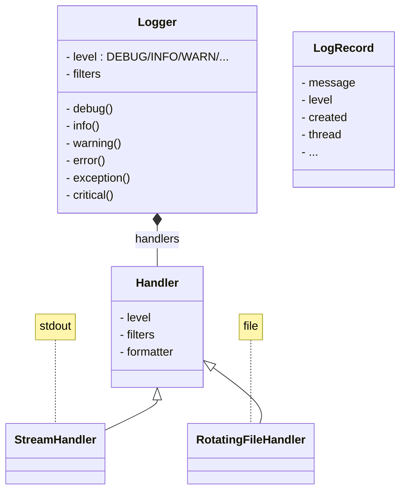
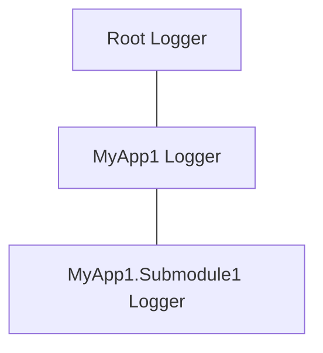

# Python

## Python arguments
```python
import argparse

def main(args):
  if args.enable:
    print("enabled")

if __name__ == '__main__':
  p = argparse.ArgumentParser()
  p.add_argument('--input-file', '-i', help='Input file name')
  p.add_argument('--output-file', '-o', help='Output file name')
  p.add_argument('args', nargs='?')
  p.add_argument("--enable", action="store_true")
  args = p.parse_args()

  main(args)
```

## Class boilerplate

```python
class Klass:
    def __init__(self, id: int, sval: str, ival: int):
        self.id: int = id
        self.sval: str = sval
        self.ival: int = ival

    def __eq__(self, other):
        if other.__class__ is not self.__class__:
            return NotImplemented
        return (other.id, other.sval, other.ival) == (self.id, self.sval, self.ival)

    def __repr__(self):
        return f"{self.__class__.__name__}(id={self.id!r}, sval={self.sval!r}, ival={self.ival!r})"

    def __hash__(self):
        ...

    def __lt__(self, other):
        ...

klass = Klass(id=1, sval="hello", ival=100)
```

### Using attrs and dataclass

Same class, but boilerplate methods are automatically generated

```python
from attrs import define, field                 | from dataclasses import dataclass, field
                                                |
@define(kw_only=True)                           | @dataclass(kw_only=True)
class User:                                     | class User:
    id: int = 0                                 |     id: int = 0
    sval: str = field(default="")               |     sval: str = field(default="")
    ival: int = field(repr=1)                   |     ival: int = field(repr=1)
                                                |
klass = Klass(id=1, sval="hello", ival=100)     | klass = Klass(id=1, sval="hello", ival=100)
```

## Web requests

```python
import requests

page = requests.get(URL)
page.text       # can have encoding problems
page.content    # raw bytes, no encoding issues

from bs4 import BeautifulSoup as BS
soup = BS(page.content, 'html.parser')

title_tag = soup.title
title_tag.contents[0].contents
for child in title_tag.children:  # direct children
  child

title_tag.string

soup.body.b
soup.a          # first tag by that name
soup.find_all('a')
head_tag = soup.head
head_tag.contents[0]                # direct children
head_tag.descendants                # all children recursively

head_tag.parent
head_tag.parents                    # recursive up

head_tag.next_sibling
head_tag.previous_sibling

head_tag.next_element
head_tag.previous_element
head_tag.next_elements
head_tag.previous_elements

soup.find_all('a') = soup.a = soup('a')
soup.body.find_all(string='python') = soup.body(string='python')
```

```text
<div id="SomeId">
  ...
  <div class="SomeClass SomeOtherClass">
    <h2 class="SubClass">...</h2>
    <p class="SubClass">...</p>
  </div>
</div>
```

## Find
```python
soup.find_all('b')
soup.find_all(re.compile("^b"))     # import re, matches body, b, ...
soup.find_all(['a', 'b'])
soup.find_all(True)
soup.find_all(predicate)            # predicate(tag) -> bool
soup.find_all(name, attrs, recursive, string, limit, ...)
                                    # name ~ tagname, predicate, ...
                                    # attrs ~ id, class_, dict(attr, val) ...
```

## Find by id
```python
results = soup.find(id='SomeId')
results.prettify()
```

## Find by div
```python
items = soup.find_all('div', class_='SomeClass')
for item in items:
  child_item = item.find('h2', class_='SubClass')
  child_item = item.find('p', class_='SubClass')
  str(child_item)
  child_item.text
  child_item.text.strip()
```

## find by content text
```python
all_h2 = results.find_all('h2')
all_h2 = results.find_all('h2', string='...')
all_h2 = results.find_all('h2', string=lambda t: '...' in t.lower())
for h2_item in all_h2:
  item = h2.parent.parent.parent
  child_item = item.find('h3', class_='SomeClass')
  child_item.text.strip()
  child_item['attrib']
  child_item['href']
```

See also: https://www.crummy.com/software/BeautifulSoup/bs4/doc/

## Windows Commands using WSH

```python
import win32com.client as wc
shell = wc.Dispatch("WScript.Shell")
# AppActivate CreateShortcut CurrentDirectory Environment Exec ExpandEnvironmentStrings LogEvent Popup RegDelete RegRead RegWrite Run SendKeys SpecialFolders
shortcut = shell.CreateShortCut(path)
# Arguments Description FullName Hotkey IconLocation Load RelativePath Save TargetPath WindowStyle WorkingDirectory
shortcut.TargetPath
print(path, shortcut.TargetPath, shortcut.Arguments)

shortcut.TargetPath = path_to_the_target_file
shortcut.Save()
```

## Basics

### Debugging
```python
print(globals())
print(locals())

import inspect
print(inspect.getsource(Klass.__init__))
```

### Compressed text to binary
```python
import bz2
import sys
import binascii

inp = bz2.BZ2File(sys.argv[1], 'r')

out = open(sys.argv[2], 'w')

for line in inp:
    date_str, ipaddr, data = line[:-1].split()
    payload = binascii.unhexlify(data)
    out.write(payload)

out.close()
inp.close()
```

### unzip gunzip the data
```python
import zlib
# this magic number can be inferred from the structure of a gzip file
d = zlib.decompressobj(16+zlib.MAX_WBITS)
indata = d.decompress(indata)
```

### Write to gzip file
```python
import gzip
outf = gzip.GzipFile(filename, 'wb')
outf.write('bla bla')
```

### python msgpack unpack
```python
import msgpack
# Unpack the msgpack data
unpacker = msgpack.Unpacker()
unpacker.feed(indata)
header_data = unpacker.next()
payload_data = unpacker.next()
more_data = unpacker.next()

# alternatively
import msgpack
msg = msgpack.unpackb(data)
```

### time and date
```python

import datetime
import time

## timestamp to datetime object
ns = 1e9
t_ns = 1413763200024882865 # nsec
dt = datetime.datetime.fromtimestamp(t_ns/ns)
print(dt)

## current local time string, now
time.asctime(time.localtime(time.time()))
```

### python unittests
```python
import unittest
class MyTestCase(unittest.TestCase):
    def setUp(self):
        pass
    def tearDown(self):
        pass
    def test_bla_bla(self):
        self.assertIn(needle, data)
        self.assertEqual()
        self.assertTrue()
        self.assertFalse()
        self.fail('Always fails')

if __name__ == '__main__':
    unittest.main(warnings='ignore')
```

### python properties
```python
class World(object):
    def __init__(self, msg):
        self.__msg = msg
    def greet(self):
        return self.__msg
    def set(self, msg):
        self.__msg = msg
    msg = property(greet, set)
```

### python logging
```python
import logging
# level = { NOTSET, DEBUG, INFO, WARN, ERROR, CRITICAL }
logging.basicConfig(filename=LOG_FILENAME,
                    level=logging.DEBUG,
                    )
logging.debug('This message should go to the log file')
```

Diagram


```mermaid
classDiagram
direction TD

class Logger {
    - level : DEBUG/INFO/WARN/...
    - filters
    - debug()
    - info()
    - warning()
    - error()
    - exception()
    - critical()
}

class Handler {
    - level
    - filters
    - formatter
}

Logger *-- Handler : handlers
Handler <|-- StreamHandler
Handler <|-- RotatingFileHandler

note for StreamHandler "stdout"
note for RotatingFileHandler "file"

class LogRecord {
    - message
    - level
    - created
    - thread
    - ...
}
```

loggers: `root`, `MyApp1`, `MyApp1.SubModule1`


```mermaid
flowchart

Root[Root Logger] --- MyApp[MyApp1 Logger]
MyApp --- SubModule[MyApp1.Submodule1 Logger]
```

#### logging config file

```python

import logging
import logging.config
import logging.handlers

logger = logging.getLogger("myapp")

def main():
    # setup logging
    config_file = "conf/logging-stderr.json"
    with open(config_file) as inp:
        import json
        config = json.load(inp)
        # or
        #pip install pyyaml
        #import yaml
        #config = yaml.safe_load(inp)
    logging.config.dictConfig(config)

    logging.basicConfig(level="INFO") # root logger level

    logger.debug("debug message")
    logger.info("info message")
    logger.warning("warning message")
    logger.error("error message")
    logger.critical("critical message")
    try:
        some_exception_throwing_code()
    except:
        logger.exception("exception message")

if __name__ == "__main__":
    main()
```

conf/logging-stderr.json

```json
{
    "version": 1,
    "disable_existing_loggers": false,
    "loggers": { "root": { "level": "DEBUG", "handlers": ["stderr", "file"] } },
    "handlers": {
        "stderr": { "class": "logging.StreamHandler", "level": "WARNING", "formatter": "simple", "stream": "ext://sys.stderr" },
        "file": { "class": "logging.handlers.RotatingFileHandler", "level": "DEBUG", "formatter": "detailed", "filename": "logs/myapp.log", "maxBytes": 100000, "backupCount": 3 },
        "queue_handler": { "class": "logging.handlers.QueueHandler", "handlers": [ "stderr", "file_json" ], "respect_handler_level": true }
    },
    "formatters": {
        "simple": { "format": "%(levelname)s: %(message)s", "datefmt": "%Y-%m-%dT%H:%M:%S%z" },
        "detailed": { "format": "[%(levelname)s|%(module)s|L%(lineno)d] %(asctime)s: %(message)s", "datefmt": "%Y-%m-%dT%H:%M:%S%z" }
    }
}
```

conf/logging-stderr.yaml
```yaml
version: 1
disable_existing_loggers: false
loggers:
  root:
    level: DEBUG
    handlers:
    - stderr
    - file
handlers:
  stderr:
    class: logging.StreamHandler
    level: WARNING
    formatter: simple
    stream: ext://sys.stderr
  file:
    class: logging.handlers.RotatingFileHandler
    level: DEBUG
    formatter: simple
    filename: logs/myapp.log
    maxBytes: 10000
    backupCount: 3
formatters:
  simple:
    format: '%(levelname)s: %(message)s'
    datefmt: '%Y-%m-%dT%H:%M:%S%z'
```

## Boost Python

### Boost Python CMake
```cmake
include_directories(${PYTHON_INCLUDE_DIRS})

add_library(MY_PYTHON_MODULE_NAME SHARED file1.cpp file2.cpp)
set_target_properties(MY_PYTHON_MODULE_NAME PROPERTIES PREFIX "")
target_link_libraries(MY_PYTHON_MODULE_NAME my_libname ${THREATS_LIBRARIES} ${PYTHON_LIBRARIES} ${Boost_PYTHON_LIBRARY})
install(TARGETS MY_PYTHON_MODULE_NAME LIBRARY DESTINATION python/foo/bar)

# copy all *.py files to install-dir
include(PythonMacros)
install_python_library_modules()

include(TestMacros)
add_test_env_path("PYTHONPATH", "${CMAKE_CURRENT_SOURCE_DIR")
```

### Boost Python C++ files
```cpp
#include <boost/python.hpp>
#include <boost/python/suite/indexing/vector_indexing_suite.hpp>

using namespace boost::python;

BOOST_PYTHON_MODULE(my_module_name)
{
}

enum_<CPP_ENUM_TYPENAME>("PYTHON_ENUM")
    .value("PYTHON_ENUM_1", CPP_ENUM_TYPENAME::cpp_enum_1)
    .value("PYTHON_ENUM_1", CPP_ENUM_TYPENAME::cpp_enum_1)
    .value("PYTHON_ENUM_1", CPP_ENUM_TYPENAME::cpp_enum_1)
    .value("PYTHON_ENUM_1", CPP_ENUM_TYPENAME::cpp_enum_1)
    ;


class_<CPP_CLASS_TYPENAME>("PYTHON_KLASS", init<>())
    .def_readwrite("field1", &InstrumentLeg::field1)
    .def_readwrite("field2", &InstrumentLeg::field2)
    .def(self_ns::str(self_ns::self))
    .def(self_ns::repr(self_ns::self))
    .add_property(field1, get_field1, set_field1)
    ;


CHECKED_VECTOR_INDEXING_SUITE(CPP_CLASS_TYPENAME)

class CPPKlass
{
    CPPKlass(ctor_signature);
    CPPKlass(other_ctor_signature);
};

#include <boost/python.hpp>

using boost::python;

void some_global_func();

BOOST_PYTHON_MODULE(module_name_in_python)
{
    // ctor
    class_<CPPKlass>("PythonKlass", init<ctor_signature>())
        .def(init<other_ctor_signature>())
        .def_readonly("member1", &CPPKlass::member1)
        .def_readwrite("member1", &CPPKlass::member1)
        // access to private member2
        .add_property("member2", &CPPKlass::get_member2, &CPPKlass::set_member2)
        .def(-self)        // __neg__, unary minus operator
        .def(self + self)  // __add__,  operator+(CPPKlass&)
        .def(self * self)  // __mul__
        .def(self * int()) // __add__, heterogeneous
        .def(int() + self) // __radd__
        ;
    class_<CPPKlass, bases<Base1, Base2>>("PythonKlass")
        ;

    def("ordinary_function", some_global_func);
}
```

```cpp

#### CHECKED_VECTOR_INDEXING_SUITE(objtype)

struct Foo
{
    int32_t myint;
};

BOOST_PYTHON_MODULE(mymodule)
{
    class_<Foo>("Foo", init<>())
        .def_readwrite("myint", &Foo::myint)
        ;
    CHECKED_VECTOR_INDEXING_SUITE(Foo)
}

#### CHECKED_MAP_INDEXING_SUITE(keytype,objtype)

struct Foo
{
    int32_t myint;
};

BOOST_PYTHON_MODULE(mymodule)
{
    class_<Foo>("Foo", init<>())
        .def_readwrite("myint", &Foo::myint)
        ;
    CHECKED_MAP_INDEXING_SUITE(uint64_t, Foo)
}

#### GETTERS_SETTERS_DEF(), FIXED_GETTERS_SETTERS_IMPL(), NSTRING_GETTERS_SETTERS_IMPL()

struct Foo
{
    core::Fixed<23, 9> px;
    core::n_string<40> symbol;
};

FIXED_GETTERS_SETTERS_IMPL(Foo, px)
NSTRING_GETTERS_SETTERS_IMPL(Foo, symbol)

BOOST_PYTHON_MODULE(mymodule)
{
    class_<Foo>("Foo", init<>())
        GETTERS_SETTERS_DEF(px)
        GETTERS_SETTERS_DEF(symbol)
        ;
}

#### COMPARISON_DEFS

class Foo
{
    //...
};

BOOST_PYTHON_MODULE(mymodule)
{
    class_<Foo>("Foo", init<>())
        //...
        COMPARISON_DEFS()
        ;
}

#### EXPORT_STATIC_VAR

//const static int64_t MYVAR; // defined in .cpp

BOOST_PYTHON_MODULE(mymodule)
{
    EXPORT_STATIC_VAR(int64_t, MYVAR)
}
```

## Pandas

```python
import numpy as np, pandas as pd
s = pd.Series([1, 3, 5, 6, 8])
dates = pd.date_range('20240101', periods=6)
# [2024-01-01, ..., 2024-01-06]

df = pd.DataFrame(np.random.randn(6, 4), index=dates, columns=['A', 'B', 'C', 'D'])
df = pd.DataFrame({
    "A": 1.0,
    "B": pd.Timestamp("20240101"),
    "C": pd.Series(1, index=list(range(4)), dtype='float32'),
    "D": np.array([3]*4, dtype='int32'),
    "E": pd.Categorical(["test", "train", "test", "train"]),
    "F": "foo",
})
df.dtypes

df.head()
df.tail(3)
df.index
df.columns
df.to_numpy()   # np.array([...])
df.describe()
df.T            # transpose
df.sort_index(axis=1, ascending=False)    # columns in decreasing order: 'D', 'C', 'B', 'A'
df.sort_values(by="B")

# selection
df["A"]
df[0:3]
df["20240101":"20240103"]
df.loc[dates[0]]
df.loc[:, ["A","B"]]

df.iloc[3]
df.iloc[3:5, 0:2]

df[df["A"] > 0]
df[df > 0]
df2 = df.copy()
```
