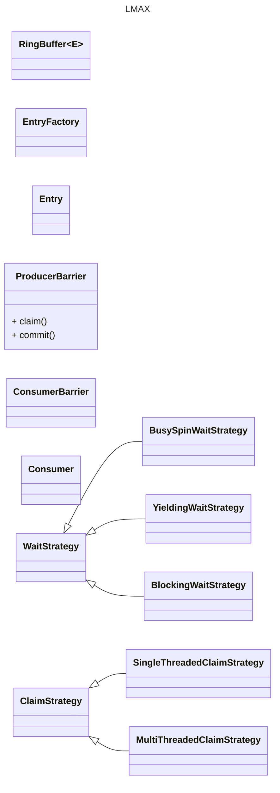

# Systems Programming

## Memory

### Virtual Memory
- Page size: 4KB = 4096 bytes
- Logical Address = (Logical Page Number, Offset)
- Physical Address = (Physical Page Number, Offset)
- Page Table = Logical Page Number -> Physical Page Number
- On Demand Paging
- Major Page Fault -- Page does not exist yet, needs to be created from disk
- Pages are shared between processes
- Copy on write (On Demand Memory/Paging)
- Special pages - swap page, zero page, read data behavior, write data behavior, anonymous vs file backed pages

```text
cat /proc/meminfo
Mem

ls /sys/devices/system/ /proc/sys/vm/

numactl --hardware
free
top
dmesg

ls /proc/pid/status,*maps
ps

ulimit -a  # how much memory can a process use
```

### Shared memory Anonymous

Can be shared with a child process, that

```cpp
size_t buffer_size = 32MB;
int flags = MAP_ANONYMOUS | MAP_SHARED | MAP_POPULATE;
flags |= MAP_HUGETLB | (30<<MAP_HUGE_SHIFT);                // 1gb hugepage
void* buf = mmap(
  nullptr,
  buffer_size,
  PROT_WRITE|PROT_READ,
  flags,
  -1,
  0
);
assert(buf != MAP_FAILED);
madvise(buf, buffer_size, MADV_WILLNEED|MADV_UNMERGABLE|MADV_HUGEPAGE);
memset(buf, 0, buffer_size);
int err = mlock(buf, buffer_size);
assert(err >= 0);
...
err = munmap(buf, buffer_size);
assert(err >= 0);

```

### Shm Named File

Can be shared with anybody who has access to the named shared mem file. Use `shm_open()` to open a shared memory object

```cpp
const string name = "/dev/shm/blah.shm";
int fd = ::shm_open(name.c_str(), O_EXCL | O_CREAT | O_RDWR, S_IRWXU | S_IRWXG | S_IRWXO);
assert(fd >= 0);
ftruncate(fd, buffer_size);
void* buf = mmap(nullptr, buffer_size, PROT_READ | PROT_WRITE, MAP_SHARED | MAP_POPULAT | MAP_LOCKED, fd, 0);
assert(buf != MAP_FAILED);
...
munmap(buf, buffer_size);
shm_unlink(name.c_str());
```

### Shared memory segment IPC
```cpp
int buffer_size = 20MB;
int segment_id = shmget(IPC_PRIVATE, buffer_size, IPC_CREAT|IPC_EXCL|S_IRUSR|S_IWUSR); // allocate a shm segment
void* buf = shmat(segment_id, 0, 0); // attach

shmid_ds info;
shmtctl(segment_id, IPC_STAT, info); // check segment size
size_t segment_size = info.shm_segsz;

sprintf(buf, "hello message");

...
shmdt(buf); // detach, do not use buf after this
void* some_memory_address = 0x5000000;             // different address
buf = shmat(segment_id, some_memory_address, 0);   // reattach at a different address

...
shmdt(buf); // detach
shmctl(segment_id, IPC_RMID, 0); // deallocate shm segment
```

## Solarflare

### Example code

#### step 1 - setup
```cpp
// setup - open the driver, allocate protection domain, allocate virtual interface from the PD
ef_driver_handle driver_handle;
ef_vi vi;
ef_pd pd;

int ifindex;

ef_driver_open(&driver_handle);
ef_pd_alloc(&pd, driver_handle, ifindex, EF_PD_DEFAULT);
ef_vi_alloc_from_pd(&vi, driver_handle, &pd, driver_handle, -1, -1, -1, nullptr, -1, 0);
```

#### step 2 - create packet buffer
```cpp
// create packet buffer - allocate memory region and register it for packet buffers
const int BUF_SIZE = 2048;
int bytes = N_BUFS * BUF_SIZE;
void* p;
posix_memalign(&p, 4096, bytes);

ef_memreg memreg;
ef_memreg_alloc(&memreg, driver_handle, &pd, driver_handle, p, bytes);
```

#### step 2.1 - cache packet metadata
```cpp
#define MEMBER_OFFSET(c_type, mbr_name) ((uint32_t) (uintptr_t)(&((c_type*)0)->mbr_name))
#define CACHE_ALIGN __attribute__((aligned(EF_VI_DMA_ALIGN)))

struct pkt_buf {
  struct pkt_buf* next; /* We’re not actually going to use this; but chaining multiple buffers together is a common and useful trick. */
  ef_addr dma_buf_addr;
  int id;
  uint8_t dma_buf[1] CACHE_ALIGN; /* Not strictly required, but cache aligning the payload is a speed boost, so do it. */
};
/* We’re also going to want to keep track of all our buffers, so have an
array of them. Not strictly needed, but convenient. */
struct pkt_buf* pkt_bufs [N_BUFS];
for( i = 0; i < N_BUFS; ++i ) {
  pkt_buf* pb = (pkt_buf*) ((char*) p + i * 2048);
  pb->id = i;
  pb->dma_buf_addr = ef_memreg_dma_addr(&memreg, i * 2048);
  pb->dma_buf_addr += MEMBER_OFFSET(struct pkt_buf, dma_buf);
  pkt_bufs[i] = pb;
}
```

#### step 3 - add filters
```cpp
// add filters
struct sockaddr_in sa_local;
ef_filter_spec filter_spec;
ef_filter_spec_init(&filter_spec, EF_FILTER_FLAG_NONE);
ef_filter_spec_set_ip4_local(&filter_spec, IPPROTO_UDP, sa_local.sin_addr.s_addr, sa_local.sin_port);
ef_vi_filter_add(&vi, driver_handle, &filter_spec, nullptr);
```

#### step 4 - add packet buffers
```cpp
// push packet buffers to the rx descriptor ring
unsigned int rx_posted = 0;
int n;
for (int i = 0; i < n; ++i)
{
  struct pkt_buf* pb = pkt_bufs[rx_posted % N_RX_BUFS];
  ef_vi_receive_init(&vi, pb->dma_buf_addr, pb->id);
  ++rx_posted;
}
ef_vi_receive_push(&vi);
```

#### step 5 - handle packets
```cpp
// handle incoming packets, poll the event queue
ef_event evs[NUM_POLL_EVENTS];
int n_ev, i;

while (true) {
  n_ev = ef_eventq_poll(&vi, evs, NUM_POLL_EVENTS);
  if (n_ev > 0) {
    for ( i = 0; i < n_ev; ++i)
    {
      switch (EF_EVENT_TYPE(evs[i]))
      {
      case EF_EVENT_TYPE_RX:
        handle_rx_packet(EF_EVENT_RX_RQ_ID(evs[i]), EF_EVENT_RX_BYTES(evs[i]));
        break;
      case EF_EVENT_TYPE_RX_DISCARD:
        fprintf(stderr, "ERROR: RX_DISCARD type=%d", EF_EVENT_RX_DISCARD_TYPE(evs[i]));
        handle_rx_packet(EF_EVENT_RX_RQ_ID(evs[i]), EF_EVENT_RX_BYTES(evs[i]));
        break;
      }
    }
  }
}
```

#### step 6 - free resources
```cpp
/* Release and free a memory region */
int ef_memreg_free(ef_memreg* mr, ef_driver_handle mr_dh);

/* Release and free a virtual interface */
int ef_vi_free(ef_vi* vi, ef_driver_handle vi_dh);

/* Release and free a protection domain */
int ef_pd_free(ef_pd *pd, ef_driver_handle pd_dh);

/* close a driver handle */
int ef_driver_close(ef_driver_handle dh);
```

- TCP Direct: [https://docs.xilinx.com/v/u/en-US/SF-116303-CD-TCPDirect_User_Guide](https://docs.xilinx.com/v/u/en-US/SF-116303-CD-TCPDirect_User_Guide)
- EF_VI: [https://docs.xilinx.com/v/u/en-US/SF-114063-CD-ef_vi_User_Guide](https://docs.xilinx.com/v/u/en-US/SF-114063-CD-ef_vi_User_Guide)
- Documentation: [https://www.xilinx.com/support/download/nic-software-and-drivers.html#open](https://www.xilinx.com/support/download/nic-software-and-drivers.html#open)

## TCP Direct

```cpp
#include <zf/zf.h>

// libonload_zf.so
// libonload_zf_static.a libciull.a

// zf_debug app
// ZF_ATTR=interface=ethX

zf_muxer_wait()
zf_attr attr {
  interface = "eth0",
  n_bufs = 2,
};
zf_stack* pstack = nullptr;
zf_stack_alloc(zf_attr* &attr, zf_stack** &pstack);
zf_stack_free(zf_stack* pstack);

zftl* tl_out;
zftl_listen(sf_stack* pstack, sockaddr* &laddr, socklen_t laddrlen, zf_attr* &attr, zftl** &tl_out);
zftl_accept(zftl* tl_out, zft** ts_out);

zft_alloc(zf_stack* pstack, zf_attr* &attr, zft_handle** &handle_out);
zft_addr_bind();

zft_connect();
zft_zc_recv();
zft_zc_recv_done();

zft_recv();
zft_send();

zf_alternatives_alloc(zf_stack* pstack, zf_attr* &attr, zf_althandle* &alt);
zf_alternatives_release(zf_stack* pstack, zf_althandle alt);
zf_alternatives_send(zf_stack* pstack, zf_althandle alt);
zf_alternatives_cancel(zf_stack* pstack, zf_althandle alt);
zf_alternatives_queue(zft* ts, zf_althandle alt, iovec* iov, iov_cnt, flags);
zf_alternatives_free_space(zf_stack* pstack, zf_althandle alt);

zftl_free(zftl* tl_out);

// epoll muxer
zf_muxer_set set;
zf_waitable* zfur_to_waitable(zfur* us); // UDP receive
zf_waitable* zfut_to_waitable(zfut* us); // UDP transmit
zf_waitable* zftl_to_waitable(zftl* tl); // TCP listening
zf_waitable* zft_to_waitable(zft* ts); // TCP

zf_muxer_add(zf_muxer_set* &set, zf_waitabile* w, epoll_event* ev);
zf_muxer_mod(zf_waitabile* w, epoll_event* ev);
zf_muxer_del(zf_waitabile* w);

zf_muxer_wait(zf_muxer_set* &set, epoll_event* events, int maxevents, int64_t timeout);

```

## LMAX Disruptor

LMAX Concepts
* Disruptor
* Ring Buffer[Event] - store and update of events
* Sequence - where a component is up to
* Sequencer - SP, MP - passing of events between P and C
* Sequence Barrier - are there any events available for the C
* Wait Strategy - how C will wait for events (lock-free?)
* Event - data passed from P to C
* Batch Event Processor - event loop for handling events by C
* Event Handler - C, callback
* Producer - enqueue events

LMAX Disruptor - high throughput, low latency
- Queues between processing stages - latency
- Contention in multiple threads
- Mechanical Sympathy - understanding how CPUs work
- Disruptor -- data structure, pattern of use
- Mean latency x 3 better than queue
- Throughput x 8 higher than queue
- Asynchronous event processing architecture
- Less write contention
- Lower concurrency overhead
- Cache friendly
- Less jitter
- 25 million messages per second, latency < 50 nsec
- Theoretical limit of processor to exchange data between cores

LMAX
- Order Matching Engine
- Real-time risk management
- Transaction Processing System (Highly available, In-memory)

- Staged Event Driven Architecture (SEDA)
- Actor model
- Concurrency - Tasks in parallel, but contention for resources
- Mutual Exclusion, Visibility of Change

- Avoid mutual exclusion - only 1 thread modifies
- Multiple writers - complex expensive coordination, locking
- Locking - context switch to kernel
- Compare and Swap (CAS) - processor has to lock its instruction pipeline (for atomicity), use a memory barrier (visible to threads)

- Out-of-order instruction execution
- Out-of-order loads and stores of memory
- Memory barrier -> when ordering of memory updates is important
- Hardware memory barrier - CPU Processor
- Software barrier - Compiler

- Cache - fast hardware hash table without chaining
- Cache coherence between processors
- "Store Buffers" - offload writes to caches
- "Invalidate Queues" - cache coherency

- Read Memory Barrier
- Write Memory Barrier

- Caches are organized in Cache Lines (64 bytes granularity)
- False sharing - 2 variables stored in same cache line, being updated by 2 threads
- Predictable memory access pattern helps CPU pre-fetch cache lines

- Queues - Bounded / Unbounded, Speed of Producers vs Speed of Consumers
- Contention points - Head, Tail, Size
- Head, Tail in same cache line

- Storage of items being exchanged
- Claiming the next sequence for exchange, coordination of producers
- Notify that a new item is available, coordination of consumers

Ring-Buffer - Pre-allocated contiguous memory, array of chunks. Size power of 2 so that remainder calculation is fast, bitmask (Size-1)

No contention on the ring-buffer slot for writing to it

Producer
- 1 producer, no contention on sequence or entry allocation
- Multiple producers, claim next entry contention. Simple CAS operation on sequence number for the slot
- Copy the data to slot, then make it public to consumers by committing the sequence
- Commit - without CAS, simple busy spin until the other producers have reached this sequence in their own commit. Then advance the cursor signifying the next available entry for consumption
- Producers avoid wrapping the ring, track the sequence of consumers, a read operation before write to the ring buffer

Consumer
- Wait for a sequence to become available, then read the chunk
- CPU resource precious, then wait on condition variable within a lock, that gets signaled by producers. Point of contention, not good for latency, throughput
- Loop checking the cursor, currently available sequence in the ring buffer. With/without thread yield (no contention)

Lock free MPMC queues - require multiple CAS operations on the Head, Tail, and Size counters

Sequence
- NextAvailableSlotSequence, Producer claim the next slot sequence before writing to the ring
  * Simple counter (SP)
  * Atomic counter, updated using CAS (MP)
- Cursor, latest entry in the ring available to consumers, producer commit to this after writing data to the slot in the ring
  * Multiple Producers
    - `long expectedSequence = claimedSequence-1;`
```
while (cursor != expectedSequence) {}
cursor = claimedSequence;
```

Classes
- `RingBuffer<WaitStrategy, ClaimStrategy>`
  * EntryFactory
  * Entry
- ProducerBarrier ( claim, commit )
- ConsumerBarrier
- Consumer
- WaitStrategy
  * BusySpingWaitStrategy
  * YieldingWaitStrategy
  * BlockingWaitStrategy
- ClaimStrategy
  * SingleThreadedClaimStrategy
  * MultiThreadedClaimStrategy

LMAX - London Multi-Asset Exchange
- Betfair spinoff, betting, gambling
- Extreme Transaction Processing (XTP)

```cpp
class RingBuffer<E>;

```



## Ring Buffer

This condition will not happen if writer does not care if the reader is slow and may loose data

```cpp
constexpr int CACHELINE_SIZE 64

// problem: lots of cache coherence evictions // cache coherency traffic
struct RingBufferNotFast {
  std::vector<int> slots;

  alignas(CACHELINE_SIZE) atomic<size_t> head {0};      // index, read from here
  alignas(CACHELINE_SIZE) atomic<size_t> tail {0};      // index, write over here

  RingBufferNotFast(size_t capacity) : slots(capacity, 0) {}
};

// buffer empty : head == tail
// buffer full : head == tail+1

bool send(int val) {
  auto const writeHere = tail.load(memory_order_relaxed);
  auto emptyMarker = writeHere+1;
  if (emptyMarker == slots.size()) { emptyMarker = 0; }

  // L1 cache of Sender CPU will load 'head', so it is shared state, when Reader thread updates 'head',
  // value of 'head' in our L1 becomes stale, cacheline gets evicted to get updated value, this will be a cache miss
  if (emptyMarker == head.load(memory_order_acquire)) { // acquire : don't want later instructions to execute before this barrier
    // buffer is full, head == (tail + 1)
    return false;
  }

  slot[writeHere] = val;
  tail.store(emptyMarker, memory_order_release); // release : don't let earlier instructions execute after this barrier
  // note: reader has also read 'tail', so when we update tail in this thread,
  // have to flush 'tail' cache line, (counted as cache miss)
  return true;
}

bool recv(int& val) {
  auto const readHere = head.load(memory_order_relaxed);
  // tail read here, when sender writes to it, we have to update the new value, cache miss
  if (readHere == tail.load(memory_order_acquire)) {  // acquire: later instructions should not execute before this barrier
    // buffer is empty, head == tail
    return false;
  }
  val = slots[readHere];
  auto nextReadHere = readHere+1;
  if (nextReadHere == slots.size()) { nextReadHere = 0; }
  // reader thread loaded 'head', we are writing to it, so cacheline has to flush
  head.store(nextReadHere, memory_order_release);   // release: earlier instructions do not execute after this barrier
  return true;
}
```

```cpp
constexpr int CACHELINE_SIZE 64

// less cache coherence evictions
struct RingBufferFaster {
  std::vector<int> slots;

  alignas(CACHELINE_SIZE) atomic<size_t> head {0};      // index, read from here
  alignas(CACHELINE_SIZE)        size_t  tailCached {0};

  alignas(CACHELINE_SIZE) atomic<size_t> tail {0};      // index, write over here
  alignas(CACHELINE_SIZE)        size_t  headCached {0};

  RingBufferFaster(size_t capacity) : slots(capacity, 0) {}
};

// buffer empty : head == tail
// buffer full : head == tail+1

bool send(int val) {
  auto const writeHere = tail.load(memory_order_relaxed);
  auto emptyMarker = writeHere+1;
  if (emptyMarker == slots.size()) { emptyMarker = 0; }

  // reduces the number of times we have to load, if there are N items pending, then it will load only once
  // cuts the number of cache misses by a lot
  if (headCached == emptyMarker) {
    headCached = head.load(memory_order_acquire);
    if (emptyMarker == headCached) {
      // buffer is full, head == (tail + 1)
      return false;
    }
  }

  slot[writeHere] = val;
  tail.store(emptyMarker, memory_order_release); // release : don't let earlier instructions execute after this barrier
  // note: reader has also read 'tail', so when we update tail in this thread,
  // have to flush 'tail' cache line, (counted as cache miss)
  return true;
}

bool recv(int& val) {
  auto const readHere = head.load(memory_order_relaxed);
  if (tailCached == readHere) {
    tailCached = tail.load(memory_order_acquire);
    if (tailCached == readHere) {
      // buffer is empty, head == tail
      return false;
    }
  }

  val = slots[readHere];
  auto nextReadHere = readHere+1;
  if (nextReadHere == slots.size()) { nextReadHere = 0; }
  // reader thread loaded 'head', we are writing to it, so cacheline has to flush
  head.store(nextReadHere, memory_order_release);   // release: earlier instructions do not execute after this barrier
  return true;
}
// source: https://rigtorp.se/ringbuffer/
// source: https://github.com/rigtorp/SPSCQueue/blob/master/include/rigtorp/SPSCQueue.h
```

## Aeron Messaging

TBD

# Networking

## Server Client
```
        SERVER                                  |       CLIENT
socket(AF_INET, SOCK_STREAM, 0) -> sock         | socket(AF_INET, SOCK_STREAM, 0 -> sock
bind(sock, sockaddr_in{AF_INET, *, 80 }, len)   |
listen(sock, queue_len=1)                       |
accept(sock, 0, 0) -> fd                        |
                                                | connect(sock, sockaddr_in{AF_INET, srvr_ip, srvr_port}, len)
    read(fd, buf, buflen)                       | send(sock, buf, buflen)
    send(fd, buf, buflen)                       | read(sock, buf, buflen)
    close(fd)                                   | close(sock)
                                                |
close(sock)                                     |
```

## IO Multiplexing - select poll epoll

```
fd_set fdset;
fd_set* readfdset = &fdset;

FD_ZERO(readfdset);
FD_SET(fd, readfdset);
select(maxfd, readfdset, writefdset, exceptfdset, timeout)
if (FD_ISSET(fd, readfdset))
{
    read(fd, buf, buflen);
}
----------------------------------------------------------------------------------

pollfd fds[] { {fd,  POLLIN, 0 }, };
n = poll(fds, numfds, timeout);
for (i : [0, numfds)) {
    if (fds[i].revents & POLLIN) {
        fds[i].revents = 0;
        read(fds[i].fd, buf, buflen);
    }
}

----------------------------------------------------------------------------------
epfd = epoll_create(ignored);
epoll_event ev {
    data: {fd,},
    events: EPOLLIN
    };
epoll_ctl(epfd, EPOLL_CTL_ADD, fd, &ev);

epoll_event events[N];
n = epoll_wait(epfd, events, N, timeout)
for (i : [0, n)) {
    read(events[i].data.fd, buf, buflen);
}
close(epfd)
```

epoll - used by libuv, libev, gevent


select
- have to build each `fdset` before each call
- check each bit `O(n)`,
- have to iterate over file descriptors to check if it exists in the set returned
- portable across flavors of unix

poll
- does not require highest numbered file descriptor
- more efficient for very large valued file descriptors
- input events are separate from output events, so don't need to reconstruct the fd set on each call

epoll
- create a context in kernel space, `epoll_create`
- fd set is managed in kernel space, `epoll_ctl`
- can add/remove fd's while waiting
- `epoll_wait` returns only the objects with ready fds
- better performance `O(1)`
- Linux specific

### New Technologies
io\_uring -  async interface to kernel, less system calls, same API for file i/o and network i/o
  - submission queue - send request to kernel
  - completion queue - results back to user space

eBPF - filters and hooks on network traffic that can execute snippets in kernel space
  - extended berkeley packet filter
  - eXpress Data Path (XDP) - high performance data path bypassing kernel network stack
