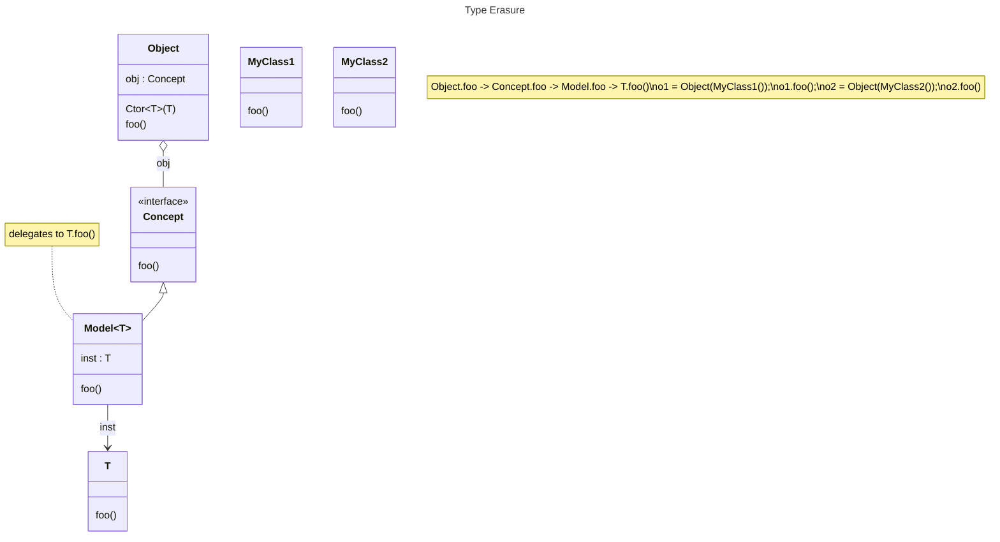
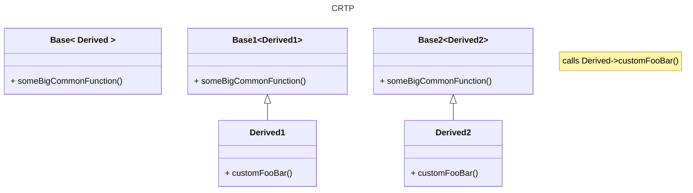

# Competitive programming

- [Competitive programming](#competitive-programming)
  - [Header for C++ contests](#header-for-c-contests)
  - [Canonical Class](#canonical-class)
    - [Overloads of class function -- ref, const-ref, rvalue, const-rvalue qualifier](#overloads-of-class-function----ref-const-ref-rvalue-const-rvalue-qualifier)
    - [Copy-Move-Swap Idioms](#copy-move-swap-idioms)
    - [Lazy Initialization](#lazy-initialization)
  - [Dump predefined macros](#dump-predefined-macros)
  - [Watch memory allocation](#watch-memory-allocation)
  - [Rounding up to next integer value](#rounding-up-to-next-integer-value)
  - [Uniform initialization](#uniform-initialization)
  - [Copyable Moveable](#copyable-moveable)
  - [Copy into a vector](#copy-into-a-vector)
    - [Copying](#copying)
  - [CPP Features](#cpp-features)
    - [Function pointers](#function-pointers)
    - [Structured binding](#structured-binding)
    - [Swap](#swap)
  - [Crazy STL](#crazy-stl)
    - [enable if](#enable-if)
      - [Usage - 4 ways](#usage---4-ways)
    - [any, variant, optional](#any-variant-optional)
      - [Usage - any (type-safe void\*)](#usage---any-type-safe-void)
      - [Implementation idea - any](#implementation-idea---any)
      - [Usage - variant (type-safe union)](#usage---variant-type-safe-union)
      - [Implementation idea - variant](#implementation-idea---variant)
    - [Tag Dispatch](#tag-dispatch)
    - [Type Erasure](#type-erasure)
    - [CRTP](#crtp)
    - [Return type resolver](#return-type-resolver)
    - [virtual constructor idiom](#virtual-constructor-idiom)
    - [std string view](#std-string-view)
    - [std span](#std-span)
    - [std function](#std-function)
    - [lambda expanded](#lambda-expanded)
    - [Using lambdas](#using-lambdas)
    - [Class Template Argument Deduction (CTAD)](#class-template-argument-deduction-ctad)
    - [std bind](#std-bind)
    - [sort](#sort)
    - [sum of vector](#sum-of-vector)
    - [std ranges](#std-ranges)
  - [Templates](#templates)
    - [Variadic Template Function](#variadic-template-function)
    - [Variadic Template Class](#variadic-template-class)
    - [Abbreviated function template, placeholder types](#abbreviated-function-template-placeholder-types)
    - [template auto](#template-auto)
  - [Concepts](#concepts)
    - [Very simple example](#very-simple-example)
  - [Print type name](#print-type-name)
    - [have compiler spit out the type name](#have-compiler-spit-out-the-type-name)
    - [utility function for printing type name](#utility-function-for-printing-type-name)
  - [RAII for malloc/free](#raii-for-mallocfree)
  - [Print a vector](#print-a-vector)
  - [Thread](#thread)
  - [Async thread](#async-thread)
  - [Synchronization](#synchronization)
    - [Mutex lock](#mutex-lock)
      - [Read-Write lock](#read-write-lock)
    - [Atomic](#atomic)
      - [Atomic for 2 numbers, pack them in 64-bit atomic word](#atomic-for-2-numbers-pack-them-in-64-bit-atomic-word)
    - [Spinlock (not optimized, not good performance)](#spinlock-not-optimized-not-good-performance)
      - [A bit better, but still not great](#a-bit-better-but-still-not-great)
      - [Optimized spin-lock](#optimized-spin-lock)
      - [Read Write Spinlock](#read-write-spinlock)
    - [Spinlock to control access to an object](#spinlock-to-control-access-to-an-object)
    - [Atomic counter, array next empty slot index](#atomic-counter-array-next-empty-slot-index)
    - [Thread Safe Unique Pointer](#thread-safe-unique-pointer)
    - [Thread Safe Shared Pointer](#thread-safe-shared-pointer)
    - [Producer-Consumer](#producer-consumer)
      - [SPSC queue using atomic size (lock-free, wait-free)](#spsc-queue-using-atomic-size-lock-free-wait-free)
      - [SPSC queue using locks](#spsc-queue-using-locks)
    - [Memory order](#memory-order)
      - [SPSC queue using atomic size (lock-free, wait-free, with appropriate memory order)](#spsc-queue-using-atomic-size-lock-free-wait-free-with-appropriate-memory-order)
      - [Release order](#release-order)
      - [Acquire order](#acquire-order)
    - [Compare and swap CAS (lock-free, but not wait-free)](#compare-and-swap-cas-lock-free-but-not-wait-free)
      - [Multiply operation in assembly is not atomic](#multiply-operation-in-assembly-is-not-atomic)
  - [Thread-safe Singleton, Double checked locking](#thread-safe-singleton-double-checked-locking)
  - [Data Strucutures](#data-strucutures)
    - [Thread safe stack](#thread-safe-stack)
      - [Problematic interface](#problematic-interface)
      - [Better interface](#better-interface)
      - [Locked stack](#locked-stack)
    - [Thread Safe Queue](#thread-safe-queue)
      - [Option 1 -- spinlock](#option-1----spinlock)
      - [Option 2 -- lock-free, wait-free queue SPSC (1 producer, 1 consumer)](#option-2----lock-free-wait-free-queue-spsc-1-producer-1-consumer)
  - [Coroutines in C++20](#coroutines-in-c20)
    - [Bare c++](#bare-c)
  - [Timeit](#timeit)
  - [Old school time (nanosec granularity, high resolution)](#old-school-time-nanosec-granularity-high-resolution)
  - [Sleep in your code](#sleep-in-your-code)
  - [Random data](#random-data)
  - [Generate N random strings of lengths upto L](#generate-n-random-strings-of-lengths-upto-l)
  - [Generate N random ints](#generate-n-random-ints)
  - [Use array of function pointers to avoid branch](#use-array-of-function-pointers-to-avoid-branch)
  - [Use lookup table](#use-lookup-table)
  - [Avoid branches](#avoid-branches)
  - [Build Benchmark, GTest](#build-benchmark-gtest)
    - [Use google benchmark](#use-google-benchmark)
  - [Backup](#backup)
  - [Tools of trade](#tools-of-trade)
  - [Visual Studio C++ Dirs](#visual-studio-c-dirs)
  - [Buzz words](#buzz-words)
  - [Glossary](#glossary)
  - [Latency numbers](#latency-numbers)
    - [Create Shortcut on windows](#create-shortcut-on-windows)
- [Python](#python)
  - [Python arguments](#python-arguments)
  - [Web requests](#web-requests)
  - [Find](#find)
  - [Find by id](#find-by-id)
  - [Find by div](#find-by-div)
  - [find by content text](#find-by-content-text)
  - [Windows Commands using WSH](#windows-commands-using-wsh)
- [Command line](#command-line)
    - [Zoxide](#zoxide)
    - [Start VM](#start-vm)
    - [Export GIT repository](#export-git-repository)
    - [Readonly GIT repository](#readonly-git-repository)
    - [MinTTY Terminal Bash](#mintty-terminal-bash)
    - [Veracrypt](#veracrypt)
    - [Music download](#music-download)
- [Rust](#rust)
    - [Rust build commands](#rust-build-commands)
    - [Rust Basics](#rust-basics)
    - [More rust things](#more-rust-things)

---

## Header for C++ contests
```cpp
#include <bits/stdc++.h>

using namespace std;

using vi = vector<int>;
using vvi = vector<vi>;
using pii = pair<int, int>;
using vpii = vector<pii>;

#define rep(i,a,b) for(int i = (a); i < (b); ++i)
#define re(b) for(int lkzij = (b); lkzij > 0; --lkzij)
#define trav(a,x) for(auto& a : x)
#define all(x) begin(x), end(x)
#define sz(x) (int)(x).size()
```

Lots of headers
```cpp
#include <iostream>
#include <variant>
#include <vector>
#include <map>
#include <string>
#include <type_traits>
#include <utility>
#include <algorithm>
#include <functional>
#include <memory>
#include <cstdint>
#include <cstdlib>
#include <numeric>
#include <mutex>
#include <thread>
#include <optional>
#include <boost/core/demangle.hpp>

#include <ranges>

namespace rs = std::ranges;
namespace rv = std::ranges::view;   // same as std::views

using namespace std;

#pragma GCC diagnostic ignored "-Wunused-parameter"
#pragma GCC diagnostic ignored "-Wunused-variable"

auto print_elem = [](auto const e) {std::cout << e << '\n'; };

int main([[maybe_unused]]int argc, [[maybe_unused]] const char* argv[])
{
  cout << endl;
  cout << string(100, '-') << endl;
}

// flag: -Wno-unused
```

## Canonical Class

```cpp
#include <iostream>

using namespace std;

class A {
public:
  // default
  A() { cout << "A::default ctor(this=" << this << ")\n"; }
  ~A() { cout << "A::dtor(this=" << this << ")\n"; }
  A(A const& rhs) { cout << "A::copy ctor(this=" << this << ", const A& rhs=" << &rhs << ")\n"; }
  A(A&& rhs) noexcept { cout << "A::move ctor(this=" << this << ", A&& rhs=" << &rhs << ")\n"; }

  // A& operator=(A const& rhs) { cout << "A::copy assignment(this=" << this << ") = " << &rhs << "\n"; return *this; }
  // A& operator=(A&& rhs) noexcept { cout << "A::move assignment(this=" << this << ") = " << &rhs << "\n"; rhs.swap(*this); return *this; }

  // replaces above 2 assignment operators
  A& operator=(A rhs) noexcept { cout << "A::copy_val assignment(this=" << this << ") = " << &rhs << "\n"; rhs.swap(*this); return *this; }

  // replaces both A::swap(b), std::swap(a, b)
  friend void swap(A& a, A& b) noexcept {
    cout << "friend swap(A& a=" << &a << ", A& b=" << &b << ")" << endl;
    // member1.swap(b.member1); or std::swap(a.member, b.member);
    // swap(pointerMember, b.pointerMember);
    // swap(basicTypeMember, b.basicTypeMember);
  }

  // void swap(A& b) noexcept {
  //   cout << "A::swap(this=" << this << ", A& b=" << &b << ")" << endl;
  //   // member1.swap(b.member1); or std::swap(a.member, b.member);
  //   // swap(pointerMember, b.pointerMember);
  //   // swap(basicTypeMember, b.basicTypeMember);
  // }
};

// namespace std {
//   // non-member swap, if we don't define, then default implementation will do tmp-move(a)-move(b)-move(tmp)
//   template<>                           // full-specialization required if defininig in std namespace
//   void swap(A& a, A& b) noexcept {
//     a.swap(b);
//   }
// }
```

Initializations: aggregate, constant, copy, default, direct, list, reference, value, zero

```cpp
T t = { 'a', "hello", 1, }; // aggregate
const int T::a = 5; // constant, static const member
T copy_t = t; // copy
T t; new T; // default
T t(some_param); // direct
T t { 'a', "hello", 1 }; // list
T& tr = t; // reference
T t = T(); T{};  // value (empty-initializer)
static T t; T t(); // zero
```

### Overloads of class function -- ref, const-ref, rvalue, const-rvalue qualifier
```
template<typename T>
class X {
  constexpr T&        get_value() &       { return get_value_impl(*this); }
  constexpr const T&  get_value() const&  { return get_value_impl(*this); }
  constexpr T&&       get_value() &&      { return get_value_impl(move(*this)); }
  constexpr const T&& get_value() const&& { return get_value_impl(move(*this)); }

  template<typename Opt>
  static decltype(auto) get_value_impl(Opt&& opt) {
    return forward<Opt>(opt).val_;
  }
  T val_;
};

// better, with C++23
template<typename T>
class X {
  template<typename Self>
  constexpr auto&& get_value(this Self&& self) {  // not valid before C++23
    return forward<Self>(self).val_;
  }
  T val_;
};
```

### Copy-Move-Swap Idioms
```cpp
class A
{
  Big big;
  Pointer* ptr;
  int v;
public:
  A(const A& that) : big(that.big), ptr(nullptr), v(that.v) {
    ptr = new Pointer(*that.ptr);
  }

  A(A&& other) : big(std::move(other.big)), ptr(exchange(other.ptr, nullptr)), v(other.v) noexcept {
  }

  // replaces both copy and move assignment operators: operator=(const A&), operator=(A&&)
  A& operator=(A that) noexcept {      // create a copy
    that.swap(*this);         // swap the copy
    return *this;
  }

  ~A() {
    delete ptr;
  }

  // A& operator=(const A& other) {
  //   if (this != &other) {
  //     A tmp(other);
  //     tmp.swap(*this);
  //   }
  //   return *this;
  // }
  //
  // A& operator=(A&& other) noexcept {
  //   other.swap(*this);
  //   return *this;
  // }

  // if we don't define, then default implementation will do tmp-move(a)-move(b)-move(tmp)
  friend void swap(A& a, A& b) noexcept {  // note: not defining member swap, just using friend non-member swap
    using std::swap;
    swap(a.big, b.big);
    swap(a.ptr, b.ptr);
    swap(a.v, b.v);
  }
};
```

### Lazy Initialization

```cpp
// option 1: Using std optional -- object on stack
class Lazy
{
  optional<BigObject> big{};
public:
  void eval_lazy() {
    if (!big) {                             // no thread-safety
      big.emplace(...);                     // lazily construct big
    }
    big->some_method(...);
  }
};

// option 2: Using std smart pointer -- object created on heap
class Lazy
{
  unique_ptr<BigObject> big{};
public:
  void eval_lazy() {
    if (!big) {                             // no thread-safety
      big = make_unique<BigObject>(...);    // lazily construct big
    }
    big->some_method(...);
  }
};

// source: https://www.cppstories.com/2019/10/lazyinit/

// option 3: Using raw pointer -- forced to implement dtor, and rule-of-seven or rule-of-five
// class Lazy
// {
//   BigObject* big {nullptr};
// public:
//   ~Lazy() { delete big;  }
//   // have to implment all ctors
//   void eval_lazy() {
//     if (!big) {
//       big = new BigObject {...};           // lazily construct big
//     }
//     big->some_method(...);
//   }
// };

class ThreadSafeLazy : public Lazy
{
  mutable mutex mut;    // not copyable, not movable, need custom copy ctors, assignment etc
public:

  ThreadSafeLazy(const ThreadSafeLazy& other) noexcept { /* do not copy mut, copy the rest */ big = other.big; }
  ThreadSafeLazy& operator=(const ThreadSafeLazy& other) noexcept { /* do not copy mut, copy the rest */ big = other.big; return *this; }
  ThreadSafeLazy(ThreadSafeLazy&& other) noexcept { /* do not copy mut, copy the rest */ big = move(other.big); }
  ThreadSafeLazy& operator=(ThreadSafeLazy&& other) noexcept { /* do not copy mut, copy the rest */ big = move(other.big); return *this; }
  void some_method(...) const {
    MakeSureReady();
    big.something(...);
  }

private:
  // should keep big and mut mutable to modify from const fn
  void MakeSureReady() const {
    scoped_lock loc(mut);
    if (!big) {
      big.emplace(...);
    }
  }
};


class ThreadSafeLazyCallOnce : public Lazy
{
  mutable once_flag flag;// not copyable, not movable, need custom copy ctors, assignment etc
public:

  ThreadSafeLazy(const ThreadSafeLazy& other) noexcept { /* do not copy mut, copy the rest */ big = other.big; }
  ThreadSafeLazy& operator=(const ThreadSafeLazy& other) noexcept { /* do not copy mut, copy the rest */ big = other.big; return *this; }
  ThreadSafeLazy(ThreadSafeLazy&& other) noexcept { /* do not copy mut, copy the rest */ big = move(other.big); }
  ThreadSafeLazy& operator=(ThreadSafeLazy&& other) noexcept { /* do not copy mut, copy the rest */ big = move(other.big); return *this; }
  void some_method(...) const {
    MakeSureReady();
    big.something(...);
  }

private:
  // should keep big and flag to modify from const fn
  void MakeSureReady() const {
    if (!big) {
      call_once(flag, [&]() {
        if (!big) { big.emplace(...); }
      });
    }
  }
};
// source: https://www.cppstories.com/2019/11/lazyinit-multithreading/
```

How to deal with copy/move of mutex member of a class?
```cpp
class A
{
  #if CPP11
    using MutexType = std::mutex;
    using ReadLock =  std::unique_lock<MutexType>;
    using WriteLock = std::unique_lock<MutexType>;
  #endif
  #if CPP14
    using MutexType = std::shared_timed_mutex;          // or recursive_mutex for (this == &rhs)
    using ReadLock =  std::shared_lock<MutexType>;
    using WriteLock = std::unique_lock<MutexType>;
  #endif
  mutable MutexType mut_;

  std::string field1_;
  std::string field2_;

private:
  // helper constructor
  A(const A& a, ReadLock rhs_lk) // lock by value
    : field1_(a.field1_), field2_(a.field2_)
  {}

public:
  A(const A& a) : A(a, ReadLock(a.mut_))
  {}

  A(A&& a) {
    // do not need to lock this->mut_ in this ctor,
    // only 1 thread could construct this object
    WriteLock rhs_lk(a.mut_);
    field1_ = std::move(a.field1_);
    field2_ = std::move(a.field2_);
  }

  A& operator=(const A& a) {
    if (&x != &y) {
      WriteLock lhs_lk(x.mut_, defer_lock);
      ReadLock rhs_lk(y.mut_, defer_lock);
      lock(lhs_lk, rhs_lk);
      x.field1_ = y.field1_;
      x.field2_ = y.field2_;
    }
  }

  A& operator=(A&& a) {
    if (&x != &y) {
      WriteLock lhs_lk(x.mut_, defer_lock);
      WriteLock rhs_lk(y.mut_, defer_lock);
      lock(lhs_lk, rhs_lk);
      x.field1_ = move(y.field1_);
      x.field2_ = move(y.field2_);
    }
  }

  friend void swap(A& x, A& y) noexcept
  {
    if (&x != &y) {
      WriteLock lhs_lk(x.mut_, defer_lock);
      WriteLock rhs_lk(y.mut_, defer_lock);
      lock(lhs_lk, rhs_lk);
      using std::swap;
      swap(x.field1_, y.field1_);
      swap(x.field2_, y.field2_);
    }
  }
};

// source: https://stackoverflow.com/questions/29986208/how-should-i-deal-with-mutexes-in-movable-types-in-c/29988626#29988626
```

## Dump predefined macros
```text
echo | g++ -std=c++20 -dM -E -x c++ -
echo | clang -dM -E -x c++ -
```

## Watch memory allocation
```cpp
void* operator new(std::size_t count)
{
  void* ptr = ::malloc(count);
  cout << "  " << count << " bytes (" << ptr << ")" << endl;
  return ptr;
}

void operator delete(void* ptr) noexcept
{
  cout << "  delete(" << ptr << ")" << endl;
  std::free(ptr);
}

/*
void operator delete(void* ptr, std::size_t count) noexcept;   // preferred over delete(void*)

void* operator new[](std::size_t count);
void operator delete[](void* ptr) noexcept;
void operator delete[](void* ptr, std::size_t count) noexcept;   // preferred over delete[](void*)

struct X {
  static void* operator new(std::size_t count);
  static void operator delete(X* ptr) noexcept;
  static void operator delete(X* ptr, std::size_t count) noexcept;

  static void* operator new[](std::size_t count);
  static void operator delete[](X* ptr, std::size_t count) noexcept;
};
*/

vector v(100); // watch this allocate and free memory
```

## Rounding up to next integer value
```cpp
i = (val+k-1) / k;
```

## Uniform initialization
```cpp
struct Blah {
  vector<int> vi;
  Blah(std::initializer_list<int> l) : vi(l) {
    // ... l.size(), l.begin(), l.end()
  }
};

Blah b { 1, 2, 3 };

struct Foo {
  Foo(int a, int b) {}
};

Foo foo { 1, 2 };
```

## Copyable Moveable

```cpp
class Copyable                                              class NotCopyable
{                                                           {
public:                                                     protected:
  Copyable() = default;                                       NotCopyable() = default;
  ~Copyable() = default;                                      ~NotCopyable() = default;
                                                            private:
  Copyable(Copyable& rhs) = default;                          NotCopyable(const NotCopyable& rhs) = delete;
  Copyable& operator=(Copyable& rhs) = default;               NotCopyable& operator=(const NotCopyable& rhs) = delete;
};                                                          };

class Moveable                                              class NotMoveable
{                                                           {
public:                                                     public:
  Moveable() = default;                                       NotMoveable() = default;
  ~Moveable() = default;                                      ~NotMoveable() = default;
                                                            private:
  Moveable(Moveable&& rhs) = default;                         NotMoveable(NotMoveable&& rhs) = delete;
  Moveable(const Moveable&& rhs) = default;                   NotMoveable(const NotMoveable& rhs) = delete;
  Moveable& operator=(Moveable&& rhs) = default;              NotMoveable& operator=(NotMoveable&& rhs) = delete;
  Moveable& operator=(const Moveable& rhs) = default;         NotMoveable& operator=(const NotMoveable& rhs) = delete;
};                                                          };

class MoveNoCopy {                                          class NoMoveNoCopy {
protected:                                                  protected:
  MoveNoCopy() = default;                                     NoMoveNoCopy() = default;
  MoveNoCopy(MoveNoCopy&&) = default;                         NoMoveNoCopy(NoMoveNoCopy&&) = delete;
  MoveNoCopy(const MoveNoCopy&) = delete;                     NoMoveNoCopy(const NoMoveNoCopy&) = delete;
  MoveNoCopy& operator=(MoveNoCopy&&) = default;              NoMoveNoCopy& operator=(NoMoveNoCopy&&) = delete;
  MoveNoCopy& operator=(const MoveNoCopy&) = delete;          NoMoveNoCopy& operator=(const NoMoveNoCopy&) = delete;
};                                                          };
```

## Copy into a vector
```cpp
#include <algorithm>
#include <iterator>

vector<int> src;
vector<int> dst;

copy(src.begin(), src.end(), back_inserter(dst));
```

### Copying

```cpp
class C {
  vector<int> vi;
  C(vector<int> v) : vi(move(v)) { /* do not use v here, it is moved. use vi */ }
};

/* lvalue */                       | /* rvalue */                       | /* l/r-value */
C(const vector<int>& v) : vi(v) {} | C(vector<int>&& v) : vi(move(v)) {}| C(vector<int> v) : vi(move(v)) {}
```

## CPP Features

### Function pointers
```cpp
R (*fp)(Arg1, Arg2);
fp = &sum;
v = fp(a, b);

R (A::*memfp)(Arg1, Arg2);
memfp = &A::foo;
A a;
v = (a.*memfp)(x, y);

```

### Structured binding

```cpp
auto [x, y] = get_point(n);

tuple<int, int> t(100, 200);
const auto& [x, y] = t;

int a[] = { 1, 3 };
auto& [x, y] = a;

struct S { int a; int b };
S s { 1, 10 };
auto [ x, y ] = s;    // accessible data members, in order declared in struct/class

int a = 1, b = 10;
const auto& [x, y] = tie(a, b);  // tie creates a tuple of lvalue references

int p, q;
tie(p, q) = tuple<int, int>(100, 200);

map<int, int> m { {1, 100}, {2, 200}, };
for (auto [x, y] : m)           | for (auto v : m)
{                               | {
  ...                           |   v.first; v.second;
}                               | }
```

Compatible type T, if the following metafunctions are available:
- `std::tuple_size<T>::value` number of T's elements
- `std::tuple_element<I>::type` type of I-th element
- `return_type std::get<I>(T)` retrieves I-th element

Already defined for `std::tuple, pair, array`

For a custom class, example:

```cpp
#include <utility>
#include <type_traits>
class A {
  ...
  // option 1 for get(), as a member
  template<size_t I> tuple_element_t<I, A>& get() &
  {
    if constexpr (I == 0) return int_val;
    if constexpr (I == 1) return char_val;
    ...
  }
  ... also need const, rvalue ref ...
  template<size_t I> tuple_element_t<I, A> const& get() const { ... }
  template<size_t I> tuple_element_t<I, A>& get() && { ... return std::move(int_val); ... }
  template<size_t I> tuple_element_t<I, A> const& get() const&& { ... return std::move(int_val); ... }
  // option 2 for get(), use helper
  template<size_t I, typename T> auto&& get_helper(T&& t)
  {
    static_assert(I < 5, "Index out of bounds for A");
    if constexpr (I == 0) return std::forward<T>(t).int_val;
    if constexpr (I == 1) return std::forward<T>(t).char_val;
    if constexpr (I == 2) return std::forward<T>(t).float_val;
    ...
  }
  template<size_t I> auto&& get() & { return get_helper<I>(*this); }
  template<size_t I> auto&& get() && { return get_helper<I>(*this); }
  template<size_t I> auto&& get() const& { return get_helper<I>(*this); }
  template<size_t I> auto&& get() const&& { return get_helper<I>(*this); }
  // see alternative get() below, as non-member
};

namespace std {
  template<> struct tuple_size<A> { static constexpr size_t value = 5; };
    // alternative
  template<> struct tuple_size<A> : integral_constant<size_t, 5> {};

  template<> struct tuple_element<0, A> { using type = int; };
  template<> struct tuple_element<1, A> { using type = char; };
  template<> struct tuple_element<2, A> { using type = float; };
  template<> struct tuple_element<3, A> { using type = string; };
  template<> struct tuple_element<4, A> { using type = int; };
    // alternative
  template<size_t I> struct tuple_element<I, A>
    : conditional<I == 0, int,
        conditonal<I == 1, char,
          conditional<I == 2, float,
            conditional<I == 3, string, int>
          >
        >
      >
  {
    static_assert(I < 5, "Index out of bounds for A">);
  };
    // alternative
  template<size_t I> struct tuple_element<I, A>
    : tuple_element<I, tuple<int, char, float, string, int>>
  {};

  // alternative get, possible to do this way for an existing class that can't modify
  template<size_t I> tuple_element_t<I, A>& get(A& a)
  {
    if constexpr (I == 0) return a.int_val;
    if constexpr (I == 1) return a.char_val;
    ...
  }

  // alternative get, using helper
  template<size_t I, typename T> auto&& A_get_helper(T&& t)
  {
    static_assert(I < 5, "Index out of bounds for A");
    if constexpr (I == 0) return std::forward<T>(t).int_val;
    if constexpr (I == 1) return std::forward<T>(t).char_val;
    if constexpr (I == 2) return std::forward<T>(t).float_val;
  }
  template<size_t I> auto&& get(A& t) { return A_get_helper<I>(t); }
  template<size_t I> auto&& get(const A& t) { return A_get_helper<I>(t); }
  template<size_t I> auto&& get(A&& t) { return A_get_helper<I>(move(t)); }
  template<size_t I> auto&& get(A const&& t) { return A_get_helper<I>(move(t)); }
}
```

See: [C++ on Sea 2020 - S/B uncovered](https://youtu.be/uZCvz-E1heA?t=1592)

### Swap

3 ways to define swap:

```cpp
// method 1: member swap, std::swap specialization
namespace X {
  class A {
    void swap(A& b) noexcept;               // member swap
  };
}
namespace std {
  template<>                              // full specialization
  void swap(A& a, A& b) noexcept { a.swap(b); }    // calls member swap
}

// method 2: overload std::swap, defined in same scope as class A
namespace X {
  class A {
    void swap(A& b) noexcept;             // member swap
  };

  // same scope as the class
  void swap(A& a, A& b) noexcept { a.swap(b); }    // calls member swap
}

// method 3: define swap() as a friend function
namespace X {
  class A {
    friend void swap(A& a, A& b) noexcept {
      ...
    }
  };
}

// usage:
template<typename T>
void some_func(T& obj)
{
  T tmp;
  using std::swap;
  swap(tmp, obj);   // would try X::swap() before std::swap()
}
```

## Crazy STL

### enable if

`enable_if< Condition, SomeType >` -- if `Condition` is true, then `enable_if::type == SomeType`, otherwise it is not defined.

```cpp
template<typename Cond, typename Type>
struct enable_if {};                            // empty

template<typename Type>
struct enable_if<true, Type> {
  using type = Type;                            // defined when Cond = true
};
```

#### Usage - 4 ways
```cpp
// usage:
// #1 - use non-type parameter for template
template<
  typename T,
  enable_if<is_integral<T>::value, Blah>::type = SomeBlahValue    // Cond is true, then this matches
                                                                  // otherwise, that type is not defined
                                                                  // and this template definition does not match
                                                                  // Blah can be int, bool, or anything else, does not matter
>
void func() { .... }

// #2 - use return type of function
template<typename T>
typename enable_if<Cond>::type            // return type, void (default param)
foobar()                                  // i.e. function: void foobar(), only if Cond is true
{}

// #3 - enable via function parameter
template<typename T>
void foobar(
  T t,
  typename enable_if<Cond>::type* = nullptr   // void* = nullptr, if Cond is true, foobar is not defined if Cond is false
)
{}

// #4 - use type parameter for template
template<
  typename T,
  typename = enable_if<Cond>::type          // enabled if Cond is true
>
void foobar(T t)
{}
```


### any, variant, optional

#### Usage - any (type-safe void*)
```cpp
#include <any>
any a = 1;
any b = "hello";
a = b;
a = "world";
any_cast<string>(a)
a.has_value()
a.reset()
a.emplace(ctor args)

vector<any> va = { 1, 20.0, "hello", A(), };
```

#### Implementation idea - any
```cpp
struct any
{
  void* data_;
  std::type_info const& (*getType_)();
  void* (*clone_)(void* otherData);
  void (*destroy_)(void* data);

  template<typename T>
  explicit any(T&& value)
    : data_{new T{std::forward<T>(value)}}
    , getType_{[]() -> std::type_info const&{ return typeid(T); }}
    , clone_([](void* otherData) -> void* { return new T(*static_cast<T*>(otherData)); })
    , destroy_([](void* data_) { delete static_cast<T*>(data_); })
  {
  }

  any(any const& other)
    : data_(other.clone_(other.data_))
    , getType_(other.getType_)
    , clone_(other.clone_)
    , destroy_(other.destroy_)
  {
  }

  ~any()
  {
    destroy_(data_);
  }
};

// https://www.fluentcpp.com/2021/02/05/how-stdany-works/
```

#### Usage - variant (type-safe union)
```cpp
variant< int, float > v;
v = 41;
int i = get<int>(v);
int i = get<0>(v);
get<float>(v); // throws bad_variant_access, stored int above

holds_alternative<int>(v) == true;

visit( [](auto&& val) { cout << val; }, v );

// https://github.com/mpark/variant
// https://github.com/groundswellaudio/swl-variant
```

#### Implementation idea - variant
```cpp
template<typename ...Types>
class Variant
{
  size_t active_idx;
  VariadicUnion<Types...> data;
public:
  template<typename T>
    requires (same_as<T, Types> or ... )
  Variant(T&& v)
    : active_idx( PackIndex<T, Types...>::value )
    , data( integral_constant<size_t, PackIndex<T, Types...>::value>(), forward<T>(v) )
  {}

  // template<typename T> Variant& operator=(T&& v);

  ~Variant() {
    data.destroy(active_idx);
  }

  size_t index() const { return active_idx; }
  
  template<std::size_t I>
  auto& get()
  {
    assert( I == active_idx );
    return data.template get<I>();
  }
};

// ---------------------------------------------------------------------------
template<typename T1, typename ...Ts>
struct PackIndex;

template<typename T1, typename ...Ts>
struct PackIndex<T1, T1, Ts...>
  : integral_constant<size_t, 0>
{};

template<typename T1, typename U1, typename ...Ts>
struct PackIndex<T1, U1, Ts...>
  : integral_constant<size_t, 1 + PackIndex<T1, Ts...>::value>
{};

// ---------------------------------------------------------------------------
template<typename T1, typename ...Ts>
union VariadicUnion                // recursive definition of union
{
  T1 first;
  VariadicUnion<Ts...> rest;

  template<typename U>
  VariadicUnion( integral_constant<size_t, 0>, U&& u)
    : first( forward<U>(u) )
  {}

  template<size_t I, typename U>
  VariadicUnion( integral_constant<size_t, I>, U&& u)
    : rest( integral_constant<size_t, I-1>(), forward<U>(u) )
  {}

  template<std::size_t I>
  auto& get() {
    if constexpr (I == 0) {
      return first;
    }
    else {
      return rest.template get<I-1>();
    }
  }

  void destroy(std::size_t I)
  {
    if (I == 0) {
      first.~T1();
    }
    else {
      rest.destroy(I-1);
    }
  }
};

template<typename T1>
union VariadicUnion<T1>                       // base case
{
  T1 first;

  template<typename U>
  VariadicUnion( integral_constant<size_t, 0>, U&& u)
    : first( forward<U>(u) )
  {}

  template<std::size_t I>
  auto& get() { return first; }

  void destroy(std::size_t I)
  {
    assert(I == 0);
    first.~T1();
  }
};

// ---------------------------------------------------------------------------
```

### Tag Dispatch

Use a type to overload an implementation

```cpp
struct RandomIteratorTag {};
struct ForwardIteratorTag {};

void advance_impl(Iter& iter, int skip, RandomIteratorTag)
{
  iter += skip;
}

void advance_impl(Iter& iter, int skip, ForwardIteratorTag)
{
  while (skip > 0) {
    iter++;
    --skip;
  }
  return iter;
}

void advance(Iter& iter, int dist)
{
  advance_impl(iter, dist, Iter::category)
}
```

### Type Erasure



Example:
```cpp
class Wrapper {
  Concept* concept;

  class Concept {
  public:
    virtual void foobar() = 0;
  };

  template<typename T>
  class Model : public Concept {
    T instance;
  public:
    Model(T& o) : instance(o) {}

    void foobar() override final {
      instance.foobar();
    }
  };

public:
  template<typename T>
  Wrapper(T&& o) : concept(new Model<T>(o)) {}
  ~Wrapper() { delete concept; }

  void foobar() {
    concept->foobar();
  }
};

class MyImpl1 {
public:
  void foobar() {
    cout << "Impl 1" << endl;
  }
};

class MyImpl2 {
public:
  void foobar() {
    cout << "Impl 1" << endl;
  }
};

vector<Wrapper> v;
v.push_back(MyImpl1());
v.push_back(MyImpl2());

for (auto& x : v) {
  x.foobar();         // will call MyImpl1/MyImpl2 foobar()
}
```

### CRTP



```cpp
template<typename Derived>
class Base
{
  // calls foobar() which is customized in derived classes
  void someBigCommonFunctionWith1Difference()
  {
    ...
    static_cast<Derived*>(this)->foobar();
    ...
  }
};

class Derived1 : public Base<Derived1>
{
public:
  void foobar()
  {
    cout << "Custom definition of Derived1.foobar\n";
  }
};

class Derived2 : public Base<Derived2>
{
public:
  void foobar()
  {
    cout << "Custom definition of Derived2.foobar\n";
  }
};

Derived1 d1;
Derived2 d2;
d1.someBigCommonFunctionWith1Difference();
d2.someBigCommonFunctionWith1Difference();
```

### Return type resolver
```cpp
class MakeContainer
{
    int size;
  public:
    explicit MakeContainer(int size) : size(size) {}

    template<typename Container>
    operator Container()                  // conversion operator
    {
      Container c(size);

      return c;
    }
};

// deduce which conversion operator to call from type of variable used for return value
vector<int> vi = MakeContainer(9);    // will create vector of int
list<A> va = MakeContainer(2);        // will create list of A

// does not even have to use templates for conversion operator

class FromString
{
  const string& source;
public:
  explicit FromString(const string& src) : source(src) {}

  operator int() { return stoi(source); }
  operator double() { return stod(source); }
};

int ival = FromString("1122");          // implicit: FromString(...).operator int()
double dval = FromString("0.5");
```

### virtual constructor idiom

```cpp
struct IAnimal abstract
{
  virtual IAnimal* createNew() = 0;
  virtual IAnimal* copy() = 0;
};

template<typename Concrete>
struct AnimalBase : public IAnimal
{
  IAnimal* createNew() override final
  {
    return new Concreate();
  }

  IAnimal* copy() override final
  {
    return new Concrete(*static_cast<const Concrete*>(this));
  }
};

struct Dog : public AnimalBase<Dog> {};
struct Cat : public AnimalBase<Cat> {};

void foo()
{
  IAnimal* animal = new Dog();

  IAnimal* new_dog = animal->createNew();
  IAnimal* dog_copy = animal->copy();
}
```

### std string view
```cpp
#include <string_view>

string_view sv = str;
string_view sv(data, len);
string_view sv(c_str);
string_view sv2 = sv.substr(m, n);

sv.find_first_not_of(' ');

cout << sv << endl;
```

### std span
```cpp
int arr[] = { 1, 2, 3, 4, 5, 6, 7, 8, 9, 10, };
vector<int> vec = { 1, 2, 3, 4, 5, 6, 7, 8, 9, 10, };
span<int, 10> arr_span { arr };     // static length
span<int>     dyn_arr_span { arr }; // dynamic length
span<int>     vec_span { vec };

span<int> sp = arr_span.subspan(3, 5);
arr_span.first(4);  // sub-span of first 4 items
arr_span.last(2);   // sub-span of last 2 items

span<char> sp { s };
span<char> sp { s, 5 };   // count=5

span<int> sp { begin(vec), end(vec) };
span<int> sp { begin(vec), 3 };   // count=3
```


### std function

`std::function` is a polymorphic callable wrapper, is implemented using type-erasure idiom.

```cpp
#include <iostream>
#include <functional>

using namespace std;
using namespace std::placeholders;

inline double add(double a, double b) { return a+b; }

struct Sub {
  double operator()(double a, double b) { return a-b; }
};

inline double multThree(double a, double b, double c) {
  return a*b*c;
}

Sub sub;

auto mult = std::bind(multThree, _1, _2, 1.0);

auto div = [](double a, double b) { return a/b; };

std::function<double(double,double)> arr[] = {
  add,        // function
  sub,        // function object
  mult,       // function object created by bind
  div,        // lambda expression
};

for (auto& f : arr) {
  cout << f(5.0, 2.5) << endl;
}
```

### lambda expanded
```cpp
int x, y;
auto f = [&x, y](double a, double b) { return (a+b+x+y); };

// equivalent to:
class Lambda  // closure type
{
  // closure
  int &x;
  int y;
public:
  Lambda(int& x, int& y) : x(x), y(y) {}

  // callable, note this will become a template function lambda uses auto for params
  double operator()(double a, double b) const              // const callable, unless mutable lambda
  { return a+b+x+y; }

  // oh i get it now, this is so that it can be implicitly
  // not really necessary, this is getting generated when I assign lambda to a std::function
  using retType = double (*)(double, double);
  constexpr operator retType() const noexcept { return invoke; }
  static double invoke(double a, double b) {
    Lambda l{};
    return l.operator()(a, b);
  }
};

Lambda f{x, y}; // closure x, y

f.operator()(1.9, 2.3);    // callable
```

### Using lambdas
```cpp
auto sumInt = [](int a, int b) { return a+b; };             // ordinary

auto addAnything = [](auto a, auto b) { return a+b; };      // can pass any type data for a, b

auto sumDec = [](auto a, decltype(a) b) { return a+b; };    // not any b, convertible to type of 'a'

auto sumTmpl = []<typename T>(T a, T b) { return a+b; };    // templatized
```

More examples:
```cpp
[](const Person& a, const Person& b) { return a.name < b.name; }
    // immutable closure, it is a const function
    // return type - deduced - bool, can instead give trailing return type
    // not noexcept by default, if needed, can declare with noexcept

[](const Person& a, const Person& b) -> bool { return a.name < b.name; }
[](const Person& a, const Person& b) mutable { return a.name < b.name; }
[](const Person& a, const Person& b) noexcept { return a.name < b.name; }

[](int i) { return i*i; }
    // lambda expressions with empty closure can be used as function pointers
    // void foo(int (*)(int) f); foo([](int i) {return i*i; });
auto* fptr = +[](int i) { return i*i; };          // idiom: unary plus operator trick
{ int i, j = 0; auto f = [=] { return i==j; }}    // capture by value, =
    // only capture local variables, can not capture global/static variables
{ int i, j = 0; auto f = [&] { return i==j; }}    // capture by reference, &

struct X {
  int i_; 
  void foo() {
    auto f = [this] {                             // capture this, to use members i_
      cout << i_;                                 // __this->i_
    };
    ...
  }
};

int foo() {
  static int k = 42;
  int m = 100;
  auto f = [=] { ++k; --m; };                     // not going to capture 'k' by value, 'm' is by val
  f();                                            // will modify that outer k, local m is not changed
  return k;                                       // will return 43
}

// idiom: immediately invoked function expression (IIFE)
[] {...} ();                                      // call it immediately, temporary lambda
const Foo foo = [] {
  if (hasDatabase) { return getFooFromDatabase(); }
  else { return getFooFromElsewhere(); }
} ();                                             // trick to conditional initialization

v.emplace_back([] {...}());                       // similar idea, passing return value of lambda
v.emplace_back(invoke([] { ...}));                // explicitly invoke the lambda, less confusing

// idiom: call-once lambda (daisy hollman, what you can learn from being too cute)
struct X {
  X() {
    static auto _ = [] { ... } ();                // we want it to be called only once
  }
};
X x1, x2, x3;                                     // called only once

// generic lambdas
[](auto i) { ... i ... };                         // template<T> call_operator(T i) const {...}

// perfect forwarding, auto ref ref
[&v](auto&& x) {                                  // template<T> call_oper(T&& x) const { __v.push_back(...); }
  v.push_back(forward<decltype(x)>(x));
};

// variadic templates
[](auto&&.. args) {
  (cout << ... << args);                          // fold expression
} (123, "hello", 'a', 4.0);

// idiom: variable template lambda (bjorn fahller)
template<typename T>                              // not just the callable, the lambda closure type also is a template
constexpr auto x = [](auto y) {
  return (T)y;                                    // cast to type T
}

// example:
template<typename T> constexpr auto duration_cast = [](auto d) {
  return std::chrono::duration_cast<T>(d);
}
using ns = std::chrono::nanoseconds;
using ms = std::chrono::milliseconds;
using us = std::chrono::microseconds;
struct Time {
  variant<ms, ns> time;
  auto convert(const auto& converter) {
    return visit(converter, time);
  }
};
void foobar() {
  Time t(ns(3000));
  auto in_usecs = t.convert(duration_cast<us>).count();
}

// init capture
unique_ptr<A> ptr;
auto lambda_f_instance = [ptr = std::move(ptr)] { ... ptr.get() ... }
// equiv to
struct LambdaClosureType {
  LambdaClosureType(unique_ptr<A> p) : __ptr(move(p)) {}
  unique_ptr<A> __ptr;
  ... callable ...
} lambda_f_instance {move(ptr)};

// idiom: init capture initialization (bartlomiej filipek - C++ lambda story book)
const string prefix="foo"; // looking for "foobar" in a vector
auto iter = find_if(vs.begin(), vs.end(), [str=prefix+"bar"](const string& s) { return s == str}; );
// versus less efficient version, calculates prefix+"bar" for every item in vs
auto iter = find_if(vs.begin(), vs.end(), [&prefix](const string& s) { return s == prefix+"bar"}; );

// lambdas can be constexpr or consteval, that can execute at compile time
auto f = []() constexpr { return sizeof(void*); };    // compile time
array<int, f()> arr = {};
auto g = [](int i) consteval { return i*i; };         // compile time only
array<int, g(5)> arr = {};                            // ok
g(x); // error, not a constant

// idiom: lambda overload set (uses CTAD)
// idea -- lambda's are conceptually classes, and you should be able to inherit from them
template<typename... Ts>                      // variadic args will be lambdas
struct overload : Ts... {                     // we inherit from those lambdas
  using Ts::operator()...;                    // we pull in the callable operator from all of them
};

overload f = {                                // note: CTAD use, haven't given template arg types
  [](int i) { cout << "Wonderful, called with int"; },
  [](float f) { cout << "Call with float detected"; }
};
f(10);  // Wonderful, called with int
f(2.5); // Call with float detected
variant<int, float> v = 3.9;
visit(f, v);        // Call with float detected

// structured binding captured in lambdas
auto [x, y] = Point();
auto f = [=] {
  cout << x << ", " << y << endl;
};
// variadic args captured in lambdas
auto foo(auto... args) { cout << sizeof...(args) << endl; }
template<typename... Args>
auto delay_invoke_foo(Args... args) {
  return [args...]() -> decltype(auto) {
    return foo(args...);
  }
}

erase_if(v.begin(), v.end(), [](auto i) { ... i ... });           // callable is a template, but no name for the type
erase_if(v.begin(). v.end(), []<typename T>(T i) { ... i ...});   // can give the template type a name, can specify constraints etc. (C++20)

// lambda as a data member of a class
class W {
  auto mem_f_ = []{};    // error: data member with auto not allowed
  decltype([]{}) mem_f_; // ok in C++20
};
// benefit: now can define template parameters that are lambdas
// note: earlier we could not do this in template definition at compile time,
// had to pass it as constructor param, which is for later (run time)
typename<typename T>
using UniquePtrTypeWithMyOwnDeleter = unique_ptr<T, decltype<[](T* t) { myDeleter(t); }>>;
UniquePtrTypeWithMyOwnDeleter<A> ptr;
// comparison function is a lambda given in template definition at compile time
using WidgetSet = std::set< Widget, decltype([](Widget& a, Widget& b) { return a.x < b.x; })>;
WidgetSet ws;

// compiler generates a different type for every lambda it sees
auto f1 = []{};
auto f2 = []{};     // f1 and f2 have different types, even though lambdas look identical
auto f3 = f1;       // f1, f3 have same type
decltype(f1) f4;    // f1 and f4 have same type
using t = decltype([]{});
t f5, f6;           // f5 and f6 have same type
template<auto = []{}> struct X{};
X x1, x2;           // x1 and x2 have different type, each instantiation is different type
static_assert(typeid(decltype(x1)) == typeid(decltype(x2)), "types are different");
// idiom: unique type generator (kris jusiak)

// idiom (C++23): recursive lambdas
// factorial using lambdas,
// idea 1:
// auto fact = [](int i) { if (i==0); return 1; return i*fact(i-1); };
// cannot refer to fact in its own initializer

// idea 2: use capture by reference, after making lambda a std::function
// ok, but there is an overhead here, function uses type erasure etc.
function<int(int)> fact = [&](int i) { if (i==0) return 1; return i*fact(i-1); };

// idea 3: c++23, "deduce this"
auto fact = [](this aut&& self, int i) { if (i==0); return 1; return i*self(i-1); };

// idiom (C++23): recursive lambda overload set -- ben deane -- deducing this patterns
// binary tree implemented as a variant, use overload defined above
struct Leaf {};
struct Node;
using Tree = std::variant<Leaf, Node*>;
struct Node { Tree left, right; }

int countLeaves(const Tree& tree) {
  return visit(
    overload {
      [] (const Leaf&) { return 1; },
      [] (this const auto& self, const Node* node) -> int {
        // self is the compiler generated type for "overload" template instantiated
        return visit(self, node->left) + visit(self, node->right);
      }
    },
    tree
  );
}
```

### Class Template Argument Deduction (CTAD)
```cpp
vector vi = { 1, 2, 3, 4}; // vector<int> deduced from the initializer list with integers
```

### std bind
```cpp
#include <functional>

using namespace std::placeholders;

double divide(double a, double b) { return a/b; }

auto calcOneByTwo = bind(divide, 1.0, 2.0);       // we get a callable object
double half = calcOneByTwo();                     // call that callable

auto inverse = bind(divide, 1.0, _1);             // 1st param is bound, 2nd is free, placeholder
double half = inverse(2.0);

auto twice = bind(divide, _1, 0.5);              // 2nd arg is bound
double ten = twice(5.0);

```

### sort

```cpp
sort(v.begin(), v.end(), [](const A& a, const A& b) { return a.m1 < b.m1; }); // lambda expr
//  lambda => "closure type" with public inline call operator

sort(v.rbegin(), v.rend()); // reverse order sort
```

### sum of vector

```cpp
#include <algorithm>
int sum = accumulate(v.begin(), v.end(), 0);

#include <numeric>
int sum = reduce(v.begin(), v.end(), 0);
```

### std ranges
```cpp
#include <ranges>
#include <algorithm>

namespace rs = std::ranges;
namespace rv = std::ranges::views;   // same as std::views

using namespace std;

auto print_elem = [](auto const e) {std::cout << e << '\n'; };
auto even = [](auto const i) { return i%2 == 0; };
auto  odd = [](auto const i) { return i%2 != 0; };
auto square = [](auto const i) { return i*i; };

// print vector elements
rs::for_each(crbegin(vi), crend(vi), print_elem);                   | for_each(cbegin(vi), cend(vi), print_elem);
rs::for_each(as_const(vi), print_elem);                             | for (const auto i : vi) { print_elem(i); }

// print vector elements in reverse
rs::for_each(rv::reverse(vi), print_elem);                          | for_each(crbegin(vi), crend(vi), print_elem);
rs::for_each(vi|rv::reverse, print_elem);                           |

// print only even items
rs::for_each(vi|rv::filter(even), print_elem);                      | for_each(cbegin(vi), cend(vi), [](auto i) { if (even(i)) print_elem(i); });


// skip 2 items, print only even from next 5 items
rs::for_each(vi|rv::drop(2)|rv::take(5)|rv::filter(even), print_elem);

// print all from 101 to 200
rs::foreach(rs::iota_view(101, 201), print_elem)                    | for (int n = 101; n < 201; ++n) { print_elem(n); }

// sort vector
rs::sort(vi);       // default: rs::less(), increasing order
rs::sort(vi, rs::greater());
rs::sort(rv::reverse(vi));

// composition
auto const vi = rs::iota_view { 1,  21 };   // view factory
for (int i : vi | rv::filter(even) | rv::transform(square)) {...}

// pipe ==> composing views
vi | rv::filter(even) | rv::transform(square);
// same as
rv::transform(
  rv::filter(
    vi
  )
);
```

## Templates

- ellipsis opertor
  - `... T` -- a **parameter pack** of 0+ arguments, example: `template<typename ...T>`, `func( ...v)` is a parameter pack
  - `pattern_with_v ...` -- an **expansion** of parameter pack into separate arguments, whole expression to the left of ellipsis is repeated for all the unpacked arguments, separated with a comma or a space
  - `p1 BINARY_OP ... BINARY_OP p2` -- a **fold** expression of parameter pack. example: `u + ... + v`, or `v + ...`, or `... + v`
- `sizeof...(T)` -- number of arguments in the pack

See also: cpp insights

### Variadic Template Function

```cpp
template<typename ...T> auto sum(const T& ... x) { // zero or more arguments
  return (x + ...);   // fold expression
}
// alternative, recursion
template<typename T1> auto sum(const T1& x1) { return x1; }                     // overload 1
template<typename T1, typename ...T> auto sum(const T1& x1, const T& ... x) {   // overload 2
  return x1 + sum(x ...);
}
```

### Variadic Template Class

```cpp
template<typename ...T> class Tuple
```

### Abbreviated function template, placeholder types
```cpp
void f1(auto v);                          |  template<typename T> void f1(T v);

template<typename T, typename U>          |  template<typename T, typename U, typename W>
void g(T x, U y, auto w);                 |  void g(T x, U y, W w);
```

### template auto
```cpp
template<auto val>                        |  template<typename T, T val>
constexpr auto constant = val;            |  constexpr T constant = val;

// example:
int age = constant<50>;                   |  int age = constant<int, 50>;
```

## Concepts

A _named set of requirements_ is `Concept`

### Very simple example
```cpp
template<typename T>
concept ConceptName = requires(T a)
{
  // satisfied by any type 'T' such that for values 'a' of type 'T', the expression in {...} compiles
  // and its result satisfies constraint_on_result
  { ... } -> constraint_on_result
}

// how to use the concept defined above
template<ConceptName T>
void f(T x) { ... }

SomeTypeThatSatisfiesConceptName y;
f(y);
```

## Print type name
```cpp
// best option
#include <boost/type_index.hpp>
boost::typeindex::type_id_with_cvr<decltype(x)>().pretty_name()

// other options
#include <typeinfo>
typeid(expr).name() // | c++filt -t

#include <boost/core/demangle.hpp>
boost::core::demangle( typeid(expr).name() )

__FUNCSIG__ // MSVC
__PRETTY_FUNCTION__

type_name<T>()

// typeid(expr) -> type_info
#include <cxxabi.h>
int status;
char* name = typeid(expr).name();
char* realname = abi::__cxa_demangle(name, nullptr, nullptr, &status);
free(realname);

// boost type_name
#include <boost/compute/type_traits/type_name.hpp>

boost::compute::type_traits::type_name(expr);
```

### have compiler spit out the type name
```cpp
template<typename T> class TypeDisplayer; // no definition, just declaration

SomeComplexType expr;                       // example: const int v = 10; auto expr = &v;

TypeDisplayer<decltype(expr)> xType;        // compiler will spit an error
// error: ... TypeDisplayer<SomeComplexType> xType has incomplete type ...
```

### utility function for printing type name
```cpp
// usage: cout << type_name<T>() << endl;
template<T>
string type_name()
{
  using TR = std::remove_reference<T>::type;
  string name = boost::core::demangle( typeid(TR).name() );

  if (std::is_const<TR>::value)             name += " const";
  if (std::is_volatile<TR>::value)          name += " volatile";
  if (std::is_lvalue_reference<T>::value)   name += " &";
  if (std::is_rvalue_reference<T>::value)   name += " &&";

  return name;
}

example: type_name<int>()
// see: https://github.com/willwray/type_name
```

## RAII for malloc/free
```cpp
unique_ptr<T, void(*)(void*)> raii_ptr( static_cast<T*>(::malloc(size)), ::free );
```

## Print a vector
```cpp
#include <algorithm>
#include <iterator>

const char* separator;
vector<int> src;
copy(src.begin(), src.end(), ostream_iterator<int>(cout, separator));

auto print_elem = [](const auto& i) { cout << i << ", "; };
for_each(cbegin(src), cend(src), print_elem);
```

## Thread
```cpp
#include <thread>

std::jthread t1(func, std::ref(obj1), val1);
t1.join();
```

## Async thread
```cpp
#include <future>
auto fut = async(std::launch::async, func, args, ...);
// func(args,...) will execute on a thread/thread-pool
fut.wait();
```

## Synchronization

### Mutex lock
```cpp
#include <mutex>
using namespace std;
mutex mut;
{                                   |  ~ +23 nsec
  lock_guard guard(mut);            |  call pthread_mutex_lock(mut) # automatic memory barriers
                                    |    if failed call __throw_system_error(...)
  ... critical section ...          |  ...
                                    |  call pthread_mutex_unlock(mut)
}
```

*Guarded* access to *shared* data is slow ... *unguarded* access to *non-shared* data is fast

See also: `std::lock`, takes care of not getting into a deadlock when locking multiple mutexes.

#### Read-Write lock

```cpp
#include <shared_mutex>
shared_mutex mut;  // provides lock/unlock(), lock_shared/unlock_shared()
{
  unique_lock g(mut);   // writer lock
  ... critical ...
}
{
  shared_lock g(mut);   // reader lock
  ... critical ...
}
```

### Atomic

```cpp
#include <atomic>
std::atomic<unsigned long> x(0);
unsigned long y(100);

{                                   |  ~ +7 nsec
  ++x; /* safe   */                 |  lock add DWORD PTR x[rip], 1  ; locks cache line
  ++y; /* unsafe */                 |  add DWORD PTR y[rip], 1
}
```

#### Atomic for 2 numbers, pack them in 64-bit atomic word

```cpp
struct Pair {
  int32_t a;
  int32_t b;

  // return true if equal, otherwise store update stored values from atomic n
  bool equal(atomic<Pair>& n) {
    if (a == b) return true;
    *this = n.load(memory_order_relaxed);
    return false;
  }
};

atomic<Pair> nums;
```

### Spinlock (not optimized, not good performance)
```cpp
class Spinlock {
public:
  // default constructible
  // noncopyable
  void lock() {
    // not CAS, always exchange, exit loop when 0 -> 1
    while (flag_.exchange(1, memory_order_acquire)) {}
  }
  void unlock() {
    flag_.store(0, memory_order_release);
  }
private:
  atomic<unsigned int> flag_; // 0: unlocked, 1: locked
};
```

#### A bit better, but still not great
```cpp
  void lock() {
      // do not keep updating when it is already 1, avoid locking cache line
    while (
      flag_.load(memory_order_relaxed) ||      // somebody else can slip in before us, its ok
      flag_.exchange(1, memory_order_acquire)
    )
    {}
  }
```

Problem: This is checking very aggressively for the lock. The thread holding the lock doesn't get scheduled to unlock. Solution: yield after trying to lock a few times

#### Optimized spin-lock

```cpp
struct SpinLock {
  SpinLock() = default; // copy constructible
  SpinLock(const SpinLock&) = delete;
  SpinLock& operator=(const SpinLock&) = delete;
  void lock() {
      // yield the cpu every now and then, by sleeping
    for (int i = 0;
      flag_.load(memory_order_relaxed) ||      // somebody else can slip in before us, its ok
        flag_.exchange(1, memory_order_acquire);
      ++i
      ) {
        if (i == 8) {       // 8 or 16 works best
          lock_sleep();
          i = 0;
        }
    }
  }

  void unlock() {
    flag_.store(0, memory_order_release);
  }

private:
  void lock_sleep() {
    static const timespec one_ns = {0, 1};
    nanosleep(one_ns, nullptr);
  }
  atomic<uint> flag_ { 0 };
};
```

#### Read Write Spinlock

```cpp
static constexpr timespec ns = { 0, 1 };
inline void nanosleep(int& i) {
  if (++i == 8) {
    i = 0;
    nanosleep(&ns, NULL);
  }
}

struct RWSpinLock {
  RWSpinLock() = default; // copy constructible
  RWSpinLock(const RWSpinLock&) = delete;
  RWSpinLock& operator=(const RWSpinLock&) = delete;

  void lock() {
    while (true) {
      if (flag_.fetch_sub(unlocked, std::memory_order_acquire) == unlocked) return;
      flag_.fetch_add(unlocked, std::memory_order_relaxed);    // Undo the lock
      for (int i = 0; flag_.load(std::memory_order_relaxed) != idle; ) {
        nanosleep(i);
      }
    }
  }

  void unlock() {
    flag_.store(unlocked, memory_order_release);
  }

  void lock_shared() {
    while (true) {
      if (flag_.fetch_sub(1, memory_order_acquire) > 0) return;
      flag_.fetch_add(1, memory_order_relaxed); // undo subtract
      for (int i = 0; flag_.load(memory_order_relaxed) <= 0; ) {
        nanosleep(i);
      }
    }
  }

  void unlock_shared() {
    flag_.fetch_add(1, memory_order_release);
  }

  bool is_unlocked() const { return flag.load(memory_order_acquire) == unlocked; }
  bool is_locked() const { return flag.load(memory_order_acquire) != unlocked; }
  bool is_rdlocked() const { return (flag.load(memory_order_acquire) & (unlocked-1)) != 0; }
  bool is_wrlocked() const { return (flag.load(memory_order_acquire) == 0; }

private:
  static constexpr long unlocked = 0x1L<<60;            // 0x 1000 0000 0000 0000
  static constexpr long write_lock = 0;                 // 0x 0000 0000 0000 0000
  static constexpr long read_lock_mask = (unlocked-1);  // 0x 7fff ffff ffff ffff ... 1

  atomic<long> flag_ { unlocked };
};
```

### Spinlock to control access to an object

```cpp
template<typename T>
class PtrSpinlock {
public:
  explicit PtrSpinlock(T* p) : p_(p) {}
  T* lock() {
    static const timespec one_ns { 0, 1 };
    T* tmp = nullptr;
    for (
      int i = 0;
      !p_.load(memory_order_relaxed) ||   // cheaper, if p_ != nullptr then try exchange
        !(tmp = p_.exchange(nullptr, memory_order_acquire);
      ++i
    ) {
      if (i == 8) {
        nanosleep(&ns, nullptr);
        i = 0;
      }
    }
    p_save_ = tmp;
    return tmp;
  }

  void unlock() { p_.store(saved_p_, memory_order_release); }
private:
  atomic<T*> p_;
  T* saved_p_ = nullptr;
};

PtrSpinlock<unsigned long> obj { new unsigned long(5) };

void t1() {
  unsigned long* p = obj.lock();
  // have exclusive access to the object
  (*p) = (*p) * 10;
  obj.unlock();
}
```

### Atomic counter, array next empty slot index

Array next empty slot index has a data dependency, we want to ensure that the producer has filled the empty slot, and only then the index is incremented. That is guaranteed with atomic index.

Counter on the other hand is not protecting any other data, so its atomic can be made memory order relaxed. Relaxed are faster on ARM CPUs, but no benefit for x86 CPUs, we any way get the stricter behavior there.

```cpp
class AtomicIndex {                                     |   class AtomicCount {
public:                                                 |   public:
  atomic<uint> N;                                       |     atomic<uint> N;
  uint incr() noexcept                                  |     uint incr() noexcept
    { return 1+N.fetch_add(1, memory_order_release); }  |       { return 1+N.fetch_add(1, memory_order_relaxed); }
  uint get() const noexcept                             |     uint get() const noexcept
    { return N.load(1, memory_order_acquire); }         |       { return N.load(1, memory_order_relaxed); }
};                                                      |   };
                                                        |
AtomicIndex idx;                                        |   AtomicCount count;
idx.incr();                                             |   count.incr();
```

### Thread Safe Unique Pointer

Efficient, but useful only when single producer. No checks at cleanup, cleanup should be handled in some other way.
Can use thread safe shared-ptr if cleanup is that big a deal.

```cpp
template<typename T>
class ThrSafeUniquePtr {
public:
  ThrSafeUniquePtr() = default;
  explicit ThrSafeUniquePtr(T* p) : p_ { p } {}
  ~ThrSafeUniquePtr() {
    del p_.load(memory_order_relaxed);
  }
  // not copyable
  ThrSafeUniquePtr(const ThrSafeUniquePtr& rhs) = delete;
  ThrSafeUniquePtr& operator=(const ThrSafeUniquePtr& rhs) = delete;

  void publish(T* p) noexcept {
    p_.store(p, memory_order_release);
  }
  T* get() const noexcept {
    return p_.load(memory_order_acquire);
  }
private:
  atomic<T*> p_;
};

ThrSafeUniquePtr<MyObj> safe_ptr;

void t1()                                   |   void t2()
{                                           |   {
  safe_ptr.publish(new MyObj());            |     MyObj* p = safe_ptr.get(); if (p != nullptr) { ... }
}                                           |   }
```

Consumer would call `get()`, good to use if returns non-null value. Otherwise publisher not ready with data yet. Should wait for `publish()`.

### Thread Safe Shared Pointer

```cpp
atomic<shared_ptr<T>>
```

### Producer-Consumer

#### SPSC queue using atomic size (lock-free, wait-free)
```cpp
array<Item, SIZE> Q;                |  // Q[0, N) is filled
atomic<size_t> N;                      // count of items
/* Producer */                      |  /* Consumer */
  produce(Q[N]);                       /* write after end of queue */
{                                   |  {
  ++N; /* advance end ptr */        |    while (N <= i) {}; /* wait for data */
}                                   |  }
                                    |  consume(Q[i]) // ok to use [0, N)
```

#### SPSC queue using locks
```cpp
array<Item, SIZE> Q;                |  // Q[0, N) is filled
size_t N;                              // count of items
mutex m;
/* Producer */                      |  /* Consumer */
  produce(Q[N]);                       /* write after end of queue */
{                                   |  {
  lock_guard l(m);                  |    size_t copy_of_N;
  ++N;                              |    do {
                                    |      lock_guard l(m);
                                    |      copy_of_N = N;
                                    |    } while (copy_of_N <= i);
}                                   |  }
                                    |  consume(Q[i]) // ok to use Q[0, N)
```

### Memory order

| Memory Order | Description |
|---|---|
| Relaxed `relaxed` | least restricted, only atomic operation guarantee, nothing about visibility of other r/w |
| Acquire-Release `acq_rel` | atomic operation become visible in correct order in all threads |
| Acquire `acquire` | all operations done after the atomic operation should become visible after that operation, should not jump before the atomic operation in any thread |
| Release `release` | all operations done before the atomic operation should become visible before that operation becomes visible to other threads. no guarantee about operations after that atomic operation |

- Note: On X86 processors, all stores are accompanied by a release barrier. So relaxed is not any cheaper on X86.
- Note: Compilers don't optimize by reordering instructions around atomic
- Note: Still may specify memory order explicitly for documenting intent, or for portability to ARM

#### SPSC queue using atomic size (lock-free, wait-free, with appropriate memory order)

```cpp
array<Item, SIZE> Q;                    |  // Q[0, N) is filled
atomic<size_t> N;                          // count of items
/* Producer */                          |  /* Consumer */
  produce(Q[N]);                           /* write after end of queue */
{                                       |  {
  N.fetch_add(1, memory_order_release); |    while (N.load(memory_order_acquire) <= i);
}                                       |  }
                                        |  consume(Q[i]) // ok to use [0, N)
```

#### Release order
```cpp
thread_A()      |   thread_B()
{               |   {
a += 1;         |   a += 1;   // can not go after release barrier
b += 1;         |   b += 1;   // can not go after barrier
... release barrier ...
c += 1;         |   c += 1;   // it is possible for this line to show up before release barrier
}               |   }
```

#### Acquire order
```cpp
thread_A()      |   thread_B()
{               |   {
a = x;          |   a = x;   // it is possible for this line to show up after acquire barrier
... acquire barrier ...
b = y;          |   b = y;   // can not go before acquire barrier
c = z;          |   c = z;   // can not go before barrier
}               |   }
```

### Compare and swap CAS (lock-free, but not wait-free)

#### Multiply operation in assembly is not atomic

```cpp
std::atomic<size_t> count;

size_t count_copy = count.load(memory_order_relaxed);  // there is no data dependency so can be relaxed
while (!count.compare_and_swap_strong(count_copy, count_copy*10, memory_order_relaxed, memory_order_relaxed))
{}
```

## Thread-safe Singleton, Double checked locking

```cpp
class Singleton
{
  Singleton() = default;
public:
  static Singleton& GetInstance() {
    static Singleton instance;
    return instance;
  }
};
```

```cpp
#include <mutex>
#include <optional>
class Singleton
{
public:
  static Singleton* GetInstance();

private:
  Singleton() = default;
  static optional<Singleton> instance;
  static once_flag flag;
};

optional<Singleton> Singleton::instance;
once_flag Singleton::flag {};

Singleton* Singleton::GetInstance()
{
  call_once(flag, []() { instance.emplace(Singleton {}); });
  return &(*instance);
}
```

With double checked locking
```cpp
#include <atomic>
#include <mutex>
class Singleton
{
public:
  static Singleton* GetInstance();

private:
  Singleton() = default;
  static atomic<Singleton*> instance;
  static mutex mut;
};

atomic<Singleton*> Singleton::instance;
mutex Singleton::mut;

Singleton* Singleton::GetInstance()
{
  Singleton* p = instance.load(memory_order_acquire);
  if (p == nullptr) {
    lock_guard g(mut);
    p = instance.load(memory_order_relaxed);
    if (p == nullptr) {
      p = new Singleton();
      instance.store(p, memory_order_release);
    }
  }
  return p;
}
```

## Data Strucutures
### Thread safe stack

#### Problematic interface

Each member function is thread safe, but together they can't ensure correctness.

```cpp
struct NaiveMTStack {       |  NaiveMTStack s;
  void push(T v);           |  ...
  void pop();               |  if (!s.empty()) {
  T top() const;            |    x = s.top(); // undefined behavior if empty
  bool empty() const;       |    s.pop();
};                          |  }
```

#### Better interface

```cpp
struct MTStack {            |  MTStack s;
  void push(T v);           |  ...
  optional<T> pop();        |  if (!s.empty()) {
  optional<T> top() const;  |    x = s.pop();  // not undefined even if empty
  bool empty() const;       |  }
};                          |
```

#### Locked stack

```cpp
#include <stack>
template<typename T, typename MutexType=mutex>      |  template<typename T>
struct LockedMTStack {                              |  struct UnsafeStack {
  void push(const T& v) {                           |    void push(const T& v) {
    lock_guard g(mut);                              |      s.push(v);
    s.push(v);                                      |    }
  }                                                 |
  optional<T> pop() {                               |    optional<T> pop() {
    lock_guard g(mut); /* writer lock */            |      if (s.empty()) { return optional<T>(nullopt); }
    if (s.empty()) { return optional<T>(nullopt); } |      else {
    else {                                          |        optional<T> v(move(s.top()));
      optional<T> v(move(s.top()));                 |        s.pop();
      s.pop();                                      |        return v;
      return v;                                     |      }
    }                                               |    }
  }                                                 |
  optional<T> top() const {                         |    optional<T> top() const {
    lock_guard g(mut); /* reader lock */            |      if (s.empty()) { return optional<T>(nullopt); }
    if (s.empty()) { return optional<T>(nullopt); } |      else {
    else {                                          |        optional<T> v(s.top());
      optional<T> v(s.top());                       |        return v;
      return v;                                     |      }
    }                                               |    }
  }                                                 |
private:                                            |  private:
  stack<T> s;                                       |    stack<T> s;
  mutable MutexType mut;                            |
};                                                  |  };
```

Performance of `LockedMTStack` vs `UnsafeStack` with 1 thread is 33ns vs 2ns.

A few ideas for performance:
- Provide interface to add / remove batches of items. That will amortize locking cost over N items
- Use RW Lock, `top()` would use R, but `pop()` and `push()` would be W lock. Not much gain in performance in benchmarks

### Thread Safe Queue

#### Option 1 -- spinlock
```cpp
template<typename T>
struct MTQueue {
  void push(const T& v) {
    lock_guard g(l);                // faster than mutex
    q.push(v);
  }

  optional<T> pop() {
    lock_guard g(l);
    if (q.empty()) {
      return optional<T>(nullopt);
    }
    else {
      optional<T> res(move(q.front()));
      q.pop();
      return res;
    }
  }
private:
  queue<T> q;
  mutable spinlock l;
};
```

#### Option 2 -- lock-free, wait-free queue SPSC (1 producer, 1 consumer)

- Producer, Consumer for a queue don't interact unless when the queue is empty. Don't need synchronization, except for `size`, which we can make atomic
- Even alternating `push()`, `pop()` will run out of a linear array when we reach the end. Solution: circular buffer
- Upper bound on the size of the queue
- 1 P, 1 C -- for  transfer data, with very low, predictable latency

```cpp
template<typename T>
struct SPSCLockFreeWaitFreeQueue {
  explicit SPSCLockFreeWaitFreeQueue(size_t cap) : capacity(cap), buffer(new T[cap]) {}
  ~SPSCLockFreeWaitFreeQueue() { delete[] buffer; }

  bool push(const T& v);
  optional<T> pop();
private:
  const size_t capacity;
  T* const buffer;
  size_t front = 0;
  size_t back = 0;
  atomic<size_t> size;
};

bool push(const T& v) {
  if (size.load(memory_order_relaxed) >= capacity) {
    return false;
  }
  new (&(buffer[back % capacity])) T(v);  // placement new
  ++back;
  size.fetch_add(1, memory_order_release);
  return true;
}

optional<T> pop() {
  if (size.load(memory_order_acquire) == 0) {
    return optional<T>(nullopt);
  }
  else {
    optional<T> res( move(buffer[front%capacity]) );
    buffer[front%capacity].~T();
    ++front;
    size.fetch_sub(1, memory_order_relaxed);
    return res;
  }
}
```

## Coroutines in C++20

### Bare c++
```cpp
// g++ -std=c++20 -fcoroutines
#include <coroutine>

// can call the return type anything else, instead of generator<T>
generator<int> a_coroutine_func()
{
  ...
  for (int i = 0; i < 100; ++i)
  {
  co_yield i;
  }
  // or
  // co_await;
  ...
  co_return;
}

int main()
{
   auto handle = a_coroutine_func().h_;     // creates activation frame
   auto& promise = handle.promise();        // not std::promise, a different type, generator::promise_type
   ...
   promise.value_;          // use what yield returned
   handle();                // resume the coroutine, like next() in python
   ...
   handle.destroy();
}

```

## Timeit
```cpp
#include <chrono>

auto tick = std::chrono::high_resolution_clock::now();
do_work();
auto tock = std::chrono::high_resolution_clock::now();
auto elapsed_secs = std::chrono::duration_cast<std::chrono::duration<double>>(tock - tick)).count();

// other clocks -- high_resolution_clock, system_clock
// system_clock -> measures realtime == wallclock time
// steady_clock -> monotonic clock
// high_resolution_clock -> system_clock (alias for smallest tick clock)
using std::chrono::{duration_cast, milliseconds, system_clock};
auto t0 = system_clock::now(); // system_clock::time_point
auto ms = duration_cast<milliseconds>(t1-t0).count();
```

## Old school time (nanosec granularity, high resolution)
```cpp
#include <time.h>
timespec real_ts0, proc_cpu_ts0, thread_cpu_ts0, monotonic_ts0;
clock_gettime(CLOCK_REALTIME, &real_ts0);
clock_gettime(CLOCK_PROCESS_CPUTIME_ID, &proc_cpu_ts0);
clock_gettime(CLOCK_THREAD_CPUTIME_ID, &thread_cpu_ts0);
clock_gettime(CLOCK_MONOTONIC_RAW, &monotonic_ts0);

secs(t) = t
nsecs(t) = t / 10**9
double duration(timespec a, timespec b) {
  return secs(a.tv_sec-b.tv_sec) + nsecs(a.tv_nsec-b.tv_nsec);
}
```

## Sleep in your code
```cpp
#include <unistd.h>
sleep(secs);
usleep(microsecs);

// --
#include <chrono>
#include <thread>

this_thread::sleep_for(chrono::milliseconds(msec));

using std::chrono_literals;
this_thread::sleep_for(400ms);

this_thread::sleep_until(steady_clock::now() + 500ms);
```

## Random data
```cpp
#include <random>

std::default_random_engine gen; // msvc: mt19937
std::uniform_int_distribution<int> U(1, 1000);
auto x_i = U(gen);

std::minstd_rand rgen; // minstd_rand0 minstd_rand mt19937 mt19937_64
const auto x_i = rgen();

std::random_device rd; // kernel random device
std::uniform_int_distribution<int> U(1, 1000);
auto x_i = U(rd);

std::random_device rd; // kernel random device
std::default_random_engine gen(rd()); // msvc: mt19937
std::uniform_int_distribution<int> U(1, 1000);
auto x_i = U(gen);

// seeded with time
std::default_random_engine gen(time(0));
auto X = gen();

// old school
#include <cstdlib>
#include <ctime>

srand(time(0)); // seed with time
srand(0); // seed with a deterministic value
int X = rand();
```

## Generate N random strings of lengths upto L
```cpp
constexpr uint L = 2**22, N = 2**18;
constexpr ntimes = 2**10;

// generate 1 random string of length
unique_ptr<char[]> s = new char[L];
memset(s.get(), 'a', L*sizeof(char));
for (uint i = 0; i < ntimes; ++i)
{
  s[rgen() % (L-1)] = 'a' + (rgen() % 26);
}
s[L-1] = 0;

// fill a vector of pointers starting at random index in s
vector<const char*> vs(N);
for (uint i = 0; i < N; ++i)
{
  vs[i] = &s[rgen() % (L-1)];
}
```

## Generate N random ints
```cpp
#include <algorithm>
for (size_t i = 0; i < N; ++i) { v[i] = i;}
std::random_shuffle(v.begin(), v.end());
```

## Use array of function pointers to avoid branch
```cpp
ulong f1(ulong x, ulong y);
ulong f2(ulong x, ulong y);

decltype(f)* fp[] = { f1, f2 };
bool* flag = new bool[...];
for (int i = 0; i < N; ++i) {
  a += f[flag[i]](p1[i], p2[i]);
}

--- equivalent ---
  a += f[flag[i]](p1[i], p2[i]);           // cons: no inlining possible

  if (flag[i]) { a += f1(p1[i], p2[i]); }
  else         { a += f2(p1[i], p2[i]); }
```

## Use lookup table
```cpp
#define times(i,N) for (int i = 0; i < N; ++i)

unsigned char* c = ...;  // random values in [0, 255]
unsigned char LUT[256] = { 0, 1, ..., 127, 128, 128, ..., 128 };
times(i,N) {
  c[i] = LUT[c[i]];
}

--- equivalent ---
  c[i] = LUT[c[i]];

  c[i] = (c[i] < 128) ? c[i] : 128;
```

## Avoid branches
```cpp
ulong a1 = 0, a2 = 0;
ulong* a[2] = { &a2, &a1 };
times(i,N) {
  ulong s[2] = { p1[i]*p2[i], p1[i]-p2[i] };
  a[b1[i]] += s[b1[i]];
}

--- or ---

ulong a1 = 0, a2 = 0;
times(i,N) {
  ulong s1[2] = { 0, p1[i]-p2[i] };
  ulong s2[2] = { p1[i]*p2[i], 0 };
  a1 += s1[b1[i]];
  a2 += s2[b1[i]];
}

--- equivalent to ---
times(i,N) {
  if (b1[i]) {
    a1 = p1[i]-p2[i];
  }
  else {
    a2 = p1[i]*p2[i];
  }
}
```

## Build Benchmark, GTest
```shell
# build google benchmark
cmake google-benchmark -B build-release \
    -DCMAKE_BUILD_TYPE=Release \
    -DBENCHMARK_DOWNLOAD_DEPENDENCIES=on  \
    -DCMAKE_BUILD_TYPE=Release  \
    -DCMAKE_INSTALL_PREFIX=d:/devtools/benchmark  \

cmake --build build-release --config Release
ctest --build-config Release
cmake --build . --config Release --target install

# build google test
cmake google-benchmark\googletest -B googletest-release \
    -DCMAKE_INSTALL_PREFIX=d:/devtools/google-test \
    -DBUILD_GMOCK=OFF \
    -Dgtest_force_shared_crt=on \

cmake --build googletest-release --config Release
cmake --build googletest-release --config Release --target install

# build project using these
cmake . -B build-msvc \
    -GNinja \
    -DCMAKE_BUILD_TYPE=Release \
    -Dbenchmark_ROOT=d:/devtools/benchmark \
    -DGTest_ROOT=d:/devtools/google-test \

cmake --build build-msvc
```

### Use google benchmark
```cpp
#include <benchmark/benchmark.h>

void BM_some_name(benchmark::State& state) {
  // args passed to BM are in state.range(i)
  // state.range(0) == 100
  ... init ..
  for (auto _ : state) {
    ... code to measure ...
    benchmark::DoNotOptimize(someFuncToMeasure(...));
  }
}
BENCHMARK(BM_some_name)->Arg(100); // Arg -> state.range(i)

...

BENCHMARK_MAIN();

// c++ -g  ... -lbenchmark -pthread
// cmake target_link_libraries(... benchmark::benchmark)

// cl.exe /nologo /TP \
//     -DBENCHMARK_STATIC_DEFINE \
//     -external:I${benchmark_ROOT}/include \
//     -external:W0 \
//     /DWIN32 \
//     /D_WINDOWS \
//     /EHsc \
//     /O2 \
//     /Ob2 \
//     /DNDEBUG \
//     -std:c++20 \
//     -MD \
//     /showIncludes \
//     /Foobjdir/blah.obj \
//     /Fdobjdir/ \
//     /FS \
//     -c \
//     blah.cpp

// vs_link_exe --rc="...\rc.exe" \
//     --mt="...\mt.exe" \
//     --manifests \
//     -- \
//     ...\link.exe \
//     /nologo \
//     objdir/blah.obj \
//     /out:blah.exe \
//     /implib:blah.lib \
//     /pdb:blah.pdb \
//     /version:0.0 \
//     /machine:x64 \
//     /INCREMENTAL:NO \
//     /subsystem:console \
//     ${benchmark_ROOT}\lib\benchmark.lib \
//     shlwapi.lib \
//     kernel32.lib \
//     user32.lib \
//     gdi32.lib \
//     winspool.lib \
//     shell32.lib \
//     ole32.lib \
//     oleaut32.lib \
//     uuid.lib \
//     comdlg32.lib \
//     advapi32.lib

```

## Backup
```text
pushd C:\Program Files
7z a z:\files-for-vm\vs2.7z "Microsoft Visual Studio\2022\Community" dotnet
pushd C:\Program Files (x86)
7z a z:\files-for-vm\vs3.7z dotnet "Microsoft SDKs" "Windows Kits" MSBuild Microsoft.NET "Microsoft Visual Studio"
```

## Tools of trade
- Google benchmark, catch2, nanobenchmark
- Google test, doctest
- Google profiler
- LLVM Machine Code Analyzer (LLVM MCA), look at timeline for assembly code execution
- renatoGarcia/icecream-cpp
- TCMalloc thread caching malloc

## Visual Studio C++ Dirs
```text
-- cmake, ninja --
C:\Program Files\Microsoft Visual Studio\2022\Community\Common7\IDE\CommonExtensions\Microsoft\CMake\CMake\bin\cmake.exe
C:\Program Files\Microsoft Visual Studio\2022\Community\Common7\IDE\CommonExtensions\Microsoft\CMake\Ninja\ninja.exe

-- Developer Command Prompt
%comspec% /k "C:\Program Files\Microsoft Visual Studio\2022\Community\Common7\Tools\VsDevCmd.bat"

-- x64 Native Tools Command Prompt
%comspec% /k "C:\Program Files\Microsoft Visual Studio\2022\Community\VC\Auxiliary\Build\vcvars64.bat"

-- x64_x86 Cross Tools Command Prompt for VS 2022
%comspec% /k "C:\Program Files\Microsoft Visual Studio\2022\Community\VC\Auxiliary\Build\vcvarsamd64_x86.bat"

-- x86 Native Tools Command Prompt for VS 2022
%comspec% /k "C:\Program Files\Microsoft Visual Studio\2022\Community\VC\Auxiliary\Build\vcvars32.bat"

-- x86_x64 Cross Tools Command Prompt for VS 2022
%comspec% /k "C:\Program Files\Microsoft Visual Studio\2022\Community\VC\Auxiliary\Build\vcvarsx86_amd64.bat"


set VS_ROOT=C:\Program Files\Microsoft Visual Studio\2022\Community
set WINKITS=C:\Program Files (x86)\Windows Kits

set PATH+=;%VS_ROOT%\VC\Redist\MSVC\14.38.33130\debug_nonredist\x64\Microsoft.VC143.DebugCRT
 - or -
set PATH+=;\VC\Redist\MSVC\14.38.33130\x64\Microsoft.VC143.CRT
set PATH+=;\VC\Tools\MSVC\14.38.33130\bin\HostX64\x64

set PATH+=;%WINKITS%\10\bin\10.0.22621.0\x64\ucrt
set PATH+=;%WINKITS%\10\bin\10.0.22621.0\x64

-- important directories in path --
C:\Program Files\Microsoft Visual Studio\2022\Community\VC\Tools\MSVC\14.38.33130\bin\HostX86\x86
C:\Program Files\Microsoft Visual Studio\2022\Community\Common7\IDE\VC\VCPackages
C:\Program Files\Microsoft Visual Studio\2022\Community\Common7\IDE\CommonExtensions\Microsoft\TestWindow
C:\Program Files\Microsoft Visual Studio\2022\Community\Common7\IDE\CommonExtensions\Microsoft\TeamFoundation\Team Explorer
C:\Program Files\Microsoft Visual Studio\2022\Community\MSBuild\Current\bin\Roslyn
C:\Program Files\Microsoft Visual Studio\2022\Community\Team Tools\Performance Tools
C:\Program Files (x86)\Microsoft SDKs\Windows\v10.0A\bin\NETFX 4.8 Tools
C:\Program Files\Microsoft Visual Studio\2022\Community\Common7\IDE\CommonExtensions\Microsoft\FSharp\Tools
C:\Program Files\Microsoft Visual Studio\2022\Community\Team Tools\DiagnosticsHub\Collector
C:\Program Files (x86)\Windows Kits\10\bin\10.0.22621.0\x86
C:\Program Files (x86)\Windows Kits\10\bin\x86
C:\Program Files\Microsoft Visual Studio\2022\Community\MSBuild\Current\Bin\amd64
C:\Windows\Microsoft.NET\Framework\v4.0.30319
C:\Program Files\Microsoft Visual Studio\2022\Community\Common7\IDE
C:\Program Files\Microsoft Visual Studio\2022\Community\Common7\Tools
C:\Windows\system32
C:\Windows
C:\Windows\System32\Wbem
C:\Windows\System32\WindowsPowerShell\v1.0
C:\Windows\System32\OpenSSH
C:\Program Files\Microsoft SQL Server\150\Tools\Binn
C:\Program Files\dotnet
C:\Program Files (x86)\Windows Kits\10\Windows Performance Toolkit
C:\Users\User\AppData\Local\Microsoft\WindowsApps
C:\Program Files\Microsoft Visual Studio\2022\Community\Common7\IDE\CommonExtensions\Microsoft\CMake\CMake\bin
C:\Program Files\Microsoft Visual Studio\2022\Community\Common7\IDE\CommonExtensions\Microsoft\CMake\Ninja
C:\Program Files\Microsoft Visual Studio\2022\Community\Common7\IDE\VC\Linux\bin\ConnectionManagerExe
C:\Program Files\Microsoft Visual Studio\2022\Community\VC\vcpkg

-- the env --
ALLUSERSPROFILE=C:\ProgramData
APPDATA=C:\Users\User\AppData\Roaming
CommandPromptType=Native
CommonProgramFiles=C:\Program Files\Common Files
CommonProgramFiles(x86)=C:\Program Files (x86)\Common Files
CommonProgramW6432=C:\Program Files\Common Files
COMPUTERNAME=WINDEV2311EVAL
ComSpec=C:\Windows\system32\cmd.exe
DevEnvDir=C:\Program Files\Microsoft Visual Studio\2022\Community\Common7\IDE\
DriverData=C:\Windows\System32\Drivers\DriverData
EFC_5140=1
ExtensionSdkDir=C:\Program Files (x86)\Microsoft SDKs\Windows Kits\10\ExtensionSDKs
EXTERNAL_INCLUDE=C:\Program Files\Microsoft Visual Studio\2022\Community\VC\Tools\MSVC\14.38.33130\include;C:\Program Files\Microsoft Visual Studio\2022\Community\VC\Tools\MSVC\14.38.33130\ATLMFC\include;C:\Program Files\Microsoft Visual Studio\2022\Community\VC\Auxiliary\VS\include;C:\Program Files (x86)\Windows Kits\10\include\10.0.22621.0\ucrt;C:\Program Files (x86)\Windows Kits\10\\include\10.0.22621.0\\um;C:\Program Files (x86)\Windows Kits\10\\include\10.0.22621.0\\shared;C:\Program Files (x86)\Windows Kits\10\\include\10.0.22621.0\\winrt;C:\Program Files (x86)\Windows Kits\10\\include\10.0.22621.0\\cppwinrt;C:\Program Files (x86)\Windows Kits\NETFXSDK\4.8\include\um
Framework40Version=v4.0
FrameworkDir=C:\Windows\Microsoft.NET\Framework\
FrameworkDir32=C:\Windows\Microsoft.NET\Framework\
FrameworkVersion=v4.0.30319
FrameworkVersion32=v4.0.30319
FSHARPINSTALLDIR=C:\Program Files\Microsoft Visual Studio\2022\Community\Common7\IDE\CommonExtensions\Microsoft\FSharp\Tools
HOMEDRIVE=C:
HOMEPATH=\Users\User
INCLUDE=C:\Program Files\Microsoft Visual Studio\2022\Community\VC\Tools\MSVC\14.38.33130\include;C:\Program Files\Microsoft Visual Studio\2022\Community\VC\Tools\MSVC\14.38.33130\ATLMFC\include;C:\Program Files\Microsoft Visual Studio\2022\Community\VC\Auxiliary\VS\include;C:\Program Files (x86)\Windows Kits\10\include\10.0.22621.0\ucrt;C:\Program Files (x86)\Windows Kits\10\\include\10.0.22621.0\\um;C:\Program Files (x86)\Windows Kits\10\\include\10.0.22621.0\\shared;C:\Program Files (x86)\Windows Kits\10\\include\10.0.22621.0\\winrt;C:\Program Files (x86)\Windows Kits\10\\include\10.0.22621.0\\cppwinrt;C:\Program Files (x86)\Windows Kits\NETFXSDK\4.8\include\um
LIB=C:\Program Files\Microsoft Visual Studio\2022\Community\VC\Tools\MSVC\14.38.33130\ATLMFC\lib\x86;C:\Program Files\Microsoft Visual Studio\2022\Community\VC\Tools\MSVC\14.38.33130\lib\x86;C:\Program Files (x86)\Windows Kits\NETFXSDK\4.8\lib\um\x86;C:\Program Files (x86)\Windows Kits\10\lib\10.0.22621.0\ucrt\x86;C:\Program Files (x86)\Windows Kits\10\\lib\10.0.22621.0\\um\x86
LIBPATH=C:\Program Files\Microsoft Visual Studio\2022\Community\VC\Tools\MSVC\14.38.33130\ATLMFC\lib\x86;C:\Program Files\Microsoft Visual Studio\2022\Community\VC\Tools\MSVC\14.38.33130\lib\x86;C:\Program Files\Microsoft Visual Studio\2022\Community\VC\Tools\MSVC\14.38.33130\lib\x86\store\references;C:\Program Files (x86)\Windows Kits\10\UnionMetadata\10.0.22621.0;C:\Program Files (x86)\Windows Kits\10\References\10.0.22621.0;C:\Windows\Microsoft.NET\Framework\v4.0.30319
LOCALAPPDATA=C:\Users\User\AppData\Local
LOGONSERVER=\\WINDEV2311EVAL
NETFXSDKDir=C:\Program Files (x86)\Windows Kits\NETFXSDK\4.8\
NUMBER_OF_PROCESSORS=4
OneDrive=C:\Users\User\OneDrive
OS=Windows_NT
Path=C:\Program Files\Microsoft Visual Studio\2022\Community\VC\Tools\MSVC\14.38.33130\bin\HostX86\x86;C:\Program Files\Microsoft Visual Studio\2022\Community\Common7\IDE\VC\VCPackages;C:\Program Files\Microsoft Visual Studio\2022\Community\Common7\IDE\CommonExtensions\Microsoft\TestWindow;C:\Program Files\Microsoft Visual Studio\2022\Community\Common7\IDE\CommonExtensions\Microsoft\TeamFoundation\Team Explorer;C:\Program Files\Microsoft Visual Studio\2022\Community\MSBuild\Current\bin\Roslyn;C:\Program Files\Microsoft Visual Studio\2022\Community\Team Tools\Performance Tools;C:\Program Files (x86)\Microsoft SDKs\Windows\v10.0A\bin\NETFX 4.8 Tools\;C:\Program Files\Microsoft Visual Studio\2022\Community\Common7\IDE\CommonExtensions\Microsoft\FSharp\Tools;C:\Program Files\Microsoft Visual Studio\2022\Community\Team Tools\DiagnosticsHub\Collector;C:\Program Files (x86)\Windows Kits\10\bin\10.0.22621.0\\x86;C:\Program Files (x86)\Windows Kits\10\bin\\x86;C:\Program Files\Microsoft Visual Studio\2022\Community\\MSBuild\Current\Bin\amd64;C:\Windows\Microsoft.NET\Framework\v4.0.30319;C:\Program Files\Microsoft Visual Studio\2022\Community\Common7\IDE\;C:\Program Files\Microsoft Visual Studio\2022\Community\Common7\Tools\;C:\Windows\system32;C:\Windows;C:\Windows\System32\Wbem;C:\Windows\System32\WindowsPowerShell\v1.0\;C:\Windows\System32\OpenSSH\;C:\Program Files\Microsoft SQL Server\150\Tools\Binn\;C:\Program Files\dotnet\;C:\Program Files (x86)\Windows Kits\10\Windows Performance Toolkit\;C:\Users\User\AppData\Local\Microsoft\WindowsApps;;C:\Program Files\Microsoft Visual Studio\2022\Community\Common7\IDE\CommonExtensions\Microsoft\CMake\CMake\bin;C:\Program Files\Microsoft Visual Studio\2022\Community\Common7\IDE\CommonExtensions\Microsoft\CMake\Ninja;C:\Program Files\Microsoft Visual Studio\2022\Community\Common7\IDE\VC\Linux\bin\ConnectionManagerExe;C:\Program Files\Microsoft Visual Studio\2022\Community\VC\vcpkg
PATHEXT=.COM;.EXE;.BAT;.CMD;.VBS;.VBE;.JS;.JSE;.WSF;.WSH;.MSC
PROCESSOR_ARCHITECTURE=AMD64
PROCESSOR_IDENTIFIER=Intel64 Family 6 Model 167 Stepping 1, GenuineIntel
PROCESSOR_LEVEL=6
PROCESSOR_REVISION=a701
ProgramData=C:\ProgramData
ProgramFiles=C:\Program Files
ProgramFiles(x86)=C:\Program Files (x86)
ProgramW6432=C:\Program Files
PROMPT=$P$G
PSModulePath=C:\Program Files\WindowsPowerShell\Modules;C:\Windows\system32\WindowsPowerShell\v1.0\Modules
PUBLIC=C:\Users\Public
SESSIONNAME=Console
SystemDrive=C:
SystemRoot=C:\Windows
TEMP=C:\Users\User\AppData\Local\Temp
TMP=C:\Users\User\AppData\Local\Temp
UCRTVersion=10.0.22621.0
UniversalCRTSdkDir=C:\Program Files (x86)\Windows Kits\10\
USERDOMAIN=WINDEV2311EVAL
USERDOMAIN_ROAMINGPROFILE=WINDEV2311EVAL
USERNAME=User
USERPROFILE=C:\Users\User
VCIDEInstallDir=C:\Program Files\Microsoft Visual Studio\2022\Community\Common7\IDE\VC\
VCINSTALLDIR=C:\Program Files\Microsoft Visual Studio\2022\Community\VC\
VCPKG_ROOT=C:\Program Files\Microsoft Visual Studio\2022\Community\VC\vcpkg
VCToolsInstallDir=C:\Program Files\Microsoft Visual Studio\2022\Community\VC\Tools\MSVC\14.38.33130\
VCToolsRedistDir=C:\Program Files\Microsoft Visual Studio\2022\Community\VC\Redist\MSVC\14.38.33130\
VCToolsVersion=14.38.33130
VisualStudioVersion=17.0
VS170COMNTOOLS=C:\Program Files\Microsoft Visual Studio\2022\Community\Common7\Tools\
VSCMD_ARG_app_plat=Desktop
VSCMD_ARG_HOST_ARCH=x86
VSCMD_ARG_TGT_ARCH=x86
VSCMD_VER=17.8.2
VSINSTALLDIR=C:\Program Files\Microsoft Visual Studio\2022\Community\
windir=C:\Windows
WindowsLibPath=C:\Program Files (x86)\Windows Kits\10\UnionMetadata\10.0.22621.0;C:\Program Files (x86)\Windows Kits\10\References\10.0.22621.0
WindowsSdkBinPath=C:\Program Files (x86)\Windows Kits\10\bin\
WindowsSdkDir=C:\Program Files (x86)\Windows Kits\10\
WindowsSDKLibVersion=10.0.22621.0\
WindowsSdkVerBinPath=C:\Program Files (x86)\Windows Kits\10\bin\10.0.22621.0\
WindowsSDKVersion=10.0.22621.0\
WindowsSDK_ExecutablePath_x64=C:\Program Files (x86)\Microsoft SDKs\Windows\v10.0A\bin\NETFX 4.8 Tools\x64\
WindowsSDK_ExecutablePath_x86=C:\Program Files (x86)\Microsoft SDKs\Windows\v10.0A\bin\NETFX 4.8 Tools\
__DOTNET_ADD_32BIT=1
__DOTNET_PREFERRED_BITNESS=32
__VSCMD_PREINIT_PATH=C:\Windows\system32;C:\Windows;C:\Windows\System32\Wbem;C:\Windows\System32\WindowsPowerShell\v1.0\;C:\Windows\System32\OpenSSH\;C:\Program Files\Microsoft SQL Server\150\Tools\Binn\;C:\Program Files\dotnet\;C:\Program Files (x86)\Windows Kits\10\Windows Performance Toolkit\;C:\Users\User\AppData\Local\Microsoft\WindowsApps;

```

## Buzz words
- New SSE 4.2 Instructions
- Improved Lock Support
- Additional Caching Hierarchy
- Deeper Buffers
- Simultaneous Multi-threading
- Faster Virtualization
- Better Branch Prediction
- Improved Loop Streaming
- Execution Unit
- L1 Data Cache
- Memory Order & Execution
- L2 Cache & Interrupt Servicing
- Paging
- Branch Prediction
- Out-of-order Scheduling & Retirement
- Instruction Decode & Microcode
- Instruction Fetch & L1 Cache
- Thread Sanitizer in GCC, Clang - detects data races etc
- NUMA - Non Uniform Memory Architecture - a memory bank is closer to one CPU, memory is not symmetric
- SIMD instructions -- SSE, AVX
- RCU Read-Copy-Update synchronization mechanism

## Glossary
- CPU
  - Instruction Level Parallelism (ILP) - if operands are already in registers, CPU can execute several operations at once (77)
  - Pipelining - a complex exporession is broken into stages and executed in a pipeline. Stage 2 of previous expression runs at the same time as stage 1 of next one (83)
  - Register renaming (85)
  - Loop unrolling
  - Conditional Move/Add instructions to avoid conditional jump screwing up pipeline (88)
  - Branch prediction - CPU analyzes history of every branch in the code and assumes behavior will not change (92)
  - Speculative execution - execute code before we know for sure whether that branch will be taken or not (92)
  - Pipeline flush - expensive, prediction was wrong, discard the result of every instruction that should not have been evaluated (92)
  - Branch misprediction - profile with gperf
  - Branchless computing (103)
  - Loop Unrolling
  - Branchless selection
- Memory
  - Column Access Strobe Latency / CAS Latency / CL - num of cycles for RAM to recv + process + return value for a data request (116)
  - cache hierarchy (CPU - L1 - L2 - L3 - RAM)
  - SRAM (cache, faster, more electricity) vs DRAM (RAM, slower, less power consumed)
  - L1 48KB (per-core), L2 512KB (per-core), L3 16MB (per-cpu)
  - Cache Hit (good), Cache Miss (slow)
  - Latency - delay between time of request for data issued and time data is retrieved
  - Bandwidth - amount of data memory bus can transmit a given time
  - Prefetch - forward/backward access orders detected, fetch with stride (skip k items) detected

- Compiler Optimizations
  - RVO return value optimization, NRVO named-RVO
  - Copy elision, Move elision
  - Loop unrolling
  - Strength reduction - taking expensive operations and transforming them to less expensive
  - Inlining
  - Constant folding - replace expressions that can be calculated at compile time with constant
  - Constant propagation - value is constant for all possible executions
  - Dead code removal
  - Instruction selection - set of choices of assembly instructions to choose
    - `countSetBits(n)` -> `POPCNT`
    - https://uops.info/table.html
  - Loop invariant code movement
  - Peephole optimization - look for local optimizations between short sequences of instructions
  - Tail call removal - replace recursive function calls with a loop
  - LTO link time optimization, LTCG link time code generation, `g++ -flto a.cpp b.cpp -o main`
  - Devirtualization, at LTO time, speculative devirtualization

- C++ Idioms
  - Empty base class optimization
  - CRTP
  - RAII
  - Tag dispatching
  - Type erasure

## Latency numbers

| Operation | Time | Size | | Cycle |
|---|---|---|---|---|
| CPU instruction cycle | 0.4 ns || 2.5 GHz | 1 cycle |
| CPU registers | ||||
| L1 cache | 0.5-1 ns | 48KB | SRAM | 4-5 cycles |
| Branch misprediction| 3-5 ns ||||
| L2 cache | 4-7 ns | 512KB | SRAM| 13 cycles |
| Mutex lock/unlock | 17-25 ns ||||
| L3 Cache || 16MB || 42 cycles |
| RAM | 100 ns| 32GB | DRAM| 42 cycles + 70 nsec |
| PCIe card to RAM (DMA) |||| ? |
| Compress 1KB w/Zippy | 3us ||||
| Send 2KB over 1Gbps nw| 20us ||||
| SSD random read | 150us ||||
| Read 1MB seq from RAM | 250us ||||
| Roundtrip within same datacenter| 0.5ms ||||
| Read 1MB seq from SSD | 1ms ||||
| Disk seek | 10ms ||||
| Read 1MB seq from disk | 20ms ||||

Source: [Latency Numbers Everyone Should Know](https://static.googleusercontent.com/media/sre.google/en//static/pdf/rule-of-thumb-latency-numbers-letter.pdf)
Ice Lake: [CPU Benchmark](https://www.7-cpu.com/cpu/Ice_Lake.html)

- Ref: Rocket Lake, 11th Gen Intel Core i7 11700 @ 2.5GHz, Cores 8, Threads 16, 32 GB, L1 32KB, L2 2MB, L3 6MB, PCIe 4
- Ref: Alder Lake, Intel Core i3-N305 @ 1.8 GHz, Core 8, Threads 8, 8 GB, L1 48KB, L2 512KB, L3 16MB, PCIe 3,

### Create Shortcut on windows
```text
C:\tools\cmder\current\vendor\git-for-windows\mingw64\bin\create-shortcut.exe

create-shortcut "PATH_TO_SOURCE" "PATH_TO_DESTINATION"

Usage: %s [options] <source> <destination>
  options:
  --work-dir  DIR_PATH
  --arguments EXTRA_ARGS
  --show-cmd "Normal window" "Minimised" "Maximised"
  --icon-file ICON_FILE_PATH
  --description "SOME COMMENT STRING"
  --desktop-shortcut
  --dry-run

also:

nircmd shortcut PATH_TO_SOURCE DEST_FOLDER DEST_FILENAME

nircmd shortcut [filename] [folder] [shortcut title] \
  {arguments} {icon file} {icon resource number} \
  {ShowCmd} {Start In Folder} {Hot Key}

Creates a shortcut to a file.

The parameters:

  [filename]: Create a shortcut to this filename.
  [folder]: Specify the destination folder that inside it the shortcut will be created. You can specify any valid folder, including the special variables that represent system folders, like ~$folder.desktop$ (Desktop folder), ~$folder.programs$ (Start-Menu-Programs folder), and so on...
  [shortcut title]: The text displayed in the shortcut.
  {arguments}: Optional parameter - Additional arguments to execute the filename.
  {icon file}: Optional parameter - Use this parameter if your want that the shortcut will be displayed with icon other than the default one.
  {icon resource number}: Optional parameter - The resource number inside the icon file.
  {ShowCmd}: Optional parameter - Use this parameter if you want to maximize or minimize the window of the program. Specify "max" to maximize the window or "min" to minimize it.
  {Start In Folder}: Optional parameter - Specifies the "Start In" folder. If you don't specify this parameter, the "Start In" folder is automatically filled with the folder of the program you specify in [filename] parameter.
  {Hot Key}: Optional parameter - Specifies an hot-key that will activate the shortcut. For example: Alt+Ctrl+A, Alt+Shift+F8, Alt+Ctrl+Shift+Y

Examples:
shortcut "f:\winnt\system32\calc.exe" "~$folder.desktop$" "Windows Calculator"
shortcut "f:\winnt\system32\calc.exe" "~$folder.programs$\Calculators" "Windows Calculator"
shortcut "f:\Program Files\KaZaA\Kazaa.exe" "c:\temp\MyShortcuts" "Kazaa"
shortcut "f:\Program Files" "c:\temp\MyShortcuts" "Program Files Folder" "" "f:\winnt\system32\shell32.dll" 45
shortcut "f:\Program Files" "c:\temp\MyShortcuts" "Program Files Folder" "" "" "" "max"
See: https://www.nirsoft.net/utils/nircmd2.html
```

# Python

## Python arguments
```python
import argparse

def main(args):
  if args.enable:
    print("enabled")

if __name__ == '__main__':
  p = argparse.ArgumentParser()
  p.add_argument('--input-file', '-i', help='Input file name')
  p.add_argument('--output-file', '-o', help='Output file name')
  p.add_argument('args', nargs='?')
  p.add_argument("--enable", action="store_true")
  args = p.parse_args()

  main(args)
```

## Web requests

```python
import requests

page = requests.get(URL)
page.text       # can have encoding problems
page.content    # raw bytes, no encoding issues

from bs4 import BeautifulSoup as BS
soup = BS(page.content, 'html.parser')

title_tag = soup.title
title_tag.contents[0].contents
for child in title_tag.children:  # direct children
  child

title_tag.string

soup.body.b
soup.a          # first tag by that name
soup.find_all('a')
head_tag = soup.head
head_tag.contents[0]                # direct children
head_tag.descendants                # all children recursively

head_tag.parent
head_tag.parents                    # recursive up

head_tag.next_sibling
head_tag.previous_sibling

head_tag.next_element
head_tag.previous_element
head_tag.next_elements
head_tag.previous_elements

soup.find_all('a') = soup.a = soup('a')
soup.body.find_all(string='python') = soup.body(string='python')
```

```text
<div id="SomeId">
  ...
  <div class="SomeClass SomeOtherClass">
    <h2 class="SubClass">...</h2>
    <p class="SubClass">...</p>
  </div>
</div>
```

## Find
```python
soup.find_all('b')
soup.find_all(re.compile("^b"))     # import re, matches body, b, ...
soup.find_all(['a', 'b'])
soup.find_all(True)
soup.find_all(predicate)            # predicate(tag) -> bool
soup.find_all(name, attrs, recursive, string, limit, ...)
                                    # name ~ tagname, predicate, ...
                                    # attrs ~ id, class_, dict(attr, val) ...
```

## Find by id
```python
results = soup.find(id='SomeId')
results.prettify()
```

## Find by div
```python
items = soup.find_all('div', class_='SomeClass')
for item in items:
  child_item = item.find('h2', class_='SubClass')
  child_item = item.find('p', class_='SubClass')
  str(child_item)
  child_item.text
  child_item.text.strip()
```

## find by content text
```python
all_h2 = results.find_all('h2')
all_h2 = results.find_all('h2', string='...')
all_h2 = results.find_all('h2', string=lambda t: '...' in t.lower())
for h2_item in all_h2:
  item = h2.parent.parent.parent
  child_item = item.find('h3', class_='SomeClass')
  child_item.text.strip()
  child_item['attrib']
  child_item['href']
```

See also: https://www.crummy.com/software/BeautifulSoup/bs4/doc/

## Windows Commands using WSH

```python
import win32com.client as wc
shell = wc.Dispatch("WScript.Shell")
# AppActivate CreateShortcut CurrentDirectory Environment Exec ExpandEnvironmentStrings LogEvent Popup RegDelete RegRead RegWrite Run SendKeys SpecialFolders
shortcut = shell.CreateShortCut(path)
# Arguments Description FullName Hotkey IconLocation Load RelativePath Save TargetPath WindowStyle WorkingDirectory
shortcut.TargetPath
print(path, shortcut.TargetPath, shortcut.Arguments)

shortcut.TargetPath = path_to_the_target_file
shortcut.Save()
```

# Command line
### Zoxide
```text
zoxide query -a -l -s
```

### Start VM
```
"c:\Program Files\Oracle\VirtualBox\VBoxManage" startvm jammy-ubuntu --type headless
```

### Export GIT repository
```
git daemon --reuseaddr --informative-errors --verbose --export-all --enable=receive-pack --base-path=C:\repos

> git clone git://localhost/dotfiles
```

### Readonly GIT repository
```
git daemon --reuseaddr --informative-errors --verbose --export-all --base-path=C:\repos
```

### MinTTY Terminal Bash
```
vendor\git-for-windows\usr\bin\bash --login -i
vendor\git-for-windows\usr\bin\mintty /bin/bash -l

PowerShell -ExecutionPolicy Bypass -NoLogo -NoProfile -NoExit -Command "Invoke-Expression 'Import-Module ''vendor\profile.ps1'''"
```

### Veracrypt
```
veracrypt /volume filename /letter t /password "password" /hash sha512 /wipecache /cache n /quit /silent
veracrypt /v filename /l t /p "password" /hash sha512 /w /c n /q /s

veracrypt /dismount /letter t /force /quit
veracrypt /d /l t /f /q

# https://www.veracrypt.fr/en/Command%20Line%20Usage.html
```

### Music download
```
mpv playlist.m3u

yt-dlp -x url -o "blah.ogg"             # extract-audio
yt-dlp --extract-audio --audio-quality 0 --audio-format opus url
# other useful flags: --no-mtime -o "%(title)s.%(ext)s"
# audio formats: best aac, alac, flac, m4a, mp3, opus, vorbis, wav
# audio quality: 0 (best), 10 (worst)
# https://github.com/yt-dlp/yt-dlp
```

# Rust

### Rust build commands
```shell
cargo new proj
cargo build
cargo run
cargo check
cargo build --release

rustc main.rs
```

### Rust Basics
```rust
fn main() { println!("Hello world!"); }

let val = 10;                                   // immutable
assert_eq(val, 10);
assert!(val == 10);

println!("val={}", val);
let val: i64 = 10;                              // with specified type

// data types, scalars
u8, u16, u32, u64, u128, usize                  // usize - architecture dependent 64-bit vs 32-bit
i8, i16, i32, i64, i128, isize                  // default integer type is: i32
f32, f64                                        // default f64
bool                                            // true, false
char                                            // 4-bytes, unicode scalar value. 'a'

// compound data types
let tup: (i32, f64, char) = (500, 6.9, 'A');    // tuple
let (x, y, z) = tup;                            // destructuring
tup.0, tup.1, tup.2                             // indexing
()                                              // empty tuple, called 'unit'

let arr = [1, 2, 3, 4];
let arr = [100; 5];                             // [ 100, 100, 100, 100 ], repeat 100 x 5 times

for i in 0..5 { ... }                           // [from, to)
if i%2 == 0 { ... } else { ... }

let mut sum = 0;                                // mutable
sum += 10;

i as f64;                                       // cast int to float

fn sqr(x: f64) -> f64 { x*x }                   // fn with param and return type, last expression in {} is returned
fn sqr(x: f64) -> f64 { return x*x; }

fn by_ref(x: &i32) -> i32 { *x+1 }              // ref: &v, deref: *v, immutable
let i = 10;
by_ref(&i);

fn square_it(x: &mut f64) { *x *= *x; }         // mutable ref

let f: f64 = 1.0;
f.cos()
f.abs()

use std::f64::consts;
consts::PI;

let arr = [1,2,3,4];                            // array type is [i32; 4], [type; len]
arr[i];
arr.len()
println!("arr: {:?}", arr);                     // debug print for array
let slice = &arr[i..j];
let slice = &arr;
let slice = &arr[i..];

for x in arr { ... }

fn sum(arr: &[i32]) -> i32 { ... }              // passing array/slice to a function
sum(&arr);                                      // & is called "borrow", means pass by reference, borrowed from original owner
sum(&arr[2..3]);                                // calling fn with array/slice

let arr = [1,2,3,4,5,6];
let item_ref = arr.get(i);                      // returns Option<&i32> (containing a reference to i32) -- Some / None
let first_ref = arr.get(0);                     // first: Some(1)
let last_ref = arr.get(100);                    // last: None
first_ref.is_some()                             // true
last_ref.is_none()                              // true
*first_ref.unwrap()                             // value stored in Some is &i32, dereference with *
*first_ref.unwrap_or(&-1)                       // will return value in first or if it is None, then will return -1

let mut v = Vec::new();
v.push(10);
v.pop();
v.extend(10..60);
v.insert(3, 200);                               // inefficient
v.remove(10);                                   // inefficient
v.clear();                                      // size = 0, capacity = unchanged
v.sort();                                       // in-place sorting
v.dedup();
let v_copy = v.clone();

let first = v[0];
let maybe_first = v.get(0);                     // Option<&i32>
sum(&v);                                        // Vector converts to slice[i32], coercing Vec<T> -> &[T]
let slice = &v[1..];                            // slice borrows the memory owned by Vector, vec manages lifetime of memory

let iter = 0..10;
iter.next()
assert!(iter.next() == Some(0));
assert!(Iter.next() == None);

let iter = arr.iter();
for i in arr.iter() { ... }
for i in slice { ... }

let s1: i32 = (0..5).sum();
let s2: i32 = [10, 20, 30].iter().sum();
let s3: i32 = arr.iter().sum();
let s4: i32 = slice.iter().sum();

for w in slice.windows(5) { ... }               // w is a sub-slice of size 5, we get sliding windows in the loop

for c in slice.chunks(4) { ... }                // c is a sub-slice of size 4, we get disjoint chunks

let v1 = vec![10, 20, 30, 40];
assert_eq(v1, &[10, 20, 30, 40]);

// String vs &str (string slice)                String = Vec<u8>    &str = &[u8]
let text = "hello world";
dump(text);
let s = text.to_string();                       // String
dump(&s);                                       // String s coerced to &str

fn dump(s: &str) {                              // takes a string slice &str, not String
  println!("str: '{}'", s);
}

s.push('A');
s.push_str("ha!");
s += "ahoy!";
s += &s2.to_string();                           // += needs a &str, to_string() returns String
s.pop();
assert_eq!(s, "abcd");

let text_slice = &text[1..];
let string_slice = &s[1..];

let char_iter = text.chars();
char_iter.count();
text.chars().count();
for ch in text.chars() { ... }                    // ch is 4-byte unicode code point, char type

text.len();
let maybe = text.find('w');
if maybe.is_some() { &text[maybe.unwrap()..] }
&text[from..to]                                   // only use from, to returned by a string method like find(),
                                                  // should align with unicode char boundary

let words: Vec<&str> = text.split_whitespace().collect(); // collect() needs a cue, to return Vec<&str>, infers from type
let stripped: String =
        text.chars()                              // iterator
          .filter(|ch| !ch.is_whitespace())       // closure (aka lambda or anonymous function)
          .collect()                              // cue is to return String
        ;

for arg in std::env::args() { ... }
let args: Vec<String> = std::env::args().skip(1).collect();
if args.len() > 0 { ... }

use std::env;
let first_arg = env::args().nth(1).expect("Required argument not found");
                                                    // .expect() is like unwrap(), but with a readable message
let n: i32 = first_arg.parse().expect("Expected an integer arg");
                                                    // convert string to number

match text.find('h') {
  Some(idx) => { ... text[idx..]} ... },
  None => { ... some message ... }
};

if let Some(idx) = text.find('h') {
  ... text[idx..] ...
}
else {
  ... some message ...
}

let text = match n {
  0 => "zero",
  1 => "one",
  2 => "two",
  _ => "many",
};

let text = match r {
  0...3 => "small",
  4...6 => "medium",
  _ => "large",
};

use std::fs::File;
use std::io::Read;

let mut file = File::open(&filename).expect("failed to open the file");
let mut data = String::new();
file.read_to_string(&mut data).expect("cannot read the file");
data.len();
file.read_to_end()

// Option = Some | None, use unwrap(), expect()
// Result = Ok | Error, can use unwrap(), expect()   -- example: Result<i32, String>, Result<String, io::Error>

use std::env;
use std::fs::File;
use std::io::Read;
use std::io;

fn read_to_string(filename: &str) -> io::Result<String> {       // io::Result<T> is same as Result<T, io::Error>
  let mut file = File::open(&filename)?;                        // note: ? operator, returns on error
  let mut text = String::new();
  file.read_to_string(&mut text)?;                              // note: ? operator, returns on error
  Ok(text)                                                      // no errors, so return io::Result = Ok(string)
}

// equivalent to this expanded version
fn read_to_string(filename: &str) -> Result<String, io::Error> {
  let mut file = match File::open(&filename) {
    Ok(f) => f,                                                 // file handle f
    Err(e) => return Err(e),                                    // return if failed to open file
  };
  let mut text = String::new();
  match file.read_to_string(&mut text) {
    Ok(_) => Ok(text),
    Err(e) => Err(e),
  }
}

let mut input_str = String::new();
io::stdin()
    .read_line(&mut input_str)
    .expect("Failed to read line")
  ;
let num: i64 = input_str
    .trim()
    .parse()
    .expect("Failed to parse number")
  ;

// https://stevedonovan.github.io/rust-gentle-intro/1-basics.html

// https://stevedonovan.github.io/rust-gentle-intro/2-structs-enums-lifetimes.html
```

### More rust things
```rust
struct User {
  active: bool,
  username: String,
  email: String,
  sign_in_count: u64,
}

fn main() {
  let user1 = User {
    active: true,
    username: String::from("james smith"),
    email: String::from("nospam@gmail.com"),
    sign_in_count: 1,
  };
}
```
